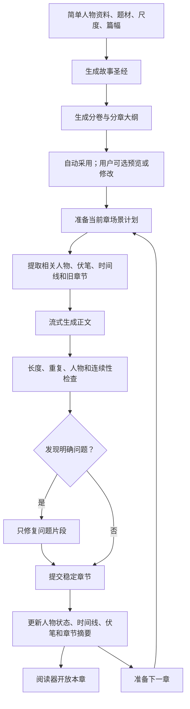

# AI 小说生成与阅读 Android 应用：产品与开发规划

> **文档提示（2026-08-01）：** 本文件保留为早期讨论记录。开发执行基线已经拆分到 [`docs/README.md`](docs/README.md) 及其编号文档；如有冲突，以 `docs` 中更具体、更新的规格为准。产品正式名称为“织卷”，当前临时 Logo 位于 `branding/selected/zhijuan-logo-draft.png`。
>
> 文档状态：项目规划基线  
> 最后更新：2026-08-01  
> 项目根目录：`D:\gptuser\projects\ai-novel-reader`  
> 使用范围：产品讨论、界面设计、技术设计、开发排期、测试和验收的共同依据

## 1. 项目结论

本项目是一款原生 Android、本地优先、无自建业务后台、以阅读为中心的 AI 小说生成器。小说默认保存在设备本地；使用远程模型连接时，会把完成当前生成所需的设定和上下文发送到用户选择的服务地址。

产品表面只要求用户填写少量内容，内部自动完成设定、提纲、逐章写作、检查、记忆更新和续写。已经生成并提交的章节立即进入阅读器，后续章节在后台继续创作。

建议使用 Kotlin 和 Jetpack Compose 开发，不建设账号、会员、服务器或管理后台。API 密钥、小说、人物资料、生成状态和阅读记录全部保存在手机本地。

### 1.1 核心产品原则

1. 默认选项直接可用，高级能力隐藏在第二层。
2. 以稳定生成、不中断和阅读舒适为第一优先级。
3. 小说生成必须采用分阶段流水线，不能依赖一次提示词直接生成整本书。
4. 本地数据库是小说状态的唯一可信来源，模型输出不能替代持久化状态。
5. 所有长任务必须支持暂停、继续、失败重试和进程被系统终止后的恢复。
6. 首版不追求功能数量，先保证短篇、中篇和长篇的核心闭环可靠。
7. 自动化优先：系统能够自行判断和补全的内容，不要求用户确认或重复选择。
8. 用户操作是可选干预，不是流程关卡；除 API 无法使用、预算达到上限或出现无法自动解决的硬冲突外，不主动打断创作。

## 2. 产品概念拆分

“成人、普通小说”不是小说风格，应拆成五个互不干扰的维度：

| 维度 | 示例 |
|---|---|
| 题材 | 玄幻、仙侠、都市、历史、科幻、悬疑、末日、言情、快穿、无限流 |
| 故事机制 | 穿越、重生、系统、升级、复仇、种田、经营、群像、权谋 |
| 文风 | 网文爽文、细腻叙事、轻小说、传统叙事、冷峻悬疑、幽默吐槽 |
| 节奏 | 快节奏、均衡、慢热 |
| 描写偏好 | 留白、均衡、细写 |

主界面不直接出现过于敏感或直白的内容尺度名称。统一使用“描写偏好”作为入口，首版只使用“留白、均衡、细写”三个中性名称。内部仍分别保存关系描写、冲突描写、黑暗程度等实际参数，避免因为界面命名含蓄而损失生成控制能力；首版不增加第四个自定义入口。

这样可以组合出“细写仙侠爽文”“细写悬疑慢热”“留白都市轻喜剧”等不同方向，而不需要为每种组合单独建立模板。

## 3. 产品范围

### 3.1 核心用户

- 仅项目所有者本人使用。
- 默认用户不理解模型参数、上下文窗口、SSE、Token 等技术概念。
- 产品必须允许用户只表达故事想法，由系统自动补全专业创作参数。

### 3.2 明确不做

- 注册登录、会员、支付和广告。
- 云端书库、社区、评论和排行榜。
- 管理后台和公共内容审核后台。
- 多人协作和公开发布平台。
- 首版多设备同步。

### 3.3 必须做好

- 一键开书。
- API 配置足够简单。
- 长篇人物和剧情不失忆。
- 生成中断后可以继续。
- 一边阅读、一边生成。
- 优质的本地书架和阅读器。
- 随时导出和完整备份。

## 4. 用户流程

### 4.1 极简开书输入

首次开书只要求用户提供一项内容：一句话故事想法。人物资料、题材、描写偏好和篇幅均允许留空，由 AI 自动判断和补全。

默认页面显示以下内容：

1. 一句话故事想法，唯一必填项。
2. 主角资料，可选；留空时由 AI 补全。
3. 题材建议，由 AI 预选；用户可以忽略或修改。
4. 描写偏好，默认沿用上次选择或采用“均衡”。
5. 篇幅，默认采用系统推荐值。
6. “开始创作”按钮。

篇幅预设：

| 类型 | 建议规模 |
|---|---|
| 短篇 | 至少 80 章；初始目标为 80 章，完整收束需要时可继续延长 |
| 中篇 | 至少 300 章；初始目标为 300 章，完整收束需要时可继续延长 |
| 长篇 | 由用户填写目标章数；必须填写 301–10,000 章，系统不代填固定默认值 |
| 连载模式 | 不预先确定最终章数，按卷持续生成 |

高级选项默认折叠，包括视角、时代、结局倾向、感情线、禁用元素、自定义字数和章节规模。

### 4.2 自动开书与可选预览

AI 在后台先生成开书方案，再开始写正文。默认自动创作模式不要求用户逐项确认方案；用户开启“写前预览”时，才显示容易理解的方案卡：

- 暂定书名和简介。
- 主角和重要配角。
- 核心矛盾。
- 世界规则。
- 故事结局方向。
- 分卷计划。
- 前若干章的章节梗概。

方案卡提供三个可选操作，但它们不是默认流程的必经步骤：

- 就这样写。
- 换一版。
- 我想修改。

用户完成“开始前确认”、真实 token/费用硬上限和数据发送目的地确认后，系统在方案内部没有明显矛盾时自动采用方案并开始生成第一章，不再要求逐项批准方案。开始前确认只读取已保存在本机的不可变创建快照；价格未知时不得伪装成 0 元，硬上限未生效时不得发送生成请求。用户可以在阅读过程中随时查看或修改设定，修改结果只影响尚未提交的后续内容。

### 4.3 边写边读

默认采用“平衡模式”：

1. 第一章生成完成并通过快速检查后开放阅读。
2. 用户阅读第一章时，第二章在后台生成。
3. 用户读到第二章时，第三章继续生成。
4. 未读章节可以自动保持领先一至三章。
5. 用户可随时暂停、停止或修改后续方向；暂停/停止必须先持久化，发送前不产生新请求，在途先取消并保存加密草稿，继续只恢复排队而不隐式重发。

提供三种易理解的生成策略：

| 模式 | 行为 |
|---|---|
| 速度优先 | 正文直接流式显示，生成最快，减少额外检查 |
| 平衡模式 | 第一章稳定后开放阅读，后续章节在阅读期间生成 |
| 质量优先 | 草稿完成检查和局部修订后再开放阅读 |

不允许阅读器中的已读文字被后台自动改写。实时内容应标记为“创作中”，正式提交后才进入稳定正文。

### 4.4 低参与自动化规则

- 首次 API 配置完成后，后续创作不重复询问服务商、模型或技术参数。
- 缺少人物姓名、年龄、身份、世界背景、配角或结局方向时，由 AI 自动补全。
- 题材、文风、节奏和篇幅采用系统推荐值，用户不选择也能直接开始。
- 开书方案、大纲、章节计划、质量检查、记忆更新和下一章调度默认自动执行。
- 轻微设定冲突由系统按故事一致性自行处理，不弹出确认框。
- API 断流、限流和临时网络失败自动重试；只有密钥失效、余额或额度问题才通知用户处理。
- 默认自动保持一至三章未读库存，并根据用户阅读速度调整生成节奏。
- 常用偏好自动记忆，例如阅读主题、字号、描写偏好、题材倾向和默认篇幅。
- 暂停、改纲、重写和高级设置始终可用，但不在正常阅读路径中主动出现。
- 如果用户长期不干预，系统也应当能够从一句话想法持续完成整本短篇或中篇小说。

## 5. 小说生成系统

### 5.1 开源方案调研结论

- [GPTAuthor](https://github.com/dylanhogg/gptauthor)采用“先提纲、再逐章写”，但只携带总提纲和上一章，项目说明中承认容易出现连续性问题。
- [NovelGenerator](https://github.com/KazKozDev/NovelGenerator)加入人物状态、剧情线、世界事实记忆和章节检查。
- [autonovel](https://github.com/NousResearch/autonovel)把小说拆成文风、世界、人物、提纲、正文和事实库等持续演化的层次。
- [novel-creator-skill](https://github.com/leenbj/novel-creator-skill)使用章节检索、角色状态、时间线、伏笔表和大纲锚点处理长篇创作。
- [LongWriter](https://github.com/THUDM/LongWriter)的 AgentWrite 采用先规划、后写作的方法，而不是只依赖一次超长输出。

### 5.2 生成流水线

### 5.3 长篇记忆系统

第一版先使用结构化记忆，不立即引入复杂的向量数据库：

- 故事圣经：不能随意改变的世界规则和全局事实。
- 人物档案：身份、成年状态、性格、关系和目标。
- 人物当前状态：位置、伤势、感情、持有物品和掌握的信息。
- 时间线：事件发生顺序和相对时间。
- 伏笔表：未埋设、已埋设、待回收、已回收。
- 分卷与章节大纲。
- 最近两至三章摘要。
- 章节全文检索和人物—章节关联表。

写下一章时，只发送“全局必要信息＋当前章相关旧内容”，不能每次把整本小说重新发送给模型。

向量检索和知识图谱放在后续版本，在结构化记忆无法满足真实长篇测试时再加入。

### 5.4 质量检查

每章执行两类检查：

**本地检查**

- 目标字数。
- 章节是否完整。
- 重复段落和高频重复表达。
- 人物名称是否异常。
- 标点、空行和格式异常。
- 常见 AI 套话和机械化句式。

**AI 检查**

- 人物行为是否与已有设定矛盾。
- 时间和地点是否冲突。
- 是否偏离当前章节目标。
- 文风是否明显漂移。
- 伏笔是否提前泄露或被遗忘。

默认不让每章调用大量模型角色。普通模式采用“一次写作＋一次必要时检查”，只有质量优先模式才增加润色和独立审稿。

## 6. API 配置设计

### 6.1 协议适配层

多模型配置可参考原生 Android 客户端 [RikkaHub](https://github.com/rikkahub/rikkahub) 的供应商、Base URL、模型和本地密钥管理思路。小说项目 [Author](https://github.com/YuanShiJiLoong/author)也采用类似的多供应商配置方式。

首版支持以下五类协议：

| 协议适配器 | 覆盖范围 |
|---|---|
| OpenAI-compatible Chat Completions | 大多数中转站、DeepSeek、OpenRouter及许多国内服务 |
| OpenAI Responses | OpenAI 官方及支持该协议的服务 |
| Anthropic Messages | Claude 官方和 Anthropic 格式中转站 |
| Gemini generateContent | Gemini 官方 |
| Ollama/OpenAI-compatible | 电脑或局域网中的本地模型 |

这些协议不能强行共用同一个流式解析器：

- [OpenAI Responses 流式事件](https://platform.openai.com/docs/api-reference/responses-streaming/response/content_part)
- [Anthropic 流式协议](https://platform.claude.com/docs/en/build-with-claude/streaming)
- [Gemini streamGenerateContent](https://ai.google.dev/api/generate-content)

DeepSeek 官方同时提供 OpenAI 和 Anthropic 兼容格式；OpenRouter说明其接口与 OpenAI 非常相似，但存在少量差异；Ollama只承诺兼容 OpenAI API 的一部分。因此应用必须实现能力检测和降级，不能假定所有中转站行为一致。

- [DeepSeek API](https://api-docs.deepseek.com/)
- [OpenRouter API](https://openrouter.ai/docs/api_reference/overview)
- [Ollama OpenAI 兼容说明](https://docs.ollama.com/api/openai-compatibility)

### 6.2 傻瓜化配置流程

选择官方预设时：

1. 选择服务商。
2. 粘贴 API Key。
3. 点击“测试并保存”。

Base URL、请求路径和常用模型自动填写。

自定义中转站时：

1. 粘贴地址。
2. 粘贴 API Key。
3. 应用自动获取模型列表。
4. 自动测试普通生成、流式生成和结构化输出。
5. 获取模型列表失败时，才允许用户手动填写模型名。

错误提示使用非技术语言：

- 密钥无效，请重新复制。
- 地址可以访问，但没有找到模型。
- 服务商正在限流，已准备稍后重试。
- 模型不支持当前任务需要的结构化输出，已切换兼容模式。

原始错误码放在折叠的“技术详情”中。

高级设置提供：

- 自定义请求头。
- 自定义请求体字段。
- 路径覆盖。
- 上下文长度。
- 最大输出长度。
- 禁用不兼容参数。
- 为构思、正文和审稿分别选择模型。

## 7. Android 技术方案

| 部分 | 推荐方案 |
|---|---|
| 开发语言与界面 | Kotlin + Jetpack Compose + Material 3 |
| 本地数据库 | Room |
| 小型设置 | DataStore |
| API 请求 | OkHttp + kotlinx.serialization |
| 流式输出 | 独立 SSE 事件归一层 |
| 密钥保护 | Android Keystore 加密 |
| 主动后台生成 | 用户启动的前台服务＋章节级检查点 |
| 故障重试 | WorkManager |
| 导出 | TXT、Markdown、EPUB、完整 JSON/ZIP 备份 |
| 最低系统 | 建议 Android 8.0 及以上 |

Android 官方推荐使用分层架构、单一数据源、Compose、协程和 Flow；Room 适合保存大量结构化离线数据：

- [Android 架构建议](https://developer.android.com/topic/architecture/recommendations)
- [Room 文档](https://developer.android.com/training/data-storage/room)

### 7.1 本地数据对象

不能把整本小说存在一个巨大文本文件中。数据库至少需要：

- 小说项目。
- 人物和人物状态。
- 世界规则。
- 分卷和章节计划。
- 章节正文和草稿状态。
- 时间线和伏笔。
- 生成任务和恢复检查点。
- API 配置和模型配置。
- 阅读进度和阅读设置。
- Token 用量和费用估算。

### 7.2 流式保存

流式内容先在内存中以约 50～100 毫秒的节奏更新界面，再按完整段落或每隔约一秒写入数据库，避免每生成一个字就触发数据库写入。

生成任务以“单章”为恢复单位。发生断网、锁屏、系统清理或应用退出后，最多重做当前未提交片段，不能丢失已经完成的章节，也不能重复追加段落。

Android 16 开始，超长 WorkManager 任务可能耗尽作业配额，因此主动生成不能完全依赖一个无限运行的 Worker。采用显式前台服务、通知栏暂停/停止按钮和章节级持久化，WorkManager仅负责重试和恢复。通知按钮只提交持久控制意图；执行器完成 Provider 取消、加密检查点和 Attempt/Usage/Stage/Job 安全点后才反馈控制完成。

- [Android 长时间后台任务说明](https://developer.android.com/develop/background-work/background-tasks/persistent/how-to/long-running)

### 7.3 API Key 安全

API Key 使用 Android Keystore 保护，默认不进入日志、普通备份和小说导出文件。

需要明确：手机被 Root、第三方中转站不可信或对方记录请求时，密钥和小说仍可能泄露。Keystore只能降低密钥被提取的风险，不能提供绝对保护。

- [Android Keystore](https://developer.android.com/privacy-and-security/keystore)

## 8. 阅读体验

### 8.1 主导航

- 书架。
- 新建。
- 设置。

### 8.2 首版阅读能力

- 纵向滚动和横向翻页。
- 字号、字体、行距、段距和左右边距。
- 白色、米黄、护眼和深色主题。
- 目录、阅读进度和章节跳转。
- 锁屏前保存阅读位置。
- 正在生成、等待检查和生成失败状态。
- 一键暂停后台生成。
- 长按选择和复制。
- 全文搜索。
- 系统亮度与应用内亮度控制。

横向分页使用 Compose `HorizontalPager` 和本地分页缓存。正文只加载当前章和相邻章节，不能把几十万字一次加载到界面中。

### 8.3 界面标准

- 内容优先、触摸优先的平面设计。
- 主要点击区域不小于 48dp。
- 输入框必须有明确标签，不能只依赖占位文字。
- API 高级参数使用渐进展开。
- 生成和连接测试必须即时反馈。
- 正文在平板和横屏上限制行宽，避免过长单行。
- 支持深色模式、系统大字体和屏幕阅读器。
- 所有交互使用统一的矢量图标，不使用 Emoji 充当结构性图标。

## 9. 视觉参考与设计基线

本章节记录已经完成的参考观察和设计方向，作为后续界面设计的输入。本次仅保存项目上下文，不代表已经开始界面设计、出图、模板制作或原型实现。

### 9.1 只读视觉参考

以下文件由用户提供，位于 C 盘下载目录，只作为只读输入。项目不得在这些路径旁生成、修改或保存任何产出。

**多看阅读器**

1. `C:\Users\du\Downloads\Screenshot_2026-08-01-12-01-50-097_com.duokan.re.jpg`
2. `C:\Users\du\Downloads\Screenshot_2026-08-01-12-01-56-535_com.duokan.re.jpg`
3. `C:\Users\du\Downloads\Screenshot_2026-08-01-12-02-12-934_com.duokan.re.jpg`
4. `C:\Users\du\Downloads\Screenshot_2026-08-01-12-02-03-647_com.duokan.re.jpg`

**起点读书**

5. `C:\Users\du\Downloads\Screenshot_2026-08-01-11-59-57-202_com.qidian.QD.jpg`
6. `C:\Users\du\Downloads\Screenshot_2026-08-01-12-00-03-422_com.qidian.QD.jpg`

### 9.2 总体组合方向

采用“多看的沉浸阅读体验＋起点的书架信息组织”的组合方案：

- 阅读器以多看为主要参考。
- 书架和小说项目状态组织以起点为主要参考。
- AI 功能融入书架、目录和正文状态，不能压过阅读内容。
- 整体克制、中文排版友好、触摸目标清晰。
- 不为了展示 AI 能力而堆叠按钮、仪表盘或复杂技术参数。

### 9.3 阅读器视觉基线

- 正文使用暖纸色背景，降低长时间阅读的视觉疲劳。
- 正文字号偏大，正文占据屏幕绝大部分面积。
- 默认界面尽量隐藏工具控件，让阅读内容成为唯一视觉中心。
- 工具层采用深色表面，与暖色正文形成清晰分层。
- 橙色作为单点强调色，用于当前章节、进度和主要确认操作。
- 不使用多种高饱和强调色争夺注意力。
- 章节标题、正文、页码和状态信息建立稳定的中文排版层级。

### 9.4 阅读交互基线

采用“内容常驻、功能按需浮现”的交互原则：

1. 正常阅读时只保留正文和必要的轻量进度信息。
2. 用户点击正文后，显示顶部栏、章节进度、底部操作和阅读设置。
3. 再次点击正文或短时间无操作后，工具层退出，恢复沉浸阅读。
4. 目录使用侧滑抽屉，当前章节使用强调色标识。
5. 阅读设置集中提供亮度、字号、字体、背景、翻页方式和夜间模式。
6. 生成状态只在必要位置出现，例如书架进度、目录状态和未完成章节末尾。
7. 生成提示不能遮挡正文、打断翻页或导致已读内容跳动。

### 9.5 书架与项目状态基线

- 采用白底或低干扰浅色背景。
- 使用“封面＋书名＋作者或生成进度”的快速扫描式列表。
- 底部导航结构清晰，入口数量保持克制。
- 红色只作为状态提醒，不扩散为大面积主题色。
- 小说生成状态直接进入书架条目，例如“正在生成第 6 章”“已暂停”“等待 API”。
- 书架同时承担普通阅读书架和 AI 小说项目入口，不建立独立的复杂项目管理后台。

### 9.6 明确排除的参考元素

不继承起点读书中与本项目无关的商业和社区元素：

- 广告。
- 签到。
- 促销。
- 社区。
- 会员。
- 商城。
- 付费引导。
- 排行榜和公共推荐信息流。

这些内容与“单人、本地、无后台”的产品定位冲突。

### 9.7 后续视觉工作的启动条件

- 当前只完成了 6 张参考图的观察和风格记录。
- 尚未生成任何界面、图片、模板、文案或原型。
- 尚未创建 Product Design 图像模板。
- Template Creator 的图像模板需要单张 PNG，除非用户明确要求批量处理。
- 当前参考是多张 JPG。后续如需正式模板，应先由用户确定一张主参考，或明确要求按照多张参考分别创建。
- 后续视觉探索、模板选择、界面设计和实现均在本项目继续，但必须等待用户明确指令。
- 所有视觉产出仍必须保存到 `D:\gptuser\projects\ai-novel-reader` 或其他明确的 `D:\gptuser` 子目录。

## 10. 成人内容和现实边界

个人使用减少了账号、后台和公共用户审核需求，但不能推出“没有任何法律、平台或服务商风险”。

目前 OpenAI 的使用政策明确禁止使用服务生成性暴力或非自愿亲密内容；Gemini会扫描露骨性内容并可能限制或关闭访问；Google Play通常也不允许以性满足为主要用途的生成式应用，并明确限制非自愿性内容。

- [OpenAI 使用政策](https://openai.com/policies/usage-policies/)
- [Gemini 滥用监控](https://ai.google.dev/gemini-api/docs/usage-policies)
- [Google Play 内容政策](https://support.google.com/googleplay/android-developer/answer/9878810)

项目采用以下边界：

- 只规划本地 APK 侧载，不以应用商店发布为首版目标。
- 成人内容中的所有人物必须明确为成年人。
- 禁止未成年人、年龄模糊人物和真实人物的性描写。
- 成人尺度和暴力尺度分别设置。
- 可以保存成熟内容偏好，但不能保证任意托管模型都会执行。
- 对模型拒绝给出清晰提示，不自动改写请求以绕过服务商保护。
- 中转站和本地模型同样受其条款、许可证和适用法律约束。
- 不设计用于绕过模型安全机制或强迫生成非自愿性性暴力的提示词。

## 11. 开发计划

以一名熟悉 Android 的全职开发者计算，可用原型约需 3 周；达到可长期使用的可靠版本，建议预留 9～12 周。兼职开发所需时间相应增加。

| 阶段 | 时间 | 交付内容 |
|---|---:|---|
| 0. 产品定稿 | 3～5 天 | PRD、页面流程、数据结构、内容模板、验收样例 |
| 1. 应用骨架 | 第 1 周 | Compose 工程、书架、项目创建、Room 数据库、主题 |
| 2. 阅读器 | 第 2 周 | 纵向阅读、字号行距主题、目录、进度保存 |
| 3. API 兼容层 | 第 3～4 周 | 五类协议、模型列表、连接测试、SSE 解析、错误归一 |
| 4. 基础生成引擎 | 第 4～5 周 | 故事圣经、大纲确认、逐章生成、实时显示 |
| 5. 任务恢复 | 第 6 周 | 暂停、继续、断网重试、进程被杀恢复、通知栏控制 |
| 6. 长篇记忆 | 第 7 周 | 人物状态、时间线、伏笔、章节摘要、相关章节检索 |
| 7. 质量控制 | 第 8 周 | 本地检查、AI 一致性检查、局部修复、用量统计 |
| 8. 阅读与导出完善 | 第 9 周 | 横向翻页、全文搜索、EPUB/TXT/Markdown、备份恢复 |
| 9. 兼容测试 | 第 10 周 | 官方 API、中转站、Ollama、异常流、长篇压力测试 |
| 10. 打磨与缓冲 | 第 11～12 周 | 性能、无障碍、小屏/横屏、数据库迁移和缺陷修复 |

## 12. 首版验收标准

- 安装后，配置官方 API 只需要选择服务商和粘贴 API Key。
- 开书只有“一句话故事想法”是必填项，其余创作参数均可由系统自动补全。
- 默认自动创作模式从点击“开始创作”到第一章开放阅读之间，不要求用户再次确认。
- 主界面使用“描写偏好”和“留白、均衡、细写”三个中性命名，不直接展示敏感或过于直白的尺度词汇；内部参数版本化保存。
- 除 API 密钥失效、预算或额度达到上限、无法自动恢复的硬错误外，连续生成过程不主动要求用户操作。
- 从打开应用到开始创建第一本小说不超过 5 分钟。
- 所有官方适配器支持流式显示。
- 中转站没有模型列表时仍能手动使用。
- 遇到 401、404、429、5xx、断流和畸形数据时应用不崩溃。
- 锁屏、旋转屏幕、退出应用和进程被杀后能够恢复。
- 不重复章节、不重复段落、不丢失已提交正文。
- API Key 不出现在日志、普通备份或小说导出中。
- 至少完成一次 100 章连续生成压力测试。
- 使用固定的十套故事种子评估人物一致性、重复率、长度达成和剧情偏移。
- 50 万字书籍仍能快速打开书架、目录和当前章节。
- 阅读器支持最大系统字体、深色模式、横屏和常见手机尺寸。

## 13. 首版暂缓内容

- AI 封面生成。
- 文字转语音和有声书。
- 多设备云同步。
- 复杂知识图谱。
- 向量检索。
- 百万字全自动无人值守生成。
- 应用商店发布。

先完成“稳定生成、不断档、读起来舒服”三个核心目标，再根据实际使用反馈扩展功能。

## 14. 项目文件规则

1. 项目正式文件统一存放在 `D:\gptuser\projects\ai-novel-reader`。
2. 项目代码、文档、构建产物、测试报告和项目专用临时文件不得写入 C 盘。
3. 通用 Skill 管理和临时验证文件遵循全局规则，存放在 `D:\gptuser\skill-management`。
4. API Key、真实中转站密钥和小说隐私内容不得提交到版本控制。
5. 本文档作为当前产品和开发规划基线；发生重大范围、架构或内容边界调整时，应同步更新本文档。

## 15. TASK-047 未知结果恢复实现基线

未知结果不能按“网络错误”直接重跑。恢复入口先读取同一 Stage 的 Attempt、Usage、加密草稿、输出提交和租约证据，再选择以下唯一动作：

1. 已有完整本地响应但尚未提交时，只恢复校验/提交，不发新请求；
2. 提供方查询显示原请求仍在运行时，保留原 Attempt，等待后续对账；
3. 提供方明确证明原请求未执行，且本地草稿为空、无已知用量、发送证据一致时，才允许自动回到 READY；
4. 提供方已完成但本地没有可恢复输出、查询无结论、查询不受支持或仅有 RequestIntent 时，统一标记结果未知并等待用户确认；
5. 用户确认只解除重试门禁，不直接联网；新执行器仍须重新领取租约、经过预算和发送审计，并创建新的 Attempt。

恢复查询与生成接口分离，协调器禁止调用 `generate`。当前四个内置适配器没有可靠的请求状态查询端点，因此保守声明为“不支持查询”，不会伪造能力或新增真实网络调用。

## 16. TASK-048 前台生成服务实现基线

- 正式 `dataSync` 前台服务仅由 App 内明确的用户动作启动，组件不导出并使用 `START_NOT_STICKY`；它是持久任务的执行机会，不是任务事实来源。
- 启动后立即发布低优先级持续通知。通知默认不显示书名、人物或正文，只提供“暂停”和“停止”两个动作；动作复用持久控制事务，不靠内存按钮状态。
- 服务只在 Job 为 `READY/RUNNING/PAUSING/STOPPING` 时存活，终态、缺失任务、非法 ID 或数据库不一致均失败关闭。
- Android 15 `dataSync` 系统限时进入独立的应用级持久化协程，记录 `SYSTEM_FGS_TIMEOUT` 可恢复暂停；服务最迟在 1.5 秒硬截止内移除通知并停止，不能等待长事务或网络。
- TASK-048 不实现真正的章节循环，不从前台服务绕过发送审计、预算或外部目的地确认。TASK-049 已补齐无网络恢复维护，TASK-050 已补齐阶段/场景准备契约；实际故事种子、圣经和总纲执行器由 TASK-051 接入。

## 17. TASK-049 WorkManager 恢复与维护实现基线

- WorkManager 只承载短时、可延迟、可重复执行的恢复审计与维护；主动生成仍由用户明确启动的前台执行机会承载，不能把长篇生成塞进长时间 Worker。
- 正式版启动 15 秒后安排一次唯一恢复检查，并以 24 小时周期、6 小时弹性窗口安排唯一维护；周期任务要求电量和存储不低，但故意不要求网络。
- 扫描每批最多 50 条、接口硬上限 100 条，只读取当前 Stage 以及父 Job 都已达到 60 秒精确过期边界的持久租约；Worker 和协调器不持有 Provider、连接配置、生成许可或预算签发能力。
- `RUNNING + PREPARING` 且尚无 Attempt 时，可在同一 SQLCipher 事务中把 Stage 和父 Job 一起回到 `READY` 并清除双租约；不能只释放 Stage 而留下阻塞后续执行的父 Job 租约。
- 已记录 RequestIntent 或进入流式阶段后，恢复器只使用现有未知结果审计并声明 `ProviderRecoveryEvidence.NOT_AVAILABLE`；它不查询远端、不创建第二个 Attempt。暂停/停止中的网络阶段只结算既有控制安全点。
- 本地 `VALIDATING/COMMITTING` 与暂停/停止同时崩溃但缺少足够提交证据时保持延后，不猜测成功、不删除草稿、不自动重发；该本地流水线在 TASK-051 以后接入实际阶段执行时补齐。
- 每个候选独立失败关闭，取消会向上传播；临时失败最多重试 2 次，输出仅含通用计数。Debug 自动调度关闭以避免设备测试夹具竞态，测试显式验证调度；Release 自动调度开启。

## 18. TASK-050 Prompt Bundle 与场景执行实现基线

- 首版固定为 `zhijuan.prompt-bundle.v1`、契约 schema v1，只接受创建快照 schema v1；绑定包含来源内容哈希、篇幅、题材基线、呈现档位、硬规则、阶段模板和输出 schema 标识，并计算确定性 SHA-256 绑定哈希。
- 13 个生成阶段全部拥有稳定契约；输入标准化、章前上下文组装和章节提交是纯本地阶段，其余阶段只生成结构化远程准备计划。层顺序与 Provider 契约逐项同名映射，未知层、未知版本或损坏快照失败关闭。
- 章节计划、章节正文、一致性检查和章节修订为场景感知阶段。细写 + 避免淡出 + 相关人物已确认成年时自动装配严格连续性：关键过程覆盖率 100%、淡出替代为 0，持续跟踪位置、姿势、衣着、接触、动作因果、触觉/视觉/声音/呼吸节奏/语言/心理、身体状态变化和相关余波。
- 用户没写年龄时，故事种子/圣经可为新建虚构人物自动补明确成年年龄，不新增默认问题；明确未成年、真实可识别人物或年龄矛盾不得改写为成年，相关场景在 Provider 准备前阻断。
- 呈现档位只改变相应写法，不暗中提高冲突、伤害、语言或情绪压迫等题材维度。普通日志和对象字符串不输出规则正文、快照哈希或绑定哈希。
- TASK-050 不创建 Job、Attempt、用量或正式章节，不打开 Provider 连接。故事种子、故事圣经和总纲的具体结果与真正阶段执行由 TASK-051 接入；费用/token 和外部数据目的地硬门仍不得绕过。

## 19. TASK-051 故事种子、故事圣经与全书总纲实现基线

- 创建生成任务时冻结 `zhijuan.prompt-bundle.v1`，并一次性创建三个有序阶段：故事种子、故事圣经、全书总纲。阶段依赖、输入哈希和幂等键可确定性复算，运行中不得动态插入或换序。
- 三类结果分别使用 `story-seed.v1`、`story-bible.v1`、`master-outline.v1`。Provider 看到的是完整 JSON Schema；本地仍执行独立严格解析，拒绝非法 UTF-8、重复键、未知字段、类型/长度/数量越界、非法 ID、重复事实和错误哈希。
- 采用逐阶段校验与提交：种子成功后才能激活圣经，圣经成功后才能激活总纲。每次提交只要求已存在的前序结果，避免“必须先有未来结果才能提交当前结果”的循环依赖。
- 圣经保存为不可变修订，并把人物、成年事实、世界规则和硬事实写入可追踪实体；总纲保存为不可变修订和唯一 BOOK 根节点。成功引用只保存稳定 ID/hash，不保存明文创作内容。
- 总纲必须从第 1 章无缝覆盖至快照冻结的目标章数；80、300 和 301–10,000 的边界继续使用创建快照，不允许模型擅自缩短或扩张。
- 精确重放只回读已有结果。书、阶段、租约、Attempt、草稿修订/hash、前序 hash 或下一阶段任一不一致，整笔 SQLCipher 事务回滚。
- 当前只以本地假 Provider 验证了完整流式、加密草稿、严格校验和三阶段提交。App 确认按钮、费用/token 硬上限、外部目的地确认和真实 Provider 仍未接线；TASK-052 已在该总纲之上补齐有限的分卷/章节窗口。

## 20. TASK-052 分卷与窗口式分章规划实现基线

- 使用 `zhijuan.arc-window-policy.v1` 在本地先冻结范围：一个当前故事弧/卷最多 40 章，一个逐章摘要窗口最多 8 章；窗口剩余 3 章时才需要补充下一窗。模型没有决定或扩大窗口大小的权限。
- 当前窗口不得跨越全书总纲的宏观节拍边界。临近节拍或全书结尾时由本地自动缩短；目标末章后 `nextWindowStartChapter` 必须为空。
- `arc-plan.v1` 同时返回当前卷的目标、进入/退出状态、里程碑、连续性约束，以及当前最多 8 章的简要目标/冲突/转折/结果/钩子/状态承接。它不是章节正文，也不是后续单章场景计划。
- 每个窗口建立一个仅含 `BUILD_ARC_PLAN` 的 `CONTINUE_BOOK` Job，冻结总纲修订/hash、当前父修订/hash、宏观节拍、卷范围和窗口范围。后续窗口可复用未结束的卷，但必须产生新的输入 hash、幂等键和不可变大纲修订。
- 窗口修订使用 BOOK 根节点、一个 ARC 节点和 1–8 个 CHAPTER 节点。旧窗口保留在父修订链中，当前 head 只前移，不复制几百或上万个历史章节节点，因此存储随窗口线性增长。
- 提交复核 Provider 产物、严格校验 permit、Stage/Job/Book/Attempt/Usage/租约、冻结输入、总纲修订和当前父 head；任一不一致整笔回滚。精确重放不重复写修订或结算费用。
- 当前只使用无网络假 Provider 完成连续两窗和故障回滚。自动补窗调度和真实 Provider 入口分别由后续任务接入；第一章快车道已由 TASK-053 补齐持久证据和第二章硬闸门。

## 21. TASK-053 第一章快车道实现基线

- `zhijuan.first-chapter-progression.v1` 明确区分快车道与完整规划模式。快车道第一章只能消费已提交故事种子、`first-chapter-bootstrap.v1`、明确成年人事实和应用硬规则；最小包固定包含人物表、核心世界规则、结局方向及第 1–3 章粗计划。
- 最小包不是临时故事圣经或总纲，不写入伪造的 Bible/Outline revision。Provider 输出必须与种子的人物、年龄、虚构身份和结局方向逐项一致，任何篡改在提交事务内再次失败关闭。
- 第一章成功提交后，系统自动建立绑定该第一章版本 ID/hash 的故事圣经与全书总纲任务。完整规划必须适配用户已经能读到的第一章，不能静默重写第一章来迁就后生成的计划。
- 第二章及后续章节必须同时具备当前圣经、总纲、目标章节窗口、紧邻上一章当前版本，以及快车道书籍的第一章适配证据。UI 布尔值、调用方自报哈希或伪造 JSON 均不能代替数据库事实。
- Provider 打开前和正式章节提交事务内都重新核对门禁，关闭“排队时合法、发送或提交时证据已变化”的竞态窗口。
- 本任务不新增 Room 表或迁移，不接入正文生成、App 确认按钮或真实 Provider；它完成的是首章前置规划与章节推进授权边界。正文底层随后已由 TASK-055 接入，完整章节流水线和 UI 仍待后续任务完成。

## 22. TASK-054 章前上下文预算实现基线

- `zhijuan.chapter-context-policy.v1` 按规范 UTF-8 输入上界、固定封套和安全余量计算预算；模型容量未知默认联网前阻断，用户明确确认时只使用保守回退值。
- 成年/身份、应用与世界硬规则、禁改事实、目标卷章、上一章承接及存在的当前状态、到期伏笔和用户补充全部整项保留；可选记忆按固定优先级整项省略，不截成残句。
- 成功组装为不可变 snapshot/manifest，本地 Stage 原子提交后才激活章节计划；Provider 打开前复核所有来源，旧版本或 hash 不一致失败关闭。
- 本阶段不创建远程 Attempt 或 Usage，真实预算预留、目的地确认和 App 确认按钮仍待后续接线。

## 23. TASK-055 章节正文与有限续接实现基线

- 正文使用严格 `chapter-draft.v1` 单字段包络，增量 JSON 解码器只把已解码 `body` 写入 Keystore 保护草稿；任意分片、转义、Unicode 代理项和 4 MiB 累计上限均有确定处理。
- `STOP` 只进入后续校验；`LENGTH` 与输出 hash、成功响应证据和 `OUTPUT_TRUNCATED` 同事务落库，避免崩溃后把已完成请求当成未完成请求。
- 自动续接使用新 Attempt、独立 Usage 和新 artifact。新草稿先预置累计正文，提示绑定父输出和 96 码点精确尾锚点，模型开头精确复现后只剥离一次；禁止模糊拼接。
- 最多自动续接 3 次，并继续受 Stage attempt、4 MiB 正文和费用/token 上限约束；第 4 次截断、格式/锚点错误或不安全片段保存现场并进入 `NEEDS_ACTION`。
- 分类落库后若进程退出，恢复器只验证本地受保护证据并完成结算，不调用 Provider；重复恢复幂等。
- API 35/API 30 各 156 项全量、JVM 唯一 371 项、Release/R8 和统一安全门禁通过；真实 API 0、实体设备写入 0。摘要/人物事件/事实提取已完成；时间线/伏笔、检查、候选正文最终原子提交与阅读 UI 从 TASK-057 起继续接入。

## 24. TASK-057 时间线与伏笔投影实现基线

- `EXTRACT_MEMORY` 作为派生记忆阶段总类保留；普通章节记忆使用 `chapter-memory.v1`，专用投影任务在冻结 Stage 来源中明确选择 `chapter-story-tracking.v1`，两种输出不能混用。
- 请求同时绑定最终章节版本/正文 hash、章节记忆快照、既有有效伏笔快照和当前故事实体快照。RequestIntent 后、Provider 打开前以及提交事务内都会重算，任何变化均失败关闭。
- 时间线只接受正文实际发生且影响顺序/后续约束的事件；参与者必须是已知实体，地点必须是已知 LOCATION。事件携带本章内确定性 story order、约束与短证据，不复制大段正文。
- 伏笔使用 PLANT、DEVELOP、RESOLVE、ABANDON 四类操作。既有伏笔必须精确回显 ID、描述、重要度和旧状态；可见实体只能增加。ABANDON 只接受正文明确证明不再可能且置信度为 100%。
- `foreshadow_item` 保存当前投影，`foreshadow_transition` 追加保存每次状态变化及来源章节/Stage，`chapter_tracking_projection` 保存整批来源和 payload hash；Room 升级至 schema v8。
- 当前正式版本的重建提交把时间线、伏笔创建/状态 CAS、转换台账、投影头、最终 Usage、Stage 和 Job 放进一个 SQLCipher 事务，支持精确幂等重放。格式失败仍只允许一次修复并结算原 Attempt 用量。
- 旧章节版本被替换时，直接来源的时间线、投影和转换失效；任何曾经过该旧版本转换的伏笔当前投影也失效，避免中间状态依赖泄漏。跨多章的自动顺序重建由 TASK-061 接入；此前只允许无后续已提交章节的安全重建。
- JVM 原始 396、唯一 381 项；API 35/API 30 各通过 App 45、Database 89、Generation 25，共 159 项；Release/R8 460 tasks、安全扫描与备份排除通过。真实 API 0、实体设备写入 0。

## 25. TASK-058 一致性与呈现检查实现基线

- 本地检查先执行且不产生网络调用：正文来源 hash、空白/最低长度/4 MiB、代码围栏、异常章节标题、长段精确重复、已知人物、成年人事实、死亡/离场回归、地点移动、物品归属、时间顺序和必需事件覆盖均使用确定性规则。
- 模型检查固定为 `chapter-consistency-report.v1`、temperature 0、512 KiB 上限。23 个预期检查项必须逐项、按固定顺序恰好出现一次；问题最多 128 条，只能使用白名单问题码、精确严重度、Unicode 码点范围、已知实体/伏笔/过程节点 ID 和固定修订动作。
- 检查请求绑定候选版本/正文 SHA-256/章节/序号、本地检查快照、场景执行契约、已知实体和证据快照。RequestIntent 后打开 Provider 前再次校验 `inputHash`；任一来源变化失败关闭，不能复用另一候选的检查结果。
- 细写 + 避免淡出 + 成年门禁通过时进入严格模式：冻结的每个关键过程节点都必须按原顺序返回 COVERED/MISSING，覆盖目标 100%；淡出替代、缺失过程、动作无反应、空间/身体/感官断裂和相关余波缺失使用固定 blocker/major 规则。成年门禁阻断时 Provider 调用为 0，不允许静默降级。
- 检查阶段不允许模型续写、改写或返回正文证据摘录。任何 `BLOCKER/MAJOR` 都进入 `REVISE_CANDIDATE`，只有 `MINOR` 或无问题才可 `ACCEPT_CANDIDATE`；文风轻微漂移和机械化细节不会被任意升级成 blocker。
- `ConsistencyReportEntity` 当前只生成绑定候选的持久化草稿；因为候选 `ChapterVersion` 尚未存在，真正插入必须由 TASK-059 与最终正文、记忆和追踪结果一起完成，不能提前伪造正式报告。
- TEST-039 固定无正文负例集已经覆盖淡出、动作、空间、身体状态、感官、关键过程、余波和机械罗列；它证明契约与门禁，不证明真实模型一定能正确识别所有中文质量问题。
- JVM 原始 426、唯一 411 项；API 35/API 30 各通过 App 45、Database 89、Generation 28，共 162 项；Release/R8 460 tasks、统一安全门禁 371 tasks、15 个 APK 扫描和备份排除通过。真实 API 0、实体设备写入 0。
