# 织卷用户流程

## 1. 首次启动：从零到可生成

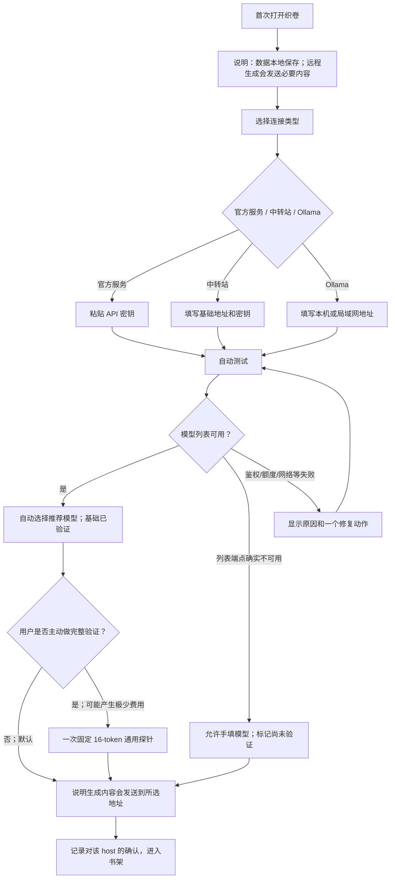
```mermaid
flowchart TD
    A["首次打开织卷"] --> B["说明：数据本地保存；远程生成会发送必要内容"]
    B --> C["选择连接类型"]
    C --> D{"官方服务 / 中转站 / Ollama"}
    D -->|"官方服务"| E["粘贴 API 密钥"]
    D -->|"中转站"| F["填写基础地址和密钥"]
    D -->|"Ollama"| G["填写本机或局域网地址"]
    E --> H["自动测试"]
    F --> H
    G --> H
    H --> I{"模型列表可用？"}
    I -->|"是"| J["自动选择推荐模型；基础已验证"]
    I -->|"列表端点确实不可用"| N["允许手填模型；标记尚未验证"]
    J --> O{"用户是否主动做完整验证？"}
    O -->|"否；默认"| K["说明生成内容会发送到所选地址"]
    O -->|"是；可能产生极少费用"| P["一次固定 16-token 通用探针"]
    P --> K
    N --> K
    K --> M["记录对该 host 的确认，进入书架"]
    I -->|"鉴权/额度/网络等失败"| L["显示原因和一个修复动作"]
    L --> H
```

规则：

- 不先要求用户理解协议、上下文窗口、token 或流式模式。
- 测试失败时保留已输入地址；密钥只显示尾部 4 位。
- 中转站探测不得枚举无关路径或向跨主机重定向发送密钥。
- 只有服务端明确表明模型列表端点不可用时才允许手填模型 ID，并明确标为“尚未验证”；错误密钥、额度失败、网络错误或未知结果不能借此绕过。
- 默认自动测试只读取模型列表，不产生生成费用；“完整验证”藏在高级动作中，由用户明确确认后才发送一次 16-token 固定通用探针。
- 连接测试绝不使用人物、设定、模板或小说正文；真正发送小说前，必须让用户知道数据会到哪个 host。地址变化后原确认失效。

TASK-030 已落地流程的第一步：说明页用三块非技术文案解释本地数据、远程生成和密钥隔离；“跳过说明”与“继续设置”进入同一连接步骤。此时不记录引导完成，有效连接建立前重新启动仍会进入引导；连接步骤的页面按钮和系统返回键均回到说明页，说明页的系统返回交还 Android。

TASK-031 已落地连接步骤：默认选择官方 DeepSeek，也可选 OpenAI、Anthropic、Gemini 或兼容中转；粘贴密钥后基础检查只读取模型列表并自动推荐模型。失败时原始密钥从界面状态清除，只保留安全存储引用与尾四位以供一键重试；换服务、换地址、退出或异常重启会撤销临时密钥。仅当模型列表端点被服务端明确拒绝时出现手填模型；完整验证藏在高级动作，并在发送固定 16-token 探针前再次确认可能费用。

TASK-032 已落地长期保存与连接管理：“使用此连接”把非密钥配置和当前选择原子提交到 SQLCipher schema v6，密钥仍只存在 Secret Store；有保存连接时重启直接进入连接列表。当前连接固定置顶，其他连接可一键设为当前；名称和已发现模型可编辑，密钥只显示尾四位；改地址/密钥走“先新增验证、再确认删除旧连接”。小说真正发送前的 host 数据说明与绑定确认仍在创建流程完成，不由连接测试冒充。

## 2. 默认创建流程

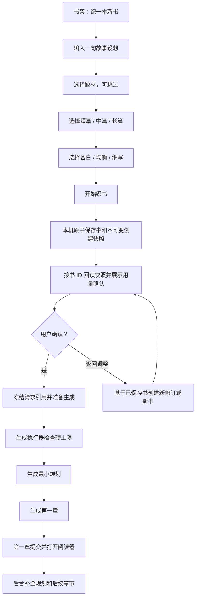
```mermaid
flowchart TD
    A["书架：织一本新书"] --> B["输入一句故事设想"]
    B --> C["选择题材，可跳过"]
    C --> D["选择短篇 / 中篇 / 长篇"]
    D --> E["选择留白 / 均衡 / 细写"]
    E --> F["开始织书"]
    F --> I["本机原子保存书和不可变创建快照"]
    I --> G["按书 ID 回读快照并展示用量确认"]
    G --> H{"用户确认？"}
    H -->|"是"| J["冻结请求引用并准备生成"]
    J --> K0["生成执行器检查硬上限"]
    K0 --> K1["生成最小规划"]
    K1 --> K["生成第一章"]
    K --> L["第一章提交并打开阅读器"]
    L --> M["后台补全规划和后续章节"]
    H -->|"返回调整"| N["基于已保存书创建新修订或新书"]
    N --> G
```

“再补充一点”可以展开人物、关系、世界、视角、风格和节奏，但所有字段都可空。创建后若 AI 自动补全了重要设定，书籍详情显示“自动补全”标签并允许修改。

已有可用当前连接时，App 重启后直接进入极简创建页，不重复经过连接说明或连接列表。创建页只显示当前连接的名称和模型，连接管理按需进入；题材默认“不限定”、篇幅默认“中篇（最低 300 章）”、呈现默认“均衡”，因此默认路径只要求输入一句故事设想并点击一次主按钮。选择长篇时才额外出现目标章数；该字段默认留空并由用户填写 301–10,000，未填写或越界时不能继续。

TASK-034 的高级区只在用户点击“再补充一点”后出现，按人物与关系、世界与背景、叙事与文风、希望保留、不想出现五组接收自然语言。折叠不会清空内容；旋转、Activity 重建或临时进入连接管理再返回时继续保留。未填写的组由后续标准化自动补齐，不追加确认步骤。

TASK-037 已接入流程中的本地确认页：创建事务提交后只保留 `bookId` 作为导航依据，页面再从 SQLCipher 回读冻结快照。它显示 80/300/用户自定义章数和冻结模型；价格目录未接入时明确说明无法可靠估算，不显示 0 元。确认动作只提交 `bookId + snapshotId + contentHash + 价格状态`，当前阶段不创建生成任务、不发网络请求；进程重建会按书 ID 重读，损坏或缺失快照会停止并提供返回路径。返回创建页后原书仍在本机，开始按钮保持锁定，避免重复建书。

## 3. 边生成边阅读

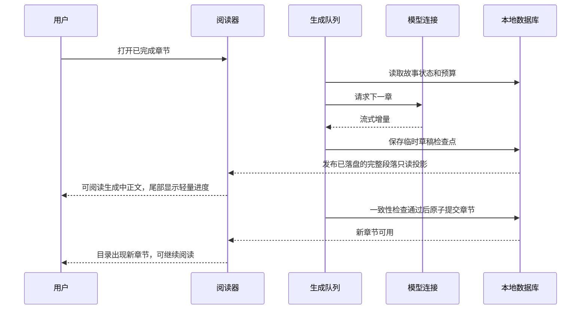
```mermaid
sequenceDiagram
    participant U as 用户
    participant R as 阅读器
    participant Q as 生成队列
    participant A as 模型连接
    participant D as 本地数据库
    U->>R: 打开已完成章节
    Q->>D: 读取故事状态和预算
    Q->>A: 请求下一章
    A-->>Q: 流式增量
    Q->>D: 保存临时草稿检查点
    D-->>R: 发布已落盘的完整段落只读投影
    R-->>U: 可阅读生成中正文，尾部显示轻量进度
    Q->>D: 一致性检查通过后原子提交章节
    D-->>R: 新章节可用
    R-->>U: 目录出现新章节，可继续阅读
```

关键行为：

- 阅读器不逐 token 重组正文，只显示已经完整解码并写入加密草稿的完整段落；未完成尾段单独标记。
- 生成中正文明确标为非正式，只读投影不进入目录的“已完成”状态、搜索、模板、导出或下一章上下文。
- 检查要求修订时显示“正在修整本章”；正式提交后按段落锚点继续，不静默把初稿冒充最终版。
- 到达费用上限、策略拒绝或需用户决策时，队列暂停并显示清晰原因。
- 用户点暂停时，发送前任务立即冻结；生成中先取消当前远程请求并保存加密草稿，再显示“已暂停”。用户点继续只恢复排队，不立即产生一次新的远程调用。
- 用户点停止时保留已经完成的章节，取消当前 Attempt 与全部未完成 Stage；“停止生成”不等于删除书。
- “取消当前章”结束当前 Attempt 并暂停在该章，只有用户继续后才重新领取执行权；迟到的远程回调不能把它自动改回生成中。
- 普通参考章达到 5 分钟时进入慢服务安全处置：停止安排新远程 Stage，在途请求尽力取消并保存检查点；结果不明时不自动重发。10 分钟仍未结束不能进入发布候选。

## 4. 从不满意的旧书重新开始

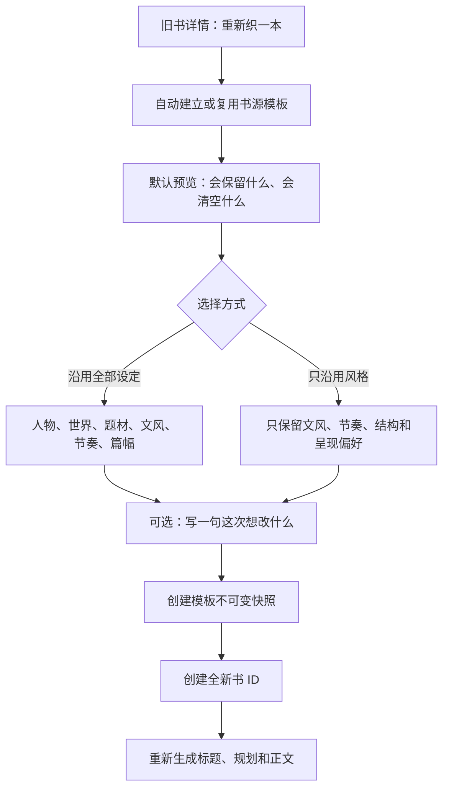
```mermaid
flowchart TD
    A["旧书详情：重新织一本"] --> B["自动建立或复用书源模板"]
    B --> C["默认预览：会保留什么、会清空什么"]
    C --> D{"选择方式"}
    D -->|"沿用全部设定"| E["人物、世界、题材、文风、节奏、篇幅"]
    D -->|"只沿用风格"| F["只保留文风、节奏、结构和呈现偏好"]
    E --> G["可选：写一句这次想改什么"]
    F --> G
    G --> H["创建模板不可变快照"]
    H --> I["创建全新书 ID"]
    I --> J["重新生成标题、规划和正文"]
```

默认不复制：旧标题、正文、章节运行摘要、人物运行状态、伏笔运行状态、请求日志、失败信息、用量记录、API 密钥。用户不必先把模板手工存入模板库；系统在背后完成并记录来源。

## 5. 三个容易混淆的动作

| 用户意图 | 动作 | 结果 |
|---|---|---|
| 方向不满意，想用同一套设定再写一本 | 模板新书 | 新书 ID，从标题和规划重新生成，不复制旧正文 |
| 对前半本满意，想从某章走另一条剧情 | 当前书分支 | 复制截至分支点的正文和状态为新书，之后重新规划 |
| 只是不喜欢某一章的写法 | 重试本章 | 在原书生成候选章节版本，确认后才替换当前版本 |

界面禁止把三者都叫“重新生成”。

## 6. 编辑已完成章节

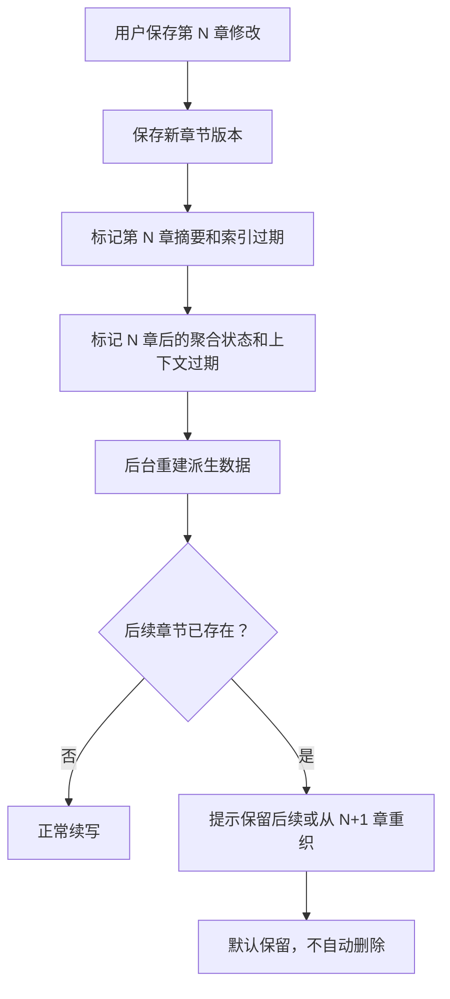
```mermaid
flowchart TD
    A["用户保存第 N 章修改"] --> B["保存新章节版本"]
    B --> C["标记第 N 章摘要和索引过期"]
    C --> D["标记 N 章后的聚合状态和上下文过期"]
    D --> E["后台重建派生数据"]
    E --> F{"后续章节已存在？"}
    F -->|"否"| G["正常续写"]
    F -->|"是"| H["提示保留后续或从 N+1 章重织"]
    H --> I["默认保留，不自动删除"]
```

## 7. 中断和恢复

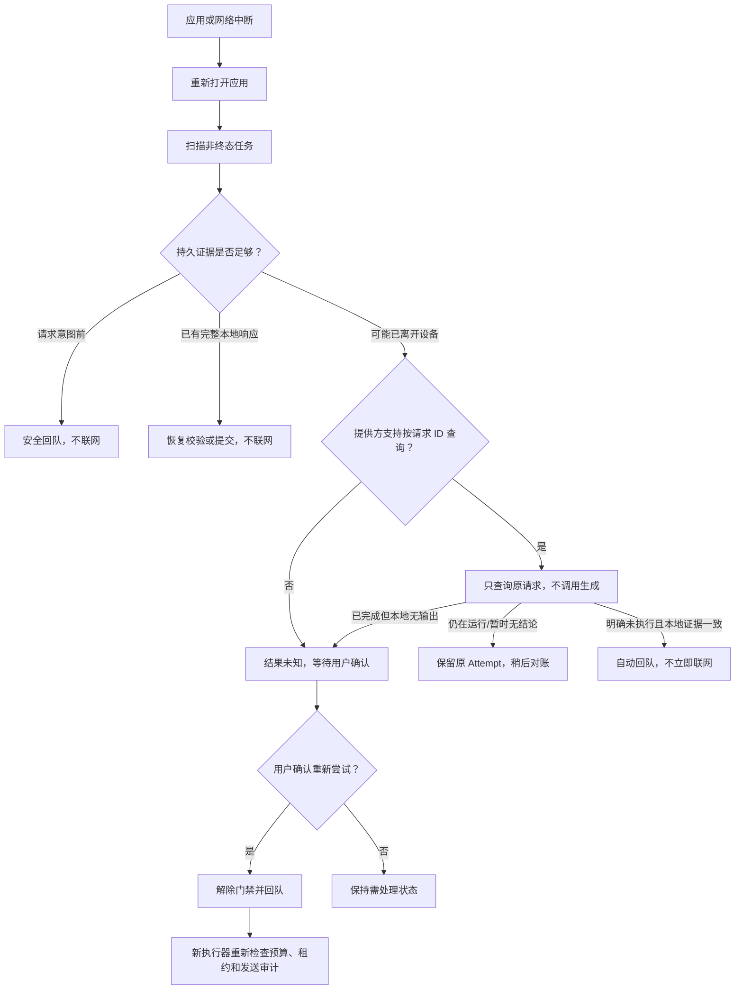
```mermaid
flowchart TD
    A["应用或网络中断"] --> B["重新打开应用"]
    B --> C["扫描非终态任务"]
    C --> D{"持久证据是否足够？"}
    D -->|"请求意图前"| E["安全回队，不联网"]
    D -->|"已有完整本地响应"| F["恢复校验或提交，不联网"]
    D -->|"可能已离开设备"| G{"提供方支持按请求 ID 查询？"}
    G -->|"是"| H["只查询原请求，不调用生成"]
    G -->|"否"| I["结果未知，等待用户确认"]
    H -->|"仍在运行/暂时无结论"| J["保留原 Attempt，稍后对账"]
    H -->|"明确未执行且本地证据一致"| K["自动回队，不立即联网"]
    H -->|"已完成但本地无输出"| I
    I --> L{"用户确认重新尝试？"}
    L -->|"是"| M["解除门禁并回队"]
    L -->|"否"| N["保持需处理状态"]
    M --> O["新执行器重新检查预算、租约和发送审计"]
```

默认界面只显示一个首选动作。查询、证据比对和本地恢复自动完成；只有系统无法证明不会重复请求时才要求用户参与。

## 8. 备份和恢复

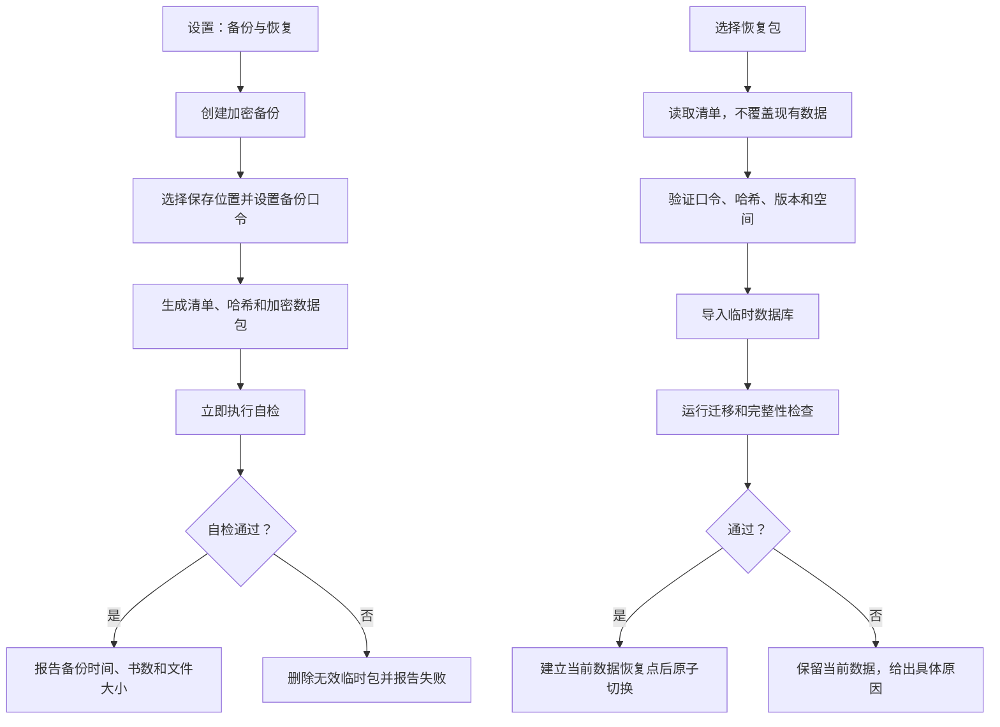
```mermaid
flowchart TD
    A["设置：备份与恢复"] --> B["创建加密备份"]
    B --> C["选择保存位置并设置备份口令"]
    C --> D["生成清单、哈希和加密数据包"]
    D --> E["立即执行自检"]
    E --> F{"自检通过？"}
    F -->|"是"| G["报告备份时间、书数和文件大小"]
    F -->|"否"| H["删除无效临时包并报告失败"]

    I["选择恢复包"] --> J["读取清单，不覆盖现有数据"]
    J --> K["验证口令、哈希、版本和空间"]
    K --> L["导入临时数据库"]
    L --> M["运行迁移和完整性检查"]
    M --> N{"通过？"}
    N -->|"是"| O["建立当前数据恢复点后原子切换"]
    N -->|"否"| P["保留当前数据，给出具体原因"]
```

## 9. 前台生成、通知控制和系统限时

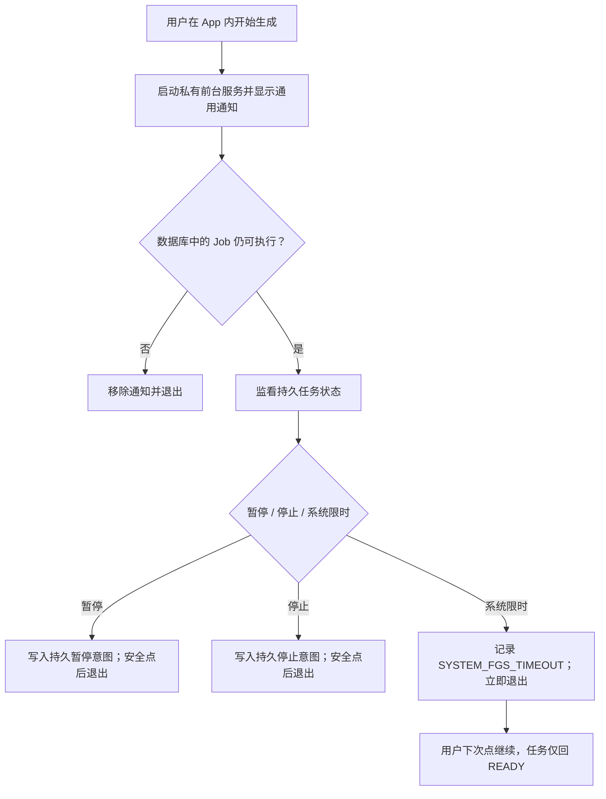
```mermaid
flowchart TD
    A["用户在 App 内开始生成"] --> B["启动私有前台服务并显示通用通知"]
    B --> C{"数据库中的 Job 仍可执行？"}
    C -->|"否"| D["移除通知并退出"]
    C -->|"是"| E["监看持久任务状态"]
    E --> F{"暂停 / 停止 / 系统限时"}
    F -->|"暂停"| G["写入持久暂停意图；安全点后退出"]
    F -->|"停止"| H["写入持久停止意图；安全点后退出"]
    F -->|"系统限时"| I["记录 SYSTEM_FGS_TIMEOUT；立即退出"]
    I --> J["用户下次点继续，任务仅回 READY"]
```

- 通知动作不直接调用模型，也不把“按钮已点”冒充“安全点已完成”。
- 系统限时暂停与用户暂停使用不同原因，界面可解释为“系统暂时停止了后台创作”；它可恢复，但恢复不立即联网。
- 正在校验或提交的本地原子工作可按既有安全点规则完成；服务自身最迟按 Android 回调宽限及时退出，持久控制由应用级协调器继续落盘。

## 10. 无感恢复与维护

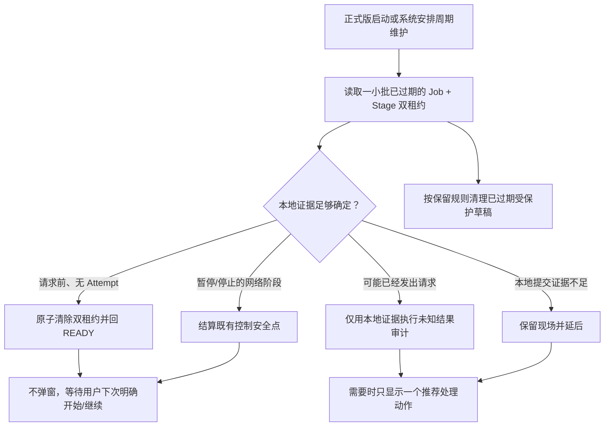
```mermaid
flowchart TD
    A["正式版启动或系统安排周期维护"] --> B["读取一小批已过期的 Job + Stage 双租约"]
    B --> C{"本地证据足够确定？"}
    C -->|"请求前、无 Attempt"| D["原子清除双租约并回 READY"]
    C -->|"可能已经发出请求"| E["仅用本地证据执行未知结果审计"]
    C -->|"暂停/停止的网络阶段"| F["结算既有控制安全点"]
    C -->|"本地提交证据不足"| G["保留现场并延后"]
    D --> H["不弹窗，等待用户下次明确开始/继续"]
    E --> I["需要时只显示一个推荐处理动作"]
    F --> H
    G --> I
    B --> J["按保留规则清理已过期受保护草稿"]
```

- 全流程没有“立即联网”分支；网络是否连接不影响维护任务是否可运行。
- 重复启动只保留一个启动检查和一个周期任务，用户不需要管理队列。
- 自动回到 `READY` 仅表示本地任务可再次被领取，不代表已经开始新请求；预算、数据目的地、租约和发送审计仍需重新通过。

## 11. 创建快照到阶段输入

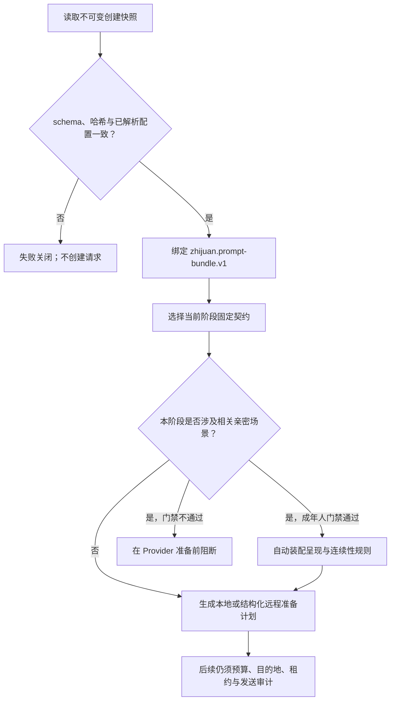
```mermaid
flowchart TD
    A["读取不可变创建快照"] --> B{"schema、哈希与已解析配置一致？"}
    B -->|"否"| C["失败关闭；不创建请求"]
    B -->|"是"| D["绑定 zhijuan.prompt-bundle.v1"]
    D --> E["选择当前阶段固定契约"]
    E --> F{"本阶段是否涉及相关亲密场景？"}
    F -->|"否"| G["生成本地或结构化远程准备计划"]
    F -->|"是，成年人门禁通过"| H["自动装配呈现与连续性规则"]
    F -->|"是，门禁不通过"| I["在 Provider 准备前阻断"]
    H --> G
    G --> J["后续仍须预算、目的地、租约与发送审计"]
```

- 用户不需要看到 Prompt Bundle、schema 或阶段层级；默认创建流程仍只有一句设想和一次开始动作。
- 未写年龄的新建虚构人物由种子/圣经阶段自动补明确成年事实；只有明确冲突或不允许自动处理的情况才需要用户处理。
- TASK-051 已接入首批结构化阶段结果，但仅由本地假 Provider 驱动；App 确认页仍不会发起真实请求。

## 12. 初始规划自动流程

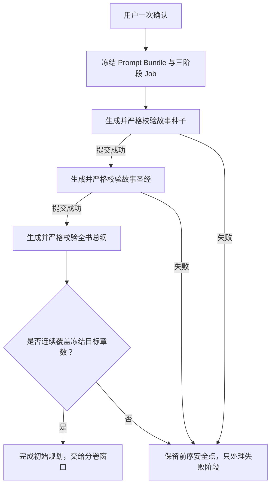
```mermaid
flowchart TD
    A["用户一次确认"] --> B["冻结 Prompt Bundle 与三阶段 Job"]
    B --> C["生成并严格校验故事种子"]
    C -->|"提交成功"| D["生成并严格校验故事圣经"]
    D -->|"提交成功"| E["生成并严格校验全书总纲"]
    E --> F{"是否连续覆盖冻结目标章数？"}
    F -->|"是"| G["完成初始规划，交给分卷窗口"]
    F -->|"否"| H["保留前序安全点，只处理失败阶段"]
    C -->|"失败"| H
    D -->|"失败"| H
```

- 默认只给用户一个进度和一个必要时的推荐动作；不要求用户看到或选择三个 schema。
- 任何恢复都从数据库中的当前 Stage、最新 Attempt、加密草稿和不可变前序结果解释现场，不从界面内存猜测。
- TASK-052 从已成功总纲中按有限窗口展开分卷与近期开章，不一次规划全部 10,000 章。

## 13. 分卷与自动补窗流程

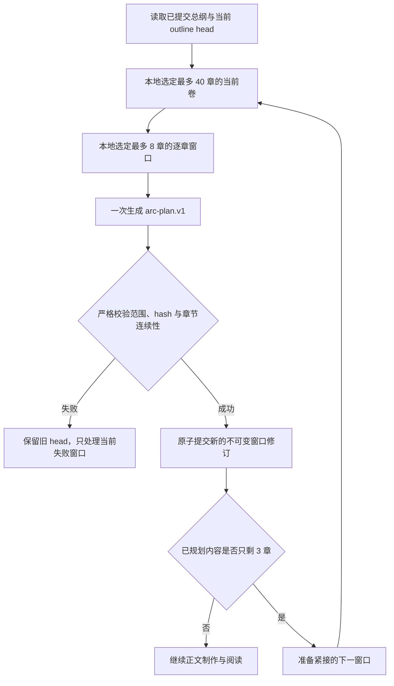
```mermaid
flowchart TD
    A["读取已提交总纲与当前 outline head"] --> B["本地选定最多 40 章的当前卷"]
    B --> C["本地选定最多 8 章的逐章窗口"]
    C --> D["一次生成 arc-plan.v1"]
    D --> E{"严格校验范围、hash 与章节连续性"}
    E -->|"失败"| F["保留旧 head，只处理当前失败窗口"]
    E -->|"成功"| G["原子提交新的不可变窗口修订"]
    G --> H{"已规划内容是否只剩 3 章"}
    H -->|"否"| I["继续正文制作与阅读"]
    H -->|"是"| J["准备紧接的下一窗口"]
    J --> B
```

- 默认不弹出“是否继续规划”或窗口大小选项；本地规则自动选择范围。
- 相同成功窗口的恢复只回读旧结果。若当前 head 已由另一执行器推进，旧窗口提交失败关闭，不能覆盖较新的计划。
- TASK-052 只提供确定性补窗判断和可靠持久化；真正的后台触发时机在后续生成循环接入。

## 14. 第一章快车道流程

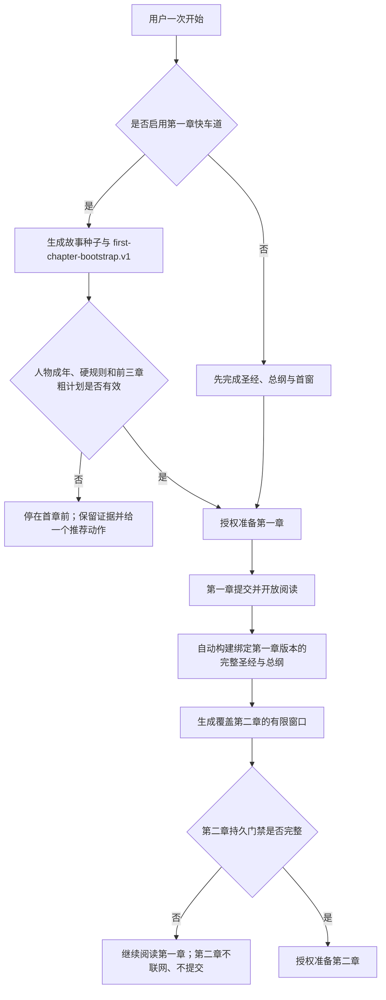
```mermaid
flowchart TD
    A["用户一次开始"] --> B{"是否启用第一章快车道"}
    B -->|"是"| C["生成故事种子与 first-chapter-bootstrap.v1"]
    C --> D{"人物成年、硬规则和前三章粗计划是否有效"}
    D -->|"否"| E["停在首章前；保留证据并给一个推荐动作"]
    D -->|"是"| F["授权准备第一章"]
    F --> G["第一章提交并开放阅读"]
    G --> H["自动构建绑定第一章版本的完整圣经与总纲"]
    H --> I["生成覆盖第二章的有限窗口"]
    I --> J{"第二章持久门禁是否完整"}
    J -->|"否"| K["继续阅读第一章；第二章不联网、不提交"]
    J -->|"是"| L["授权准备第二章"]
    B -->|"否"| M["先完成圣经、总纲与首窗"]
    M --> F
```

- 用户不需要逐项确认最小人物表、三章粗计划或规划适配；正常情况下只看到自然语言进度。
- 第一章提交后发生的规划必须适配已读正文，系统不能为了让新计划“看起来一致”而静默替换第一章。
- 第二章门禁读取数据库中的成功阶段、不可变修订、窗口父链和第一章当前版本；界面状态或内存布尔值不能放行。

## 15. 章前上下文自动组装流程

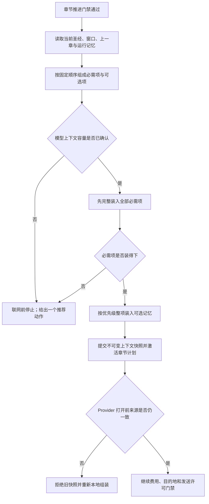
```mermaid
flowchart TD
    A["章节推进门禁通过"] --> B["读取当前圣经、窗口、上一章与运行记忆"]
    B --> C["按固定顺序组成必需项与可选项"]
    C --> D{"模型上下文容量是否已确认"}
    D -->|"否"| E["联网前停止；给出一个推荐动作"]
    D -->|"是"| F["先完整装入全部必需项"]
    F --> G{"必需项是否装得下"}
    G -->|"否"| E
    G -->|"是"| H["按优先级整项装入可选记忆"]
    H --> I["提交不可变上下文快照并激活章节计划"]
    I --> J{"Provider 打开前来源是否仍一致"}
    J -->|"否"| K["拒绝旧快照并重新本地组装"]
    J -->|"是"| L["继续费用、目的地和发送许可门禁"]
```

- 整个成功路径不增加默认页面操作；用户只看到“正在整理本章资料”等自然语言状态。
- 可选材料只能整项保留或整项省略，不能把一条时间线、人物事实或伏笔裁成残句。
- 本地组装不联网、不计费、不创建 Attempt；阻断发生在任何 Provider 连接之前。

## 16. 章节正文与自动续接流程

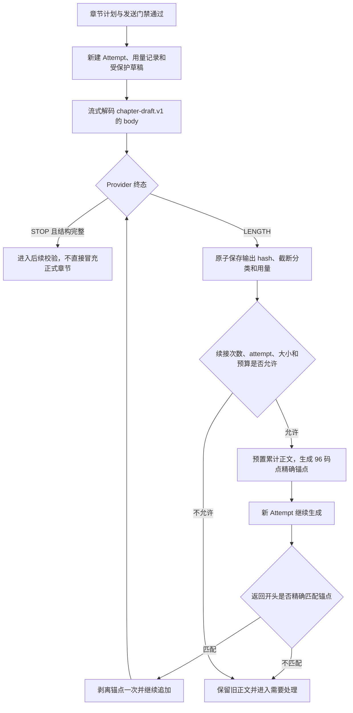
```mermaid
flowchart TD
    A["章节计划与发送门禁通过"] --> B["新建 Attempt、用量记录和受保护草稿"]
    B --> C["流式解码 chapter-draft.v1 的 body"]
    C --> D{"Provider 终态"}
    D -->|"STOP 且结构完整"| E["进入后续校验，不直接冒充正式章节"]
    D -->|"LENGTH"| F["原子保存输出 hash、截断分类和用量"]
    F --> G{"续接次数、attempt、大小和预算是否允许"}
    G -->|"允许"| H["预置累计正文，生成 96 码点精确锚点"]
    H --> I["新 Attempt 继续生成"]
    I --> J{"返回开头是否精确匹配锚点"}
    J -->|"匹配"| K["剥离锚点一次并继续追加"]
    K --> D
    J -->|"不匹配"| L["保留旧正文并进入需要处理"]
    G -->|"不允许"| L
```

- 正常路径不增加“是否继续”的弹窗；最多 3 次自动续接均由持久规则完成，重启不会重置次数。
- 每次续接独立计费、独立审计，累计正文通过新受保护草稿承接；父草稿不被原地篡改。
- 进程在终态落库后退出时，本地恢复器完成同一结算，不联网、不重发；只有无法证明连续或达到硬限制时才让用户参与。
- 当前流程完成的是正文底层安全闭环。正式章节还要经过 TASK-056/057 契约对应的记忆与追踪候选、TASK-058 检查以及 TASK-059 的有限修订/提交流程；阅读界面不能提前展示未提交草稿为正式内容。

## 17. 章节记忆自动提取流程

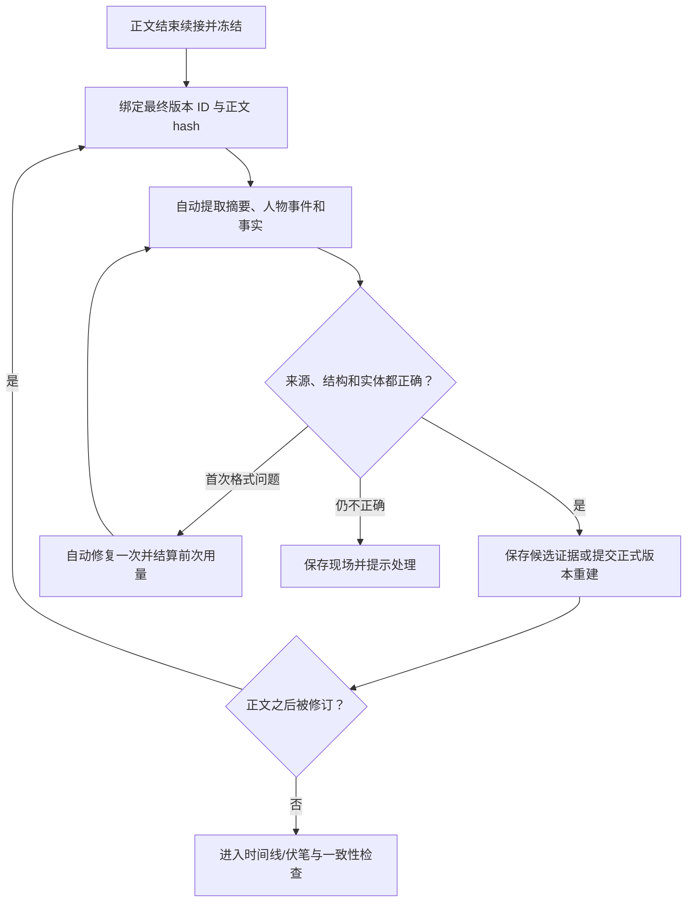
```mermaid
flowchart TD
    A["正文结束续接并冻结"] --> B["绑定最终版本 ID 与正文 hash"]
    B --> C["自动提取摘要、人物事件和事实"]
    C --> D{"来源、结构和实体都正确？"}
    D -->|"是"| E["保存候选证据或提交正式版本重建"]
    D -->|"首次格式问题"| F["自动修复一次并结算前次用量"]
    F --> C
    D -->|"仍不正确"| G["保存现场并提示处理"]
    E --> H{"正文之后被修订？"}
    H -->|"是"| B
    H -->|"否"| I["进入时间线/伏笔与一致性检查"]
```

- 正常用户不新增操作；来源仍有效时自动继续。
- 记忆重建在 Provider 打开前和提交前复核当前正式版本，换版本时旧请求 0 次联网。
- 正常候选提取只有在 TASK-059 与同 hash 正文原子提交后才成为正式记忆，避免修订前结果污染后续章节。

## 18. 一致性检查与退修分流

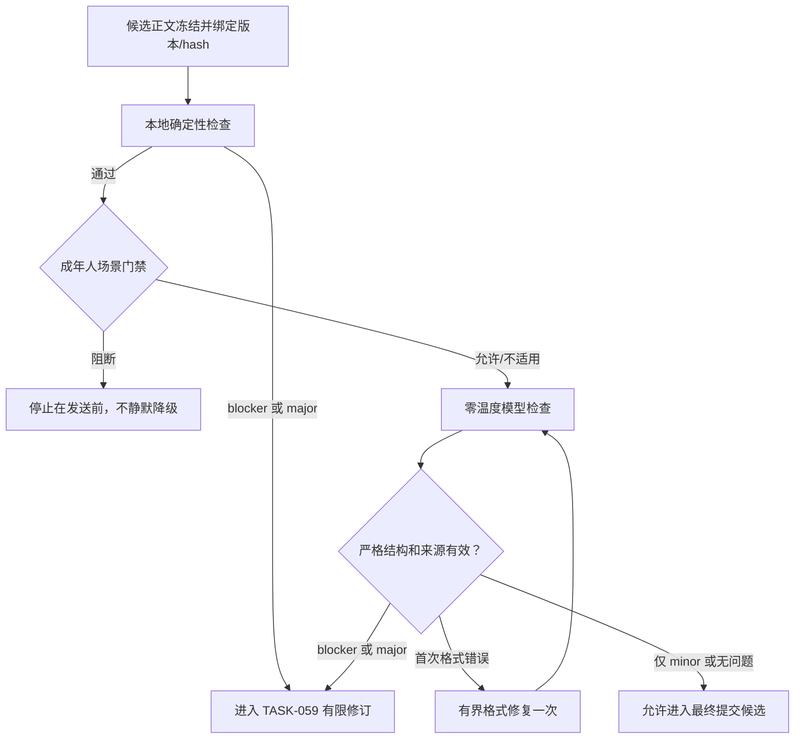
```mermaid
flowchart TD
    A["候选正文冻结并绑定版本/hash"] --> B["本地确定性检查"]
    B -->|"blocker 或 major"| G["进入 TASK-059 有限修订"]
    B -->|"通过"| C{"成年人场景门禁"}
    C -->|"阻断"| H["停止在发送前，不静默降级"]
    C -->|"允许/不适用"| D["零温度模型检查"]
    D --> E{"严格结构和来源有效？"}
    E -->|"首次格式错误"| F["有界格式修复一次"]
    F --> D
    E -->|"blocker 或 major"| G
    E -->|"仅 minor 或无问题"| I["允许进入最终提交候选"]
```

- 用户不需要审核 23 项检查，也不需要逐场点击确认；系统只在无法安全继续或有限修订耗尽时显示一个主操作。
- 严格场景的每个关键过程节点必须按冻结顺序返回 COVERED/MISSING，不能只给一个笼统“通过”分数。
- 检查报告只保存问题码、严重度、码点位置、已知对象 ID 和固定修订动作，不保存正文证据摘录。
- TASK-058 到“允许提交候选/必须退修”为止；TASK-059 才能真正修订并把正文与派生数据原子发布。

## 19. 时间线与伏笔自动投影流程

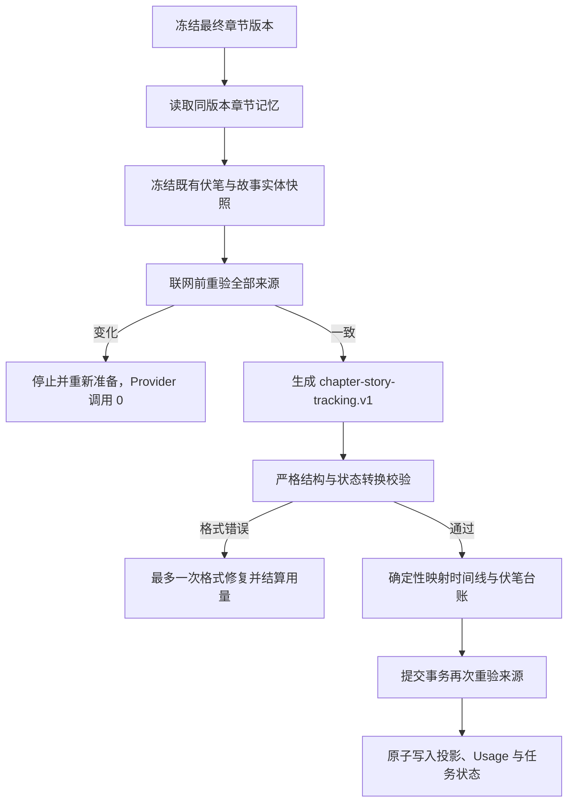
```mermaid
flowchart TD
    A["冻结最终章节版本"] --> B["读取同版本章节记忆"]
    B --> C["冻结既有伏笔与故事实体快照"]
    C --> D["联网前重验全部来源"]
    D -->|变化| X["停止并重新准备，Provider 调用 0"]
    D -->|一致| E["生成 chapter-story-tracking.v1"]
    E --> F["严格结构与状态转换校验"]
    F -->|格式错误| G["最多一次格式修复并结算用量"]
    F -->|通过| H["确定性映射时间线与伏笔台账"]
    H --> I["提交事务再次重验来源"]
    I --> J["原子写入投影、Usage 与任务状态"]
```

- 正常路径不新增用户操作；只有来源冲突、契约失败或硬上限触发时才进入需要处理。
- 同一伏笔在同一章最多变化一次；旧状态必须与数据库快照完全相同，CAS 失败整笔回滚。
- 编辑较早章节后，受该章节中间转换影响的伏笔会先失效。TASK-061 接入整段重建前，系统拒绝跳章修补，避免生成一份表面完整但因果链错误的台账。
