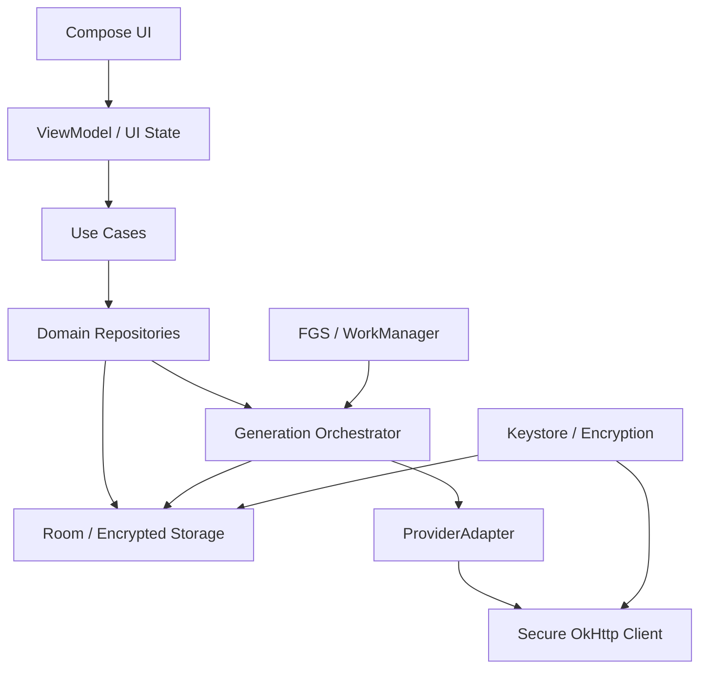

# 织卷技术架构

## 1. 技术基线

- Kotlin；
- Jetpack Compose + Material 3（建立织卷自有 design tokens）；
- Navigation Compose；
- Room + SQLite FTS；
- DataStore 仅保存非敏感轻量偏好；
- Android Keystore + 应用加密层；
- OkHttp + kotlinx.serialization；
- WorkManager 负责可延迟维护任务；
- Foreground Service 只承载用户明确启动、当前可感知的生成工作；
- Kotlin Coroutines + Flow；
- Hilt 或 Koin 二选一，进入编码前在 ADR 确定，禁止混用。

## 2. 架构原则

- UI 不持有网络请求和生成真状态；数据库是可恢复任务的事实来源。
- 领域层不知道 OpenAI、Anthropic 等具体请求格式。
- 正式章节不可被流式增量直接覆盖。
- 每个外部请求前先写“意图记录”，返回后再写结果，支持崩溃审计。
- API 密钥不进入 Room；正文不进入普通日志；价格表不硬编码到业务逻辑。
- Android 调度能力只作为执行机会，不作为任务状态本身。

## 3. 模块建议

```text
:app
:core:model              领域枚举、值对象、错误
:core:database           Room、迁移、FTS、事务
:core:security           Keystore、字段/文件加密、脱敏
:core:backup             分块认证备份、临时发布、原子恢复
:core:network            OkHttp、安全策略、流解析基础
:core:diagnostics        结构化低敏事件、哈希关联标识、加密滚动存储
:core:designsystem       主题、排版、通用组件
:core:testing            假时钟、假网络、夹具
:provider:common         ProviderAdapter、能力、请求和标准流事件契约
:provider:capability-storage  能力证据与 Room 的映射桥接
:provider:transport      Secret Store、安全 OkHttp、取消、响应边界与加密诊断组装
:provider:openai-chat    OpenAI/DeepSeek/中转站 Chat Completions 兼容
:provider:openai-responses  OpenAI Responses（TASK-022）
:provider:anthropic      Messages
:provider:gemini         generateContent
:provider:ollama         native + compatibility
:feature:onboarding
:feature:library
:feature:createbook
:feature:reader
:feature:generation       已落地审计后 Provider 执行、独立租约心跳与加密流草稿桥接
:feature:templates
:feature:connections
:feature:usage
:feature:backup
:feature:settings
:feature:diagnostics
```

MVP 可以先在一个 Gradle 工程内按 package 建立这些边界，再逐步拆模块；但依赖方向从第一天保持一致。

## 4. 层次与依赖



允许依赖：feature → domain/core；provider → provider-common/core-network；能力存储桥接 → provider-common/core-database；app 负责组装。禁止 core 反向依赖 feature 或服务商适配器。

## 5. 生成编排

`GenerationOrchestrator` 每次只推进一个可执行阶段：

1. 从数据库领取 `READY` 阶段并原子变为 `PREPARING`；
2. 校验依赖版本、连接、能力和预算；
3. 先分配受保护草稿引用，并与 `RequestIntent`、Attempt、未知 Usage 和 Stage 原子绑定；
4. 一次性发送授权通过持久证据与租约复核后，由受控执行器打开 adapter；增量只写入加密草稿；
5. 标准化结束原因、usage 和错误；
6. 解析/检查输出；
7. 在事务中提交输出、派生数据、用量和下一阶段；
8. 释放任务租约。

任务租约包含 owner、获得时间和心跳。进程重启后，过期租约可被回收；未过期的租约不允许第二执行器并行处理。

## 6. Android 后台执行策略

生成整部长篇不能依赖一个永久运行服务。策略：

- 用户在前台点击生成：启动前台服务并显示持续通知；
- 设备/系统允许时连续处理若干章；
- 应用转后台后遵守前台服务类型和时限；接近系统时限时安全停在检查点；
- WorkManager 负责本地恢复审计、重建索引、备份提醒等可延迟工作；网络恢复信号只能让任务重新具备领取条件，不能由 Worker 直接补发付费请求；
- 重启后不自动产生新的付费请求，除非用户开启“允许自动继续”，且预算和系统条件满足；
- 电量低、温度高、存储不足时暂停非必要维护；
- UI 总能从数据库读出“为什么停下”和“如何继续”。

Android 15+ 对部分前台服务类型存在 24 小时窗口内累计 6 小时时限，因此必须实现 `onTimeout` 并及时 `stopSelf`，不能把几十小时生成计划绑定到服务生命周期。

### M0.6 Android 15 实验结论

- Debug 探针把 `dataSync` 时限临时设为 3,000ms，系统约 3,642ms 后调用 `Service.onTimeout(startId, fgsType)`；服务记录检查点后立即移除前台通知并 `stopSelf(startId)`，无 ANR。
- 服务使用 `START_NOT_STICKY`；进程被 `am force-stop` 后确实消失，系统不会把服务内存当作可恢复状态。
- 重新启动 App 时，启动期探针发现持久状态仍为 `RUNNING`，只改为 `RECOVERY_REQUIRED`；不会直接补发付费请求。
- 正式实现必须先检查 `RequestIntent`、远程请求结果、预算和租约，再决定继续哪一个阶段。
- 探针只在 Debug source set，Release Manifest 对探针 service/provider 和调试 dataSync 权限均为 0 命中。

以上只证明 API 35 模拟器行为；物理厂商系统、普通系统回收、重启广播和 WorkManager 约束仍需后续实机验证。

### TASK-048 正式前台服务结论

- 主清单声明 `FOREGROUND_SERVICE`、`FOREGROUND_SERVICE_DATA_SYNC` 和 `POST_NOTIFICATIONS`；正式服务 `exported=false`、`foregroundServiceType=dataSync`、`stopWithTask=false`、`START_NOT_STICKY`。
- `onStartCommand` 在解析命令前先进入前台，避免超过系统启动宽限；非法 action/Job ID、任务缺失或终态均移除通知并退出。一个服务实例只绑定一个 Job。
- 通知使用通用文字、`VISIBILITY_PRIVATE`、不可变显式 `PendingIntent`，仅含暂停/停止；书名、正文、Job ID 和错误原文均不进入可见通知。
- 服务每秒读取数据库状态，不持有另一份任务状态。通知控制和系统超时写入既有持久控制边界，迟到服务/回调不能复活 Job。
- Android 15 API 35 真实系统探针把后台 `dataSync` 时限设为 3,000ms，约 4,648ms 后观察到 `SYSTEM_FGS_TIMEOUT`、Job `PAUSED` 和服务退出；配置在 `finally` 中恢复。探针 receiver 仅存在 Debug，Release 命中为 0。
- 当前服务是生命周期与控制宿主，尚未连接实际章节循环；不得据此宣称已经能生成小说。

### TASK-049 WorkManager 恢复/维护结论

- `ZhijuanApplication` 仅在 Release 自动调用调度器：唯一启动工作延迟 15 秒、策略 `KEEP`；唯一周期工作为 24 小时、6 小时弹性窗口、策略 `UPDATE`，并要求电量和存储不低。两者都保持 `NetworkType.NOT_REQUIRED`。
- Worker 是短时 `CoroutineWorker`，每批默认 50 条、硬上限 100 条；它打开既有加密数据库和受保护 artifact store，执行完一批即关闭，不用长时 Worker 承载小说生成。
- `GenerationMaintenanceOperations` 刻意只有五个本地动作，没有 Provider、传输、连接、预算签发和 `generate`。已有请求统一以 `ProviderRecoveryEvidence.NOT_AVAILABLE` 进入 TASK-047 的保守审计。
- 扫描只接受当前 Stage 与父 Job 的双租约都在 60 秒边界过期的现场。请求前崩溃由一个 Room 事务同时回队 Stage/Job 并释放双租约；并发更新、活动心跳和时间倒退失败关闭。
- 候选按最旧心跳排序且有界；每个候选隔离错误，Worker 总失败最多指数退避重试两次。正常输出只保存计数和 `hasMore`，不保存任何小说或连接标识。
- WorkManager 初始化器、SystemJobService 和 Worker 构造器已经在 R8 Release seeds/mapping 中保留；Release BuildConfig 自动调度为 `true`，Debug/AndroidTest 为 `false`，设备测试通过显式调度避免夹具竞态。
- 当前安全保留项：暂停/停止与本地 `VALIDATING/COMMITTING` 同时崩溃但缺少完整提交证据时只延后。实际阶段执行接入后必须复用 TASK-045/047 的本地恢复许可，不能在维护 Worker 中猜测完成或删除草稿。

## 7. 并发模型

- 默认全 App 同时仅一个付费生成请求；用户可在专家设置提高到 2，但正式版上限固定且警告费用。
- 同一本书的正文阶段严格串行；维护性摘要重建可在不影响当前上下文时并发 1 个。
- 数据库写使用短事务；网络请求绝不持有数据库事务。
- 流式 UI 更新每 50–100ms 合并一次；加密草稿默认每 2 秒或待写数据达到 32 KiB 建立检查点，单阶段明文上限 4 MiB。
- 请求、阶段、章节提交分别用稳定 ID 防重复。

## 8. 存储布局

```text
app internal storage
├─ db/
│  └─ zhijuan.db.enc
├─ content/
│  └─ protected-artifacts/
│     └─ artifact-<randomRef>.zjaf
├─ covers/
│  └─ <bookId>.webp.enc
├─ recovery/
│  └─ pre-migration-<version>.enc
├─ diagnostics/
│  └─ current-log.ref
├─ content/protected-artifacts/
│  └─ artifact-<diagnosticRef>.zjaf
└─ cache/
   └─ expendable files only
```

用户选择的备份/导出位置通过 Storage Access Framework 获得。可丢弃缓存与正式数据严格分开；系统清缓存不能丢书。

### M0.8 备份提交边界

```text
创建：活动快照 -> 内部/目标同目录临时包 -> 完整解密自检 -> 原子发布新备份
恢复：外部备份 -> 活动库同文件系统临时文件 -> schema/引用/哈希校验
     -> 旧库恢复点 -> 原子切换 -> 启动后轻量复检
```

- 加密流按块认证，包头和块位置进入 AAD；错误口令、任意块损坏、截断和尾随字节均失败。
- 活动库切换不允许“删除旧库后复制新库”的降级路径；原子移动不可用时保持旧库并报错。
- SAF 只作为外部输入/输出边界。恢复时不能直接在第三方 DocumentsProvider 上替换活动数据，必须先进入应用内部 staging。
- 正式实现需要由 Room checkpoint/关闭流程得到一致快照，不能只复制仍在写入的数据库主文件而忽略 WAL/SHM。

## 9. 加密边界

- Keystore 生成/保护主密钥包装密钥；
- 数据库使用经审查的 SQLite 加密方案或字段级加密，选型必须以 Room 迁移、FTS 和性能验证为依据；
- 如果 FTS 无法直接处理加密正文，优先只为应用内部建立受保护的派生索引，设备锁定/应用锁定时不可查询；
- 临时草稿、封面、恢复点和日志单独加密；
- API 密钥作为小型 secret 单独加密并通过 `secretRefId` 引用；
- 备份使用用户口令派生的独立密钥，不导出设备 Keystore 主密钥。

正式选型前需做安全 ADR 和实机基准，不能自行拼接加密算法。

### M1.6 正文、草稿与恢复点的落地边界

- 正式 `ChapterVersion.content` 仍是 Room 内的唯一正文事实源，整个主库、WAL 和 SHM 由 SQLCipher 保护；不额外复制一份正文文件，避免正文版本和引用分叉。
- 流式草稿和数据库恢复点使用 `AndroidProtectedArtifactStore`。文件名只含随机 `artifactRefId`，真实任务/书/章节关系只通过加密数据库中的引用建立，不把业务 ID 暴露在路径中。
- 每个 artifact 使用独立 Android Keystore AES-256-GCM 密钥；格式头、类型、随机引用、修订号、keyVersion 和时间由独立认证标签保护。
- 内容默认按 64 KiB 分块认证，每块使用新随机 IV，并把格式头摘要、连续块序号和明文长度放入 AAD；加密尾记录绑定总块数、总字节数和 SHA-256，截断、重排、插入、尾随字节和任意位篡改均失败。
- 草稿检查点使用 `AtomicFile` 原子替换，并要求调用方提供 `expectedRevision`；旧执行器不能覆盖新检查点，写入中断会恢复上一份完整密文。
- 大恢复点通过 InputStream/OutputStream 有界传输，单次读取不超过 64 KiB；普通草稿内存读取硬限制为 4 MiB，并只通过可关闭、可清零 lease 暂借。
- 锁定会清零现有正文草稿 lease 并拒绝内容和元数据访问；删除 artifact 时先删除独立 Keystore key，再清理密文文件，使残留密文不可再解密。
- 正式正文测试在数据库开启和关闭两个时点扫描主库及所有同名 WAL/SHM 文件；草稿/恢复点测试扫描全部 artifact 与 AtomicFile 备份文件，测试明文均为 0 命中。

TASK-043 已完成 `streamDraftRef` 生成管线接线：发送前分配随机 UUID artifact 并写入 RequestIntent；默认每 2 秒或待写 32 KiB 原子换版；旧修订写者被栅栏；成功提交后保留 24 小时，失败/未知结果保留 7 天，孤立 artifact 保留 24 小时。目录扫描同时识别 `AtomicFile` 的基础文件、`.bak` 和 `.new`，避免崩溃后只剩备份文件时漏掉可恢复草稿。迁移前一致数据库快照、恢复点清单和原子回切仍由 TASK-100~103 完成；TASK-043 不提前宣称章节已正式提交。

## 10. 原子性边界

### 10.1 提交章节事务

同一事务：

- 插入 `ChapterVersion`；
- 更新 `Chapter.currentVersionId/status`；
- 插入结构化摘要/事实/人物事件/伏笔更新；
- 记录 `GenerationStage` 终态；
- 写入 `UsageLedger`；
- 激活创建 Job 时已冻结的下一阶段；
- 更新书的进度。

TASK-045 已落地此边界：`ChapterGenerationCommitRepository` 只接收校验成功后签发的内部 permit，并在一个 SQLCipher/Room 事务中完成上述写入。Attempt 审计与 Usage 在章节提交前已存在，因此不存在“正文先成功、审计日志稍后补写”的旁路；任何提交内写入失败均整笔回滚。

### 10.2 创建模板新书事务

- 建立/复用模板修订；
- 创建使用快照；
- 创建书和来源关系；
- 创建生成任务与首阶段；
- 不在事务中发网络请求。

### 10.3 TASK-036 极简创建事务

1. UI 原样提交 `MinimalBookDraft`，不在表单层丢弃原始空白或改写中文标点；
2. `CreationStandardizerV1` 统一生成 NFC 标准化输入、规则推导标题、显式/关键词/默认题材来源、题材内容基线、呈现完整配置和当前 connection/model 引用；
3. 固定顺序的结构化载荷计算 SHA-256；随机书 ID、快照 ID 和时间不参与内容哈希；
4. `BookCreationRepository` 在单一 Room 事务中插入不可变 `BookCreationSnapshot` 与引用它的 `Book`；失败时不得留下孤立快照；
5. schema v7 同时在 DAO 与 SQLite 触发器检查篇幅 schema v1 的 80/300/301 下限，旧 schema0 数据只兼容读取；
6. 本事务不创建请求意图、不调用 Provider；`promptBundleVersion` 记录明确未分配哨兵，后续生成 Job 必须冻结真实版本。

### 10.4 TASK-037 冻结确认读模型

1. `BookCreationRepository.create` 在事务成功后立即按 `bookId` 回读书与快照，无法回读则不返回假成功；
2. App 导航只持久保存 `pendingBookId`，确认页进入或进程重建时调用 `findCreationSummary`，不复用可变 UI 草稿；
3. 映射层只从快照中的 `modelPreferenceJson` 读取非秘密的模型 ID；缺失、空白或畸形 JSON 失败关闭，不回退到当前连接猜测；
4. 确认请求只携带 `bookId`、`snapshotId`、64 位内容哈希和费用可信状态。UI 再次比对这些冻结引用后才接受一次确认；
5. 当前 `PRICE_CATALOG_UNAVAILABLE` 状态禁止构造数字金额。确认成功只显示本地状态并锁定按钮，不创建 Job/Stage/RequestIntent，不调用 Provider；
6. 真实费用估算、token 硬上限、外部 host 确认和生成启动仍分别由 TASK-080~085、TASK-110 与 E4 完成，任何一层不得把本占位确认当成联网授权。

### 10.5 TASK-040 持久 Job/Stage 转换边界

1. `core:task` 对 Job 和 Stage 的每个“状态 × 事件”组合做穷举测试；只有白名单中的 13 个 Job 转换和 21 个 Stage 转换合法，新增枚举值若未补矩阵会立即失败；
2. `GenerationDao` 在 Room 事务中先读当前状态、校验调用方期望值和单调时间，再用 compare-and-set 更新；过期写者、并发竞争和时钟倒退都不能覆盖新状态；
3. Job 只有在数据库中所有 Stage 都为 `SUCCEEDED` 时才能进入 `COMPLETED`，不能用一个上层布尔值提前结束；
4. 进入 READY/等待/需处理/恢复/终态时清除对应租约；运行、暂停中和提交中的阶段继续保留租约，其心跳和过期回收已由 TASK-041 接入；
5. 普通 Stage 转换禁止冒充专用原子事务：领取租约、冻结 RequestIntent、请求发送、流结果、未知结果、提交成功和父任务停止都必须走各自专用事务；
6. 重试必须带标准错误和不早于当前时间的 `nextRetryAt`，到时前不能恢复；阻断/需处理状态必须带标准错误，恢复后清除旧错误；
7. `GenerationStateRepository` 只向后续执行器暴露必要的持久状态快照和安全转换，不暴露 Room 实体、底层 CAS 或请求正文。

### 10.6 TASK-041 租约凭证、心跳与安全回收

1. 每次 Job/Stage 领取返回 `GenerationLeaseToken(ownerId, acquiredAt)`；领取时间必须严格晚于当前持久时间，避免同一 owner 在同一时刻形成可重放凭证；
2. 默认每 15 秒心跳，连续 60 秒没有有效心跳即到期；恰好到达 60 秒视为到期。时钟倒退失败关闭，已到期的迟到心跳不能续活；
3. 心跳和所有运行中状态推进都比较 owner、领取时间、当前状态和时间。租约被清除或新执行器领取后，旧执行器的心跳、阻断、发送结果或完成动作均失败；
4. `PREPARING` 尚未产生 RequestIntent，过期后可通过显式 `LEASE_EXPIRED_BEFORE_REQUEST` 事务回到 READY；该转换加入 Stage 全矩阵，合法转换数由 21 增至 22；
5. `REQUEST_INTENT_RECORDED/STREAMING/VALIDATING/COMMITTING` 已经存在请求、输出或计费不确定性，过期扫描只返回 `RECOVERY_AUDIT_REQUIRED`，不清租约、不新建 attempt、不盲目重试；TASK-047 已用 Attempt、Usage、加密草稿、远端请求引用和本地提交事实完成保守裁决；
6. `GenerationStateRepository` 公开领取、心跳、过期检查与回收结果，只返回持久投影和租约凭证；Room Entity 与原始更新仍保持模块内可见。

### 10.7 TASK-042 发送前持久审计门

1. 执行器使用 `GenerationRequestAuditRepository.persistBeforeSend` 提交非密钥连接/模型/协议快照、输入 SHA-256、草稿引用、重试父链和当前 Stage 租约；
2. Room 单事务先创建 `INTENT_RECORDED` Attempt，再创建 `UNKNOWN/PROVISIONAL` UsageLedger，最后把 Stage 推进到 `REQUEST_INTENT_RECORDED` 并增加 attemptCount。任一唯一约束、租约、状态或计数失败会整体回滚；
3. 事务提交并回读三项事实后才构造 `PersistedRequestSendPermit`。其构造器和实际 claim 对模块外不可见，默认字符串不包含 attempt/stage/owner/inputHash；
4. `claimForProviderOpen` 在真正交给网络执行器前再次比对 Attempt、Usage、inputHash、attemptNo 和 RequestIntent 时间，再以同一租约凭证刷新 Stage 心跳。租约已过期或现场改变时，凭证被销毁且不会返回联网授权；
5. 一张 permit 只能 claim 一次；请求被接受后，`markRequestSent` 再以相同审计证据和租约原子推进 Attempt/Stage。重复/迟到标记失败，不伪造发送成功；
6. 三类快照必须是有界 JSON Object，递归拒绝 API key、Authorization、cookie、password、access token、client secret 等敏感字段；允许 `secretRefId` 这类不可用引用。正式密钥仍只能在 TASK-021 的 Secret Store 短租借中注入；
7. TASK-043 已把 Provider Adapter 接到受控执行器；该执行器只能消费本审计入口产生的一次性发送授权，不能从 PREPARING 或普通请求对象直接打开网络。

### 10.8 TASK-043 加密流草稿与受控 Provider 入口

1. `GenerationStreamingDraftRepository.prepareBeforeSend` 先创建空的 `STREAM_DRAFT` artifact，再把其随机 UUID 与 RequestIntent、Attempt、未知 Usage 和 Stage 原子绑定；审计失败会清理刚分配的孤立文件；
2. `claimForProviderOpen` 回读并核对数据库中的唯一草稿引用、artifact 类型和租约。外部执行器无法直接调用底层 `persistBeforeSend`、`claimForProviderOpen` 或 `markRequestSent` 绕过此桥接；
3. `AuditedStreamingProviderExecutor` 只有取得 claimed authorization 并一次性打开草稿 buffer 后才调用 `ProviderAdapter.generate`。独立协程按租约间隔心跳，即使 Provider 暂时无事件也不会因 collector 阻塞而漏续租；
4. `Started` 事件后原子推进 Attempt 为 `SENT`、Stage 为 `STREAMING`，随后正文和结构化增量只追加到受保护草稿。开始前 delta、协议乱序、无语义终态 EOF 均失败关闭；
5. 检查点按“2 秒或 32 KiB，先到者”为默认节流，最大明文 4 MiB。每次换版比较 expectedRevision；过期 writer 一旦冲突便自我栅栏并清零内存，不能覆盖新草稿；
6. 正常 `STOP` 终态在独立心跳停止后强制 flush、核对修订与长度、计算草稿 SHA-256，并原子把 Attempt 推进为 `SUCCEEDED`、Stage 推进为 `VALIDATING`；主动暂停/停止由 TASK-046 处理，拒绝、失败和未知结果由 TASK-047 的持久恢复裁决处理；
7. 崩溃扫描可区分需恢复、成功保留、失败/未知保留、孤立、缺失、重复引用和完整性错误。清理前在进程内互斥区再次核对数据库，避免把刚被绑定的孤立 artifact 删除；重复引用和冲突一律不自动删除；
8. 成功保留时间以 Stage 正式提交时间为基准，精确 24 小时后可删；未成功 attempt 精确 7 天后可删；无数据库引用的孤立 artifact 精确 24 小时后可删。真正的章节原子提交和未知结果裁决分别由 TASK-045、047 完成。

### 10.9 TASK-044 严格结构化校验与单次修复

1. `GenerationOutputValidationRepository` 只接受已完全检查点化、修订/长度一致且 SHA-256 与持久 Attempt 相符的最新草稿；默认对象不暴露 artifact 引用或正文；
2. 校验器在解析前执行严格 UTF-8 和有界 JSON 扫描，拒绝重复键（含转义后等价键）、包装/尾随内容、非法数字/代理对，以及字节、深度、节点、成员、数组、字符串和数字长度越界；
3. 根值必须为 object，`schemaVersion` 必须是受支持的数值版本。旧版本只有显式迁移成功并产生当前版本才可继续，未来版本失败关闭；
4. 契约校验只返回最多 64 个有界问题码和静态路径。报告、校验结果、修复计划和请求的默认字符串均不包含原始输出；
5. 第一次且可修复的格式错误把 Attempt 标记 `FORMAT_INVALID`，Stage 进入 `RETRY_WAIT`。修复请求只携带当前 schema、问题码和作为 JSON 字符串数据封装的无效输出，不重放原始创作提示，温度固定为 0；
6. 先前已有格式失败、无剩余 attempt、空/过大/无效 UTF-8 或资源上限错误直接进入 `NEEDS_ACTION`。修复次数从同一 Stage 的持久 Attempt 链计算，进程重启不会重置；
7. 校验成功只推进 `VALIDATING → COMMITTING`，不创建正式章节。超出契约上限的输出仍在全局 4 MiB 草稿硬上限内读出并明确判为不可修复，避免读取层异常把 Stage 留在 `VALIDATING`。

### 10.10 TASK-045 章节原子提交许可与事务

1. `GenerationOutputValidationRepository` 在 `VALIDATING → COMMITTING` 成功后返回不可由模块外伪造的 `ValidatedOutputCommitPermit`，其中绑定最新成功 Attempt、Stage、草稿引用、修订、输出 SHA-256、校验时间和当前租约；默认字符串全部脱敏；
2. `ChapterGenerationCommitRepository` 在事务前复核加密 artifact 的类型、修订和 SHA-256，进入事务后再次核对最新 Attempt、Stage 目标、Job/Book/Chapter 归属、模型快照和当前非过期租约；已成功提交的精确重放可在 24 小时草稿清理后依持久提交证据回读；
3. 单一 Room 事务写入不可变 `ChapterVersion`、章节摘要、人物事件、事实、时间线和新伏笔记录；若替换旧版本，同事务执行既有 stale 级联；随后 CAS 切换 `Chapter.currentVersionId`，更新完成章数和书籍生成摘要；
4. 同一事务把既有 `UsageLedger` 单向结算为 FINAL，以租约 CAS 完成当前 Stage；若有下一阶段，只允许同 Job 内预冻结的 `PENDING` Stage 经 `DEPENDENCIES_SATISFIED` 进入 `READY` 并推进 Job 指针；若没有下一阶段，数据库确认所有 Stage 已成功后才完成 Job；
5. `outputReferenceJson` 只保存 schema、Attempt/hash、章节版本/hash、稳定提交载荷 hash 和下一 Stage ID，不保存正文。载荷 hash 对派生记录按 ID 排序并逐字段编码，不依赖 Kotlin `toString()`，确保升级后仍可可靠判定精确重放；
6. 章节当前版本变化、租约过期、外键/唯一约束失败、并发提交、用量冲突、下一阶段错误或任一 CAS 失败都会抛错并回滚整个事务；正式章节、派生记忆、用量、Stage 与书籍进度不会出现部分成功。

### 10.11 TASK-046 持久生成控制与执行器握手

1. `GenerationControlRepository` 是用户暂停、取消当前章、停止全书和继续的唯一写入口；控制来源使用固定枚举写入 `GenerationJob.pauseOrStopReason`，不保存自由文本；
2. 发送前暂停在一个 Room 事务内把 `PREPARING → READY`、Job `RUNNING → PAUSED` 并清除租约；RequestIntent 已存在后先进入 `PAUSING/STOPPING`，不能假设远程请求尚未打开；
3. `claimForProviderOpen` 把持久证据、父 Job 必须为当前 `RUNNING`、Stage 租约心跳放在同一事务核对。暂停或停止提交后，未 claim 的发送许可不能打开 Provider；
4. 已 claim 的执行器独立轮询持久控制。命中后取消 Provider，强制 flush 加密草稿，再在一个事务中取消 Attempt、把 Usage 结算为 FINAL、回队当前 Stage 或取消所有未完成 Stage，并结束 Job 控制状态；
5. `VALIDATING/COMMITTING` 属于本地原子流水线：暂停允许当前校验/提交走到安全点。有效章提交后下一 Stage 保持 READY 且 Job PAUSED；格式失败先保存错误证据再 PAUSED；末 Stage 成功可直接 COMPLETED；
6. 执行器使用同一互斥序列写 Stage 心跳、请求已发送和流已开始，防止并行数据库提交造成时间戳倒序。控制轮询不持有该锁，不阻塞网络收流；
7. 崩溃时，已持久控制意图不会丢失；活动 RequestIntent/流可在精确租约到期后由恢复入口代执行安全点。未知远程结果由 TASK-047 按持久证据保守裁决，不会因超时或租约到期自动重发。

### 10.12 TASK-047 未知结果恢复与确认门

1. `GenerationUnknownResultRecoveryRepository` 是恢复状态的唯一持久写入口；它在一个 Room 事务中核对最新 Attempt、Usage、Stage、Job、租约和观测时间，再原子决定回队、等待远端、需要用户确认或仅恢复本地结果；
2. `UnknownResultRecoveryPolicy` 是不接触数据库和网络的纯决策层。仅有 RequestIntent、查询不支持/无结论、草稿不可读、已有正文或已知 usage 都不能证明请求未执行；
3. 自动回队必须同时满足：提供方按远端请求 ID 明确确认未执行、请求已有发送证据、加密草稿可读且为空、没有已知 usage。回队只改变持久状态，不打开 Provider；
4. 原请求仍在运行或查询无结论时保留活动 Attempt 与 PROVISIONAL Usage，并把 Stage 置为 `RECOVERY_REQUIRED`、Job 置为带稳定原因的 `NEEDS_ACTION`，供后续对账；
5. 提供方已完成但本地没有输出时，把 Attempt/Stage 置为未知并以提供方证据最终结算 Usage；本地已有完整响应时保留成功 Attempt，只恢复校验/提交；两种路径均不新建请求；
6. 用户确认由专用事务将 `UNKNOWN_RESULT/NEEDS_ACTION` 恢复到 READY。通用 `ISSUE_RESOLVED` 和普通 Stage 转换不能绕过稳定恢复原因；两个并发确认最多一个成功，且确认事务不创建 Attempt；
7. `UnknownResultRecoveryCoordinator` 只有在适配器声明 `STATUS_QUERY` 且数据库保存远端请求引用时才发起一次有界查询。它从不调用 `generate()`；查询超时或异常转成无结论，外部取消正常传播；
8. 当前四个内置远程适配器未宣称不存在的查询能力，全部保持 `NOT_SUPPORTED`。未来接入官方查询端点时只需实现标准结果映射，不改变数据库安全门。

## 11. 配置与版本

独立版本：

- `databaseSchemaVersion`；
- `backupFormatVersion`；
- `templateSchemaVersion`；
- `promptBundleVersion`；
- `capabilityRegistryVersion`；
- `adapterVersion`；
- `contentControlSchemaVersion`。

每个生成结果记录相关版本。更新提示模板不会暗改已经运行中的阶段；运行中任务继续使用开始时冻结的版本或暂停要求重新确认。

## 12. 性能基线

- 章节列表分页/惰性加载，不一次实例化所有 UI 行；
- 正文按章节读取，不把全书拼成一个超大字符串常驻内存；
- 数据库对 `bookId + chapterIndex`、任务状态、模板分类、usage 时间建立索引；
- 备份流式读写，禁止把整包载入内存；
- 大型迁移使用批次并显示进度，但切换数据库前保持旧库可用；
- 使用 Macrobenchmark 测书架启动、章节打开、长目录滚动。

### M0.7 Compose 长内容实验结论

- 20 万字正文按 100 字夹具段落拆为 2,000 个稳定项，`LazyColumn` 在 API 35 x86_64 Debug 模拟器首尾均只组合 4 个可见项；末段直接定位约 95.84 ms，观测 PSS 增量约 7,745 KB。
- 1 万章目录使用 `items(count)`、稳定 key 和 content type，首尾均只组合 13 行；末章直接定位约 146.90 ms，定位后点击状态正确。
- 首次挂载观测约为正文 212.11 ms、目录 400.28 ms。它包含 Debug、测试框架和模拟器开销，只作为回归基线，不作为 60fps 或发布性能达标证明。
- 正式实现沿用“段落窗口化 + 目录惰性化 + 直接跳转”，并把段落预处理移出主线程。进入发布候选前仍需 Macrobenchmark、帧时间/jank、真实中文混合段落和物理中档设备测试。

## 13. 构建与环境

- `debug`：允许假提供方、详细但仍脱敏的诊断；
- `benchmark`：基准配置；
- `release`：关闭网络抓包信任、关闭调试接口、启用收缩和许可证清单；
- 服务器基础地址不写死密钥；
- 签名配置不提交仓库；
- CI 使用测试签名，正式签名仅在受控本地发布流程使用。

### M0.9 网络边界实现

- OkHttp 客户端关闭自动重定向和 `retryOnConnectionFailure`；适配器/编排器必须显式决定重试，并受 attempt 幂等与预算约束。
- URL 校验、重定向决策、异常分类和脱敏摘要属于 `:core:network`，具体提供方只负责协议字段与事件映射，不能自行放宽 TLS/重定向规则。
- TLS/证书错误优先于连接错误分类；错误树同时遍历 cause 与 suppressed，保证多 IP/多 route 失败时不隐藏证书问题。
- 当前 `:provider:common` 已完成供应商无关领域契约、模型能力解析和 TASK-029 连接验证编排，`:provider:capability-storage` 已接入加密 Room，`:provider:transport` 已把 `:core:network`、Secret Store 和加密诊断接成唯一安全出口，四类首发适配器已接入模型级能力 resolver；TASK-031/032 已在 App 组装连接向导、临时 secret 生命周期、schema v6 长期连接、当前选择和编辑/删除，并把运行期能力登记切换为 Room 存储。

### TASK-020 适配器边界

- 领域层只依赖 `ProviderAdapter`，不依赖服务商 SDK 或 JSON 类型；
- 连接配置只带密钥引用，真实密钥必须由 TASK-021 在发送瞬间从 Secret Store 短暂取得；
- 能力快照采用失败保守策略：`UNKNOWN` 不等于支持，可选字段必须先被明确放行；
- 请求提示按固定优先级分层，供应商适配器负责映射为原生 system/user/content 结构，但不得改变层次顺序；
- 所有流式协议最终汇聚成同一事件集合，并经过单终态门控后才交给生成编排器；
- 默认字符串表示只输出类型、数量和布尔状态，不输出正文、schema、模型原值、端点或远端请求 ID；
- 当前实现是纯 JVM 契约，无网络访问、无真实密钥、无付费请求。

### TASK-021 传输组装边界

- `core:network` 继续保持无 Keystore/诊断反向依赖；Android 相关组装放在独立 `provider:transport`，避免基础网络模块变成无法替换的大模块；
- `ProviderHttpRequestSpec` 只接受安全路径段、公开 query/header、Secret Store header 绑定、可清零正文和响应上限，不接受完整任意 URL；
- `SecureProviderHttpTransport` 在同步 `open` 期间完成路径解析、密钥短租借、请求发送和响应 lease 建立；具体 adapter 必须在 IO dispatcher/Flow 中调用，不得阻塞主线程；
- 活动 Call 以 requestId 登记。收到响应后仍保留可取消能力，直到 response lease 关闭或流读取失败；重复 requestId 不替换在途请求；
- OkHttp request 在交给响应 lease 前移除所有请求密钥 header，敏感正文 buffer 随 `open` 返回而清零；受限 response lease 的默认字符串只含状态码和是否有 body；
- `CREDENTIAL_UNAVAILABLE` 专指手机本地密钥锁定、失效或损坏；远端 401/403 仍由协议 adapter 映射为 `AUTH_FAILED`，用户文案不得混淆；
- 生产诊断绑定只把原始关联值交给哈希工厂，最终保存结构化枚举、数字、关联哈希和异常类型。

### TASK-023 Chat Compatible 模块边界

- `:provider:openai-chat` 只依赖 `:provider:common`、`:provider:stream`、`:provider:transport` 和 JSON/Okio 基础库；不依赖 App、Room、Compose 或具体连接页面；
- 连接持久层必须保存明确兼容模式，运行期通过 resolver 注入；适配器不根据 host、模型字符串或中转站名称自动猜协议方言；
- 请求编码器直接构造可清零 UTF-8 byte buffer，再交给 `SensitiveHttpBody`；它不建立包含整段提示词的普通请求 body 字符串；
- 响应 mapper 只输出统一事件。DeepSeek 思考内容和 OpenAI 流混淆字段不进入正文，服务商 error message 不跨过适配器边界；
- 流终态以 `[DONE]` 为提交证据，finish reason 先暂存，确保尾随 usage 可以进入台账；EOF、格式冲突或未知终态不能伪装成功；
- `OPENAI`、`DEEPSEEK`、`RELAY_MINIMAL` 的字段策略相互隔离。中转默认从最小字段集开始，高级能力必须由后续探测/用户覆盖明确放行；
- 当前真实网络集成只使用本地 HTTPS 假服务器；用户提供的真实密钥没有进入进程、命令、源码、文档、报告或 APK。

### TASK-022 OpenAI Responses 模块边界

- `:provider:openai-responses` 与 Chat Compatible 模块隔离，直接依赖统一领域、SSE 分帧与安全传输，不通过服务商 SDK，也不依赖 App/Room/Compose；
- 请求消息保持 system/developer/user 优先级，显式 `store:false`，不使用服务端 conversation 或 previous response 维护长篇上下文；
- Responses 的流以 `response.completed/incomplete/failed/error` 为语义终态，不寻找 `[DONE]`；未知未来事件忽略，未知未来终态最终按中断处理；
- `OpenAiResponsesCapabilityResolver` 是模型级能力注入口；默认解析器只放行协议基线，模型相关的结构化输出、采样参数和 reasoning 均保持 `UNKNOWN`，不以模型名猜测；
- 正文、结构化增量、拒绝和 usage 分开输出，usage 先于唯一终态；重复/倒序 sequence 不重复写入正文，而是失败关闭；
- JSON 请求正文使用可清零 UTF-8 buffer，Bearer 密钥仍只在 TASK-021 传输出口短暂取得；服务端 message 和提示正文不进入诊断；
- Android 集成只连接干净模拟器内的本地 HTTPS 假服务；物理设备和真实 API 都未触碰。

### TASK-024 Anthropic Messages 模块边界

- 协议版本集中为单一常量，不由连接页面任意填写；升级版本必须重新跑全部事件和错误夹具；
- 适配器只借用安全传输、统一领域和 SSE 分帧，不引入 Anthropic SDK，也不让服务商 JSON 类型进入业务层；
- `SensitiveJsonBodyBuilder` 位于安全传输模块，为新增适配器提供可清零 UTF-8 JSON 构造；它仍只接受 ASCII 结构片段，提示正文通过转义字符串片段写入；
- content block 有显式 index 生命周期；正文、thinking、tool input 和未知 block 分型处理，避免思考或工具 JSON 混入小说；
- `AnthropicCapabilityResolver` 是模型级能力注入口；默认只放行 streaming/system/max_tokens 等协议基线，结构化输出、采样和 effort 保持未知；
- 实体机、真实服务和真实密钥均未进入测试路径。

### TASK-025 Gemini GenerateContent 模块边界

- `:provider:gemini` 只实现无状态 GenerateContent；Google 新的 Interactions API 将来以新协议 ID 和新适配器加入，不把两套生命周期塞进同一解析器；
- 模型名先移除可选 `models/` 前缀，再按单个安全路径段拼接 RPC 方法后缀，拒绝斜杠、反斜杠、冒号和控制字符；
- API key 只走 `x-goog-api-key` 的 PrimarySecret RAW 注入；传输层只额外开放非敏感 `x-goog-request-id` 读取，不开放任意响应头；
- `GeminiCapabilityResolver` 是模型级能力入口；默认不假设结构化输出、采样、seed 或 thinking level，避免旧模型和新模型的参数差异变成付费失败请求；
- SSE 没有独立 done 事件，因此适配器把已观察到的 finish reason 保留至 EOF，允许最后一个 usage-only chunk 到达；没有 finish reason 的 EOF 不提交半章；
- candidate、prompt feedback、usage 和 error 先映射为统一领域事件，Google JSON 类型不进入生成编排和 UI；
- `store:false` 是请求侧隐私约束，但不能代替服务商条款说明；首次启动说明与连接向导已明确区分“零生成连接检查”和后续会向目标 host 发送的小说提示内容，正式生成前仍需绑定 host 的发送确认。

### TASK-027 能力登记模块边界

- `:provider:common` 持有纯 Kotlin 的证据、优先级、过期、探测结果和用户覆盖契约，不依赖 Android、Room 或任何具体提供方；
- `:core:database` 只持有 `provider_capability` 原始实体、DAO、schema v5 与 `MIGRATION_4_5`，不反向依赖 provider 领域；
- `:provider:capability-storage` 是唯一 Room ↔ 能力领域映射桥，损坏数据映射失败时跳过该记录，调用方得到保守解析；
- 每个提供方模块只新增 registry-backed resolver；协议编码器仍只消费 `ProviderCapabilitySnapshot`，不接触 DAO；
- 端点指纹绑定规范化 base URL 与协议，默认字符串不泄露地址；地址变化、adapterVersion 变化、过期证据和跨模型证据都不能复用；
- 完整联网探测由 TASK-029 调用适配器并产出 `ProviderCapabilityProbeEvidence`。本层只接受有界、可过期、明确成功/明确字段拒绝的证据，不把网络失败推断成“不支持”。

### TASK-028 重试决策模块边界

- `:provider:transport` 只判定请求是否明确未发送或送达结果不明，不自行重试 POST；
- `:provider:common` 承载请求送达证据、标准失败事件和无副作用的 `Retry-After` 解析，不依赖任务编排；
- 四个提供方适配器负责把 HTTP/协议证据映射为标准错误与送达状态，不执行延时或再次发送；
- `:core:task` 的 `ExternalRequestRetryPolicy` 是唯一自动动作决策点，输入正文观察、预算、次数和等待窗口，输出纯决策，不负责 sleep、网络调用或数据库写入；
- TASK-042/047 后续负责把决策与新 attempt 持久化并执行；进程恢复不能凭 WorkManager 状态绕过同一策略。

### TASK-029 连接验证模块边界

- `:provider:common` 的 `ProviderConnectionVerifier` 是唯一连接测试编排器；具体适配器仍只负责 `listModels/getCapabilities/generate`，UI 不拼装厂商请求；
- 默认模型发现与可选生成探针是两个明确动作。前者零生成请求，后者必须有已选模型、费用确认和 16-token 硬上限；
- 连接报告显式区分模型列表、所选模型验证来源、最小生成结果和 usage 是否观察到，不能用一个模糊的“测试成功”覆盖部分成功；
- 60 秒是整条编排的共同 deadline，探针只拿模型发现后剩余的网络预算；所有失败均为单次证据，不在本层重试；
- 官方模型元数据和成功探针写入 TASK-027 能力登记；登记写失败不触发远端重放，连接 UI 后续负责提示“本次成功但能力缓存未更新”；
- 新远程 host 的连接测试只发送固定通用探针，不能接触用户小说；host 的正文发送确认仍由 TASK-110 独立控制。

### TASK-030 首次启动说明界面边界

- App 根 Compose 状态当前区分“本地保存说明”“连接向导”和“连接准备完成”；使用 `rememberSaveable` 保持说明/向导导航状态，密钥原文刻意不进入 saveable 状态；TASK-032 接入连接 Repository 后再由持久状态决定首次启动目的地；
- 从连接入口按页面返回或 Android 系统返回均回到说明；说明首屏不拦截系统返回；
- 跳过说明只前进到连接向导，不写“引导完成”。TASK-031 只形成可撤销的临时安全连接；只有 TASK-032 原子提交有效连接后，才允许持久化完成状态；
- 页面使用 edge-to-edge safe drawing insets、纵向滚动、最大 560dp 文本宽度和 Material 原生按钮；大字体、横屏和宽屏不依赖另一套布局；
- 浅色/深色通过语义颜色集中定义，不由页面硬编码；本阶段没有网络调用、密钥输入或数据持久化。

## 14. 需要在编码前完成的技术尖峰

1. Room 与候选加密方案、迁移和 FTS 的兼容性；
2. 五种协议流式解析夹具；
3. 前台服务超时、进程回收和恢复；
4. 大章节文本的 Compose 阅读性能；
5. 加密备份原子恢复；
6. 中文 FTS 召回基准；
7. 自定义中转站 URL、重定向和证书错误测试。

## 15. TASK-050 Prompt Bundle 架构边界

- `:core:task` 拥有纯 Kotlin 的 `PromptBundleCatalogV1`，负责版本、硬规则、呈现规则、13 阶段契约、场景门禁和确定性绑定哈希；不依赖 Android、Room 或 Provider 实现。
- `:core:database` 的 `PromptBundleBindingRepository` 只读 Book 与不可变 CreationSnapshot，在同一事务解析并交叉检查已保存的篇幅、呈现和题材维度。它不更新快照、不创建 Job、不读取密钥，损坏或未来 schema 失败关闭。
- `:feature:generation` 的 `PromptBundleProviderBridge` 只把已绑定契约转换为本地、阻断或远程准备计划；它不持有网络客户端、连接秘密、预算或发送 permit。
- `:app` 继续在创建时保存明确的未分配哨兵；这避免创建页假装已经选择实际生成提示版本。TASK-051 创建生成 Job 时再冻结 `zhijuan.prompt-bundle.v1`。
- 这种三层拆分使 UI 无须理解提示词，数据库不能偷偷发送请求，Provider 也不能绕过成年门禁和阶段选择。

## 16. TASK-051 初始规划架构

- `:feature:generation` 拥有三份领域模型、完整 schema、严格解析、跨文档验证和持久化草稿映射；它不直接写 Room，也不持有密钥。
- `:core:database` 的 `InitialPlanningJobFactory` 冻结三阶段 Job 与 Prompt Bundle 版本；`InitialPlanningCommitRepository` 消费内部校验 permit，在单一事务内核对最新 Attempt、artifact、租约、目标和依赖后提交当前结果并激活下一阶段。
- 故事种子以加密 artifact + hash 作为可恢复证据；故事圣经和总纲进入既有不可变 revision 体系。该设计没有为了第一阶段再增加可原地修改的旁路表。
- 端到端测试通过既有审计、加密流、校验、提交和 Usage 结算通路驱动本地假 Provider，确认没有第二套状态机或测试专用提交捷径。

## 17. TASK-052 窗口规划架构

- `:core:task` 的 `ArcPlanningWindowPolicyV1` 只做确定性范围选择和补窗判断，不依赖 Android、Room 或 Provider。
- `:core:database` 的 `ArcWindowPlanningJobFactory` 把总纲/父修订证据和选定范围冻结为单 Stage Job；CommitRepository 复核当前 head、父链、artifact/Attempt/Usage/租约与 inputSources 后原子提交新 revision。
- `:feature:generation` 拥有 `arc-plan.v1` schema、严格解析、冻结期望交叉校验和 BOOK/ARC/CHAPTER 节点映射；它不能自行打开 Provider 或更新 Room。
- 不新增 Room 表或 schema 版本。现有 append-only outline revision 与节点类型已经能表达窗口快照；查询旧窗口使用父 revision 链，而不是让当前 revision 复制全部历史节点。

## 18. TASK-053 第一章快车道架构

- `:core:task` 的 `FirstChapterProgressionPolicyV1` 定义模式、版本、证据需求和稳定阻断原因；它是纯 Kotlin 规则，不读 Room、不持有 Provider。
- `:feature:generation` 拥有 `first-chapter-bootstrap.v1` 的完整 schema、严格解析、跨种子验证、持久化映射和专用 Provider 准备桥；最小包不会冒充完整章节计划。
- `:core:database` 的 `FirstChapterFastLaneJobFactory/CommitRepository` 冻结和提交最小包；`PostFirstChapterPlanningJobFactory` 冻结第一章当前版本进入 Bible → Master 链；`ChapterProgressionGateRepository` 只从已提交持久事实签发章节推进 permit。
- `GenerationRequestAuditRepository` 在 Provider-open claim 内复核门禁，`ChapterGenerationCommitRepository` 在正式提交事务内再次复核，形成“排队、发送、提交”三层竞态防线。
- 当前 outline head 可能是后续窗口修订，因此门禁沿 parent 链寻找 master 与目标窗口，而不是错误假设 current head 必须直接等于 master。遍历有界且链损坏失败关闭。
- 本任务复用加密 artifact、revision、outline node、ChapterVersion、Stage output reference 和 inputSources，不新增 Room 表或 schema 迁移。

## 19. TASK-054 章前上下文架构

- `:core:task` 的 `ChapterContextBudgetPolicyV1` 是无 Android/Room 依赖的纯规则：计算有效输入预算、按整项选择候选、生成稳定 manifest，并对未知容量与必需项超限失败关闭。
- `:core:database` 的 `ChapterContextAssemblyJobFactory` 建立本地 `ASSEMBLE_CONTEXT` → 远程 `BUILD_CHAPTER_PLAN` 两阶段 Job；冻结的输入来源、上下文阶段 ID 和幂等键阻止恢复时重建成另一份任务。
- `ChapterContextAssemblyRepository` 从 SQLCipher 读取当前圣经、总纲/窗口、上一章和运行记忆，授权后组装并原子提交既有 `ContextSnapshot`。成功同时完成本地 Stage、激活下一 Stage、推进 Job；阻断不留下半快照或远程 Attempt。
- `GenerationRequestAuditRepository` 在领取 Provider-open permit 时调用上下文重验，形成“组装时授权 + 打开连接前重验”的竞态防线。旧 head、旧章节版本或损坏 manifest/payload hash 均失败关闭。
- 本任务复用现有 `ContextSnapshot`、Stage output reference、inputSources 和 Memory 查询，不新增 Room 表及 schema 迁移。

## 20. TASK-055 正文与续接架构

- `:core:task` 的 `ChapterDraftContinuationPolicyV1` 负责纯本地决策：Unicode 安全尾锚点、2,048 码点尾窗、3 次自动续接、Stage attempt 和 4 MiB 累计正文上限，以及稳定续接输入 hash。
- `:feature:generation` 的 `ChapterDraftV1StreamPayloadDecoder` 增量解析严格 `{\"body\":\"…\"}`，只输出解码后的正文；`ChapterDraftStreamingCoordinator` 强制精确 schema/续接提示绑定，并按 `STOP/LENGTH/INVALID` 分流。
- `:core:database` 的 `ChapterDraftContinuationRepository` 校验最新 Attempt、父链、草稿 revision/hash、Usage、Stage/Job 和租约；每次续接先把父正文复制到新的受保护 artifact，父 artifact 永久保留为审计证据。
- `OUTPUT_TRUNCATED/FORMAT_INVALID` 与成功响应证据同事务落库。`recoverPendingSettlement` 只在当前最新已分类 Attempt 上本地完成状态和 UNKNOWN Usage 结算，不持有 Provider 能力；重复恢复为精确重放。
- 本任务复用现有 Attempt、Usage 和加密 artifact，不新增 Room 表或数据库迁移。正式章节仍只能经校验 permit 和 TASK-045 原子提交产生。

## 21. TASK-056 章节记忆架构

- `:feature:generation` 提供 `ChapterMemoryOutputContractV1`、严格解析/交叉验证、请求工厂、执行协调器和确定性持久化映射；它不了解 Room 事务细节。
- `:core:database` 提供单阶段提取 Job、Provider-open 来源守卫和正式版本重建提交仓库。守卫只读 SQLCipher 当前章节/版本，提交再校验 Attempt、artifact、规范 hash、模型快照、租约、书和来源。
- `ChapterSummary`、`EntityEvent`、`CanonFact` 沿用 schema v7；本任务新增查询和事务，不新增表/字段或迁移。事件 story order 使用 `chapterIndex * 1,000,000 + ordinal`，ID 由 stage/版本/序号稳定派生。
- 正式版本重建将三类派生数据、FINAL Usage、Stage 和 Job 原子提交；重放要求 output reference 和所有存储行精确相等。
- 候选生成路径只复用契约与 mapper；TASK-058 已补齐检查请求、校验和接受门禁，正文+派生数据最终原子提交在 TASK-059 落地，当前不会提前把候选写成正式记忆。

## 22. TASK-057 时间线与伏笔投影架构

- `:core:task` 继续把 `EXTRACT_MEMORY` 定义为派生记忆阶段总类；Stage 来源中的冻结 `outputSchemaId` 决定使用普通章节记忆或专用 story-tracking 子契约。
- `:feature:generation` 提供 `ChapterTrackingOutputContractV1`、绑定既有实体/伏笔的交叉校验、请求构造、执行协调和确定性 mapper。领域层不直接推进 Room 状态。
- `:core:database` 提供来源快照仓库、Provider-open 守卫、schema v8 表/触发器、payload hasher 和原子提交仓库。提交使用既有伏笔状态 CAS，拒绝并发覆盖。
- `chapter_tracking_projection` 保存整批来源和计数；`foreshadow_transition` 追加记录状态变化；`foreshadow_item` 仍是快速读取当前状态。历史证据与当前投影分离。
- 版本替换的 stale 事务也检查伏笔转换历史，防止只看当前 `sourceChapterVersionId` 而漏掉中间依赖。跨章顺序重建编排仍由 TASK-061 完成。

## 23. TASK-058 一致性与呈现检查架构

- `:core:model` 定义 29 个有界问题码、三档严重度、23 个检查标准和固定修订动作；领域枚举不携带正文或 Provider 实现。
- `:core:task` 的 `ChapterConsistencyPolicyV1` 只从冻结 `SceneExecutionContract` 导出 NOT_APPLICABLE/PROPORTIONAL/STRICT，不信任调用方自报布尔值；`ChapterLocalConsistencyChecker` 负责零网络的确定性检查。
- `:feature:generation` 拥有 `chapter-consistency-report.v1` 完整 schema、严格解析/交叉验证、请求工厂、流式协调器、接受门禁和持久化草稿 mapper。
- `ChapterConsistencyCheckCoordinator` 复用加密 artifact 与统一流式审计，并要求持久 `inputHash` 与候选来源绑定 hash 精确一致后才可打开 Provider。
- 模型结果不直接改正文、不直接更新 Room。`ChapterConsistencyPersistenceMapper` 只生成绑定尚未提交候选版本的报告草稿；TASK-059 在最终版本和所有派生数据齐备后负责同事务插入。
- 本任务复用 schema v8 的 `consistency_report`，不新增表、字段或迁移。这样避免为了尚未存在的候选 `ChapterVersion` 提前破坏外键一致性。
