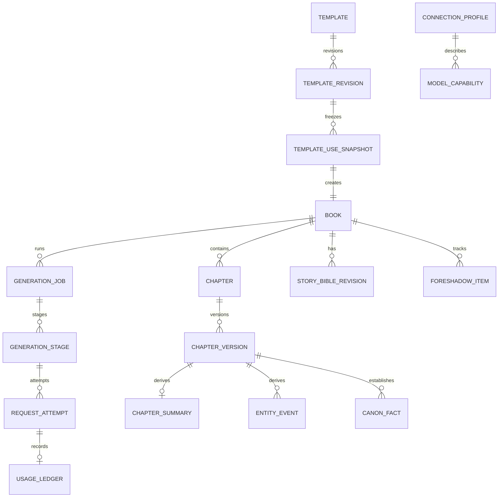

# 织卷本地数据模型

## 1. 总体关系

## 2. 标识与通用字段

- 主键使用随机 UUID/ULID，不用会暴露数量且难合并的自增 ID 作为跨包标识。
- 所有可同步/备份对象具有 `createdAt`、`updatedAt`；不可变对象无 `updatedAt`。
- 软删除字段 `archivedAt/deletedAt` 只用于有引用关系的核心对象。
- JSON 扩展字段必须带 schema 版本，不能成为逃避建模的万能字段。
- 时间以 UTC epoch 保存，界面按本地时区显示；故事内时间单独建模。

## 3. 核心实体

### DATA-001 `Book`

| 字段 | 说明 |
|---|---|
| `bookId` | 主键 |
| `title` / `titleSource` | 当前标题及人工/AI/系统规则推导来源 |
| `status` | DRAFT/GENERATING/PAUSED/COMPLETED/ARCHIVED/ERROR |
| `lengthMode` | SHORT/MEDIUM/LONG；长篇目标由 `targetChapters` 表达，不再另设 CUSTOM 模式 |
| `minimumChapters` / `targetChapters` | 规划下限与目标；短篇 80/80、中篇 300/300、长篇 301/用户目标 |
| `lengthPolicySchemaVersion` | 篇幅规则版本；首版为 1，旧书不随未来规则静默变化 |
| `targetCharacters` | 可空的字数估算目标，不替代章节规则 |
| `currentPlanRevisionId` | 当前规划 |
| `currentBibleRevisionId` | 当前故事圣经 |
| `templateUseSnapshotId` | 创建时不可变模板快照 |
| `branchedFromBookId/chapterVersionId` | 仅书分支使用 |
| `completedChapterCount` | 事务维护的快速字段 |
| `lastReadChapterId/offset` | 最近阅读位置 |
| `generationStatusSummary` | 可重建的显示摘要 |

### DATA-002 `BookCreationSnapshot`

保存用户原始输入、五组可选补充、标准化字段、自动推断字段及其来源、题材、篇幅模式、最低章数、目标章数、篇幅规则版本、呈现维度、模型偏好、schema 和提示版本。创建后不可变；重大设定编辑进入故事圣经新版本，不回写它。TASK-036 已把原始草稿与标准化结果分开：原始 JSON 保留用户提交文本，标准化 JSON 使用 NFC、统一换行和空白并加入规则推导书名；题材按显式选择、确定性关键词、系统默认三级来源解析；连接快照只保存 connection/model 引用，不保存地址或密钥。

所有影响后续生成的 JSON 与 schema 进入固定顺序的哈希载荷，保存 64 位小写 SHA-256；随机 ID 和创建时间不进入内容哈希，因此相同内容的重新建书可比较但仍是不同实体。`promptBundleVersion=unassigned-before-generation` 是明确的创建期未分配哨兵，不冒充已经绑定的 `zhijuan.prompt-bundle.v1`；真正发起生成时必须由 Job/Stage 另行冻结实际版本。

TASK-037 没有新增表或复制快照字段。确认页使用只读投影 `StoredBookCreationSummary` 联合读取 `Book + BookCreationSnapshot`，并要求书、快照、目标章数和 64 位小写 SHA-256 都可用；UI 只接收必要摘要。进程保存的只是 `bookId`，模型 ID 每次从冻结的 `modelPreferenceJson` 解析，避免当前连接变化后悄悄改写已创建书的选择。确认占位不写 `GenerationJob`、`GenerationStage`、`RequestAttempt` 或 `UsageLedger`。

TASK-035 的呈现数据分两层：

- `ContentPresentationDirective` 保存外部三档、总体细节、亲密细节、淡出策略、四个可空覆盖字段、`presentationMappingSchemaVersion` 与 `contentControlSchemaVersion`；覆盖字段为空明确表示继承题材基线，不表示 0；
- `ContentControlProfile` 在标准化阶段把题材基线解析为六个 0–4 数值和淡出策略。解析器只接受已知 schema，未知版本失败关闭；
- 成年人门禁不写死在书级预设里，具体场景使用 `CONFIRMED_ADULTS / NOT_CONFIRMED / UNKNOWN` 重新判断。后两种返回阻断结果，不静默降低细节继续生成；
- `intimacyDetailLevel=4 + AVOID + CONFIRMED_ADULTS` 解析为严格身体与感官连续性、100% 关键过程覆盖和禁止淡出替代；该策略不包含正文或提示词文本。

### DATA-003 `Chapter`

| 字段 | 说明 |
|---|---|
| `chapterId` / `bookId` | 主键/外键 |
| `chapterIndex` | 书内稳定顺序，唯一索引 |
| `plannedTitle` / `displayTitle` | 计划标题和当前标题 |
| `status` | PLANNED/GENERATING/DRAFT_READY/CHECKING/REVISING/READY/ERROR/EDITED/CONSISTENCY_UNKNOWN |
| `currentVersionId` | 当前正式版本 |
| `consistencyStatus` | VALID/UNKNOWN/ISSUES |

### DATA-004 `ChapterVersion`

不可变。字段：`chapterVersionId`、`chapterId`、`versionNo`、加密正文引用/内容、字符数、内容哈希、生成/人工来源、父版本、生成阶段、实际模型快照、创建时间。人工编辑总是新版本。

TASK-015 采用“加密库内内容”方案：正式正文仍直接存于 `ChapterVersion.content`，但生产库必须通过 `EncryptedZhijuanDatabaseFactory` 以 SQLCipher 打开，因此主库、WAL/SHM 和索引处于同一加密边界。它不会同时建立正文文件副本。设备测试写入唯一正文 canary，在数据库打开与关闭时扫描全部同名物理文件均为 0 命中，并能用同一 Keystore 包装的数据库口令重开读取。

### M1 / TASK-010 已实现基线

正式 `ZhijuanDatabase` schema v1 已落地 `book_creation_snapshot`、`book`、`chapter`、`chapter_version` 四张表：

- 创建快照与书一对一，快照及章节版本由数据库触发器禁止原地更新；
- `(bookId, chapterIndex)` 与 `(chapterId, versionNo)` 唯一；
- 章节的 `currentVersionId` 使用 `(chapterId, versionId)` 复合外键，不能误指向另一章版本；父版本使用同样复合外键，不能形成跨章父链；
- 版本提交在单事务内创建不可变版本、比较并交换当前版本、更新章节可读状态，并仅在首个正式版本时增加全书完成章数；
- 过期写入拒绝并回滚，不留下孤立版本；同一生成阶段与内容哈希的成功提交可幂等复用；
- 书分支必须同时记录来源书与来源章节版本，并验证两者归属；来源仍被引用时禁止单边硬删除；
- 核心内容外键不做级联删除；删除必须经过后续显式清理流程；
- 字符数按 Unicode code point 计算，避免 emoji 等代理对导致 Kotlin 与 SQLite 计数不一致；
- schema 导出到 `core/database/schemas/app.zhijuan.core.database.ZhijuanDatabase/1.json`。

Job/Stage 已由 TASK-011 加入，Bible/Outline/Memory 已由 TASK-012 加入；Template/Revision/Snapshot/Tag 留给 TASK-013。M0 搜索表仍是技术尖峰，不冒充已经接入正式书库；正式 FTS 同步在后续检索任务完成。

### DATA-005 `StoryBibleRevision`

不可变。包含稳定人物、成人年龄确认、世界规则、主题、禁改事实、文风、内容维度及来源。记录父修订和内容哈希。

### DATA-006 `OutlineRevision`

不可变的总纲、分卷和分章计划集合。具体计划节点使用 `OutlineNode` 表，支持局部重规划和来源追踪。

### DATA-007 `ChapterSummary`

引用唯一 `chapterVersionId`，含 schema、结构化摘要、重要度、状态 `VALID/STALE/FAILED` 和提取模型快照。

### DATA-008 `Entity`

统一人物、地点、物品、组织等稳定标识，字段含类型、标准名、别名、稳定定义、来源版本。人物包含明确的成人状态：`CONFIRMED_ADULT/UNKNOWN/NOT_ADULT`；涉及亲密内容时只允许第一种。

### DATA-009 `EntityEvent`

由章节版本导出的状态事件：实体、属性、旧值/新值、故事内时间、置信度、事实等级、来源证据、失效状态。

### DATA-010 `CanonFact`

事实三元/文本表达、等级 `HARD_CANON/STORY_CANON/PLAN_ONLY/INFERRED`、适用范围、来源对象、有效时间和冲突组 ID。

### DATA-011 `TimelineEvent`

事件名称、参与实体、地点、故事内时间表达、排序键、前置/后置约束、来源和有效状态。

### DATA-012 `ForeshadowItem`

伏笔描述、状态、计划/实际埋设章、目标回收窗口、实际回收章、可见角色、重要度和来源。

### M1 / TASK-012 已实现基线

正式 `ZhijuanDatabase` schema v3 已通过显式 `MIGRATION_2_3` 加入版本化故事资料和派生记忆：

- 故事圣经与大纲采用不可变修订；书只通过 `BookMemoryHead` 指向当前修订，历史版本不被覆盖；
- 大纲节点由复合外键限制在同一大纲修订内，不能跨版本挂接父节点；
- 章节摘要、人物事件、事实、时间线、伏笔、聚合状态、上下文快照和一致性报告均记录明确来源版本；数据库触发器拒绝跨书引用和伪造章节序号；
- 人物内部保存结构化成年状态和年龄事实。`CONFIRMED_ADULT` 必须有不小于 18 的年龄，未成年人、未知状态及非人物实体采用互斥组合；界面仍使用克制、隐蔽的呈现名称；
- 替换第 N 章版本时，旧版本直接派生数据、N 章起的聚合状态和 N 章之后的上下文/检查报告会进入 `STALE`；后续已有正文只进入 `CONSISTENCY_UNKNOWN`，不删除也不改写；
- 伏笔只要其来源、实际埋设或实际回收引用了被替换版本，就会失效，避免只检查“创建来源”漏掉后续状态；
- 失效事务可重复执行，第二次不会制造额外变更；传入错误书 ID 会在任何写入前拒绝；
- v2→v3 迁移保留原书库，并由 Room 对 13 张新表、索引、外键和保护触发器进行设备级结构校验。

当前失效事务已可由业务层调用，但“章节新版本提交成功后自动触发失效事务”的最终编排仍属于 TASK-061；正式中文检索索引同步也尚未接入。

## 4. 模板实体

### DATA-020 `Template`

稳定逻辑对象：`templateId`、显示名、说明、来源类型、根来源、当前修订、收藏、置顶、归档和时间。

### DATA-021 `TemplateRevision`

不可变：

- `templateRevisionId/templateId/revisionNo`；
- `parentTemplateRevisionId`；
- `sourceBookId/sourceBookTitleSnapshot`；
- `originRootId/originChainJson`；
- `payloadEncrypted`、`contentHash`；
- `templateSchemaVersion/promptBundleVersion/contentControlSchemaVersion`；
- `createdByAppVersion/createdAt`；
- `extractionModelSnapshot`（若由 AI 辅助提取）。

### DATA-022 `TemplateUseSnapshot`

创建书时的不可变最终合并结果：来源修订、合并覆盖项、最终 payload、内容哈希、能力解析结果、创建时间。与 `Book` 一对一。

### DATA-023 `TemplateTag`

系统/用户标签、维度、标准值、显示名、来源、置信度。联合唯一索引避免重复标签。

### M1 / TASK-013 已实现基线

正式 schema v4 已通过显式 `MIGRATION_3_4` 落地四类模板实体：

- `Template` 的来源类型和系统预设键不可变，名称、说明、收藏、置顶和归档可独立修改；
- `TemplateRevision` 不可变，父修订、来源根、书名快照、幂等提取键和内容哈希完整保存；内容按允许类别分列，没有正文、日志、费用、密钥或阅读状态字段；
- `TemplateUseSnapshot` 与新书一对一并不可变，冻结使用模式、用户覆盖、来源、最终允许字段、能力解析和 schema 版本；
- `TemplateTag` 由复合外键保证推导修订属于同一模板，来源身份不可改，置信度和主标签规则由触发器校验；
- 来源书 ID 是可失联的历史标识而非强外键：创建书源修订时核对真实来源书和标题，来源书删除后仍保留 ID/标题快照；
- 同一 `derivationKey` 只产生一条书源修订；`contentHash` 不唯一，避免把不同来源链误合并；
- 从模板创建书的事务只写创建快照、空白新书和模板使用快照，不复制章节、派生记忆、任务、请求或用量。

正式提取器的完整排除清单、规范化哈希和 `STYLE_ONLY` 清洗仍由 TASK-071/072/076 完成；本阶段不把数据库字段白名单冒充已经完成 AI 提取。

## 5. 生成和请求实体

### DATA-030 `GenerationJob`

一本书的一次长任务：`jobId`、类型、状态、用户意图、预算快照、提示版本快照、起止时间、当前阶段、暂停/终止原因、租约信息。

`pauseOrStopReason` 只允许稳定枚举来源：用户暂停、取消当前章、用户停止。`PAUSING/STOPPING` 表示控制已持久但执行器尚未完成安全点；`PAUSED/STOPPED` 才表示 Attempt/Stage/Usage 已与控制结果一致。继续会清除可恢复原因并回到 `READY`，不会签发网络发送权。

### DATA-031 `GenerationStage`

阶段实例：`stageId`、`jobId`、类型、目标对象、状态、依赖版本哈希、幂等键、attempt 次数、最大次数、输入来源清单、输出引用、错误和时间。

幂等键建议由 `(jobId, stageType, targetId, inputVersionHash)` 计算。同一输入版本只能有一个成功提交阶段。

### DATA-032 `RequestAttempt`

每次真实外部调用：`attemptId`、阶段、请求意图时间、发送时间、providerRequestId、连接/模型/协议快照、终态、标准错误、HTTP 状态、输入/输出哈希、流式草稿引用、重试父 attempt。

`streamDraftRef` 只保存 `AndroidProtectedArtifactStore` 生成的随机 UUID 引用，不保存路径、书名、章节名或明文。TASK-043 已完成正式接线：引用在 RequestIntent 之前分配并与 Attempt/未知 Usage/Stage 原子绑定；artifact 带认证类型与单调修订号，调用方通过 expectedRevision 写检查点，旧网络回调冲突后立即栅栏。成功提交草稿保留 24 小时，失败/未知保留 7 天，孤立 artifact 保留 24 小时；重复引用、完整性冲突和仍在恢复期的草稿不自动清理。草稿不属于 `ChapterVersion`，正式正文仍只能由 TASK-045 的章节提交事务产生。

TASK-055 不增加表或字段：正文 `LENGTH` 使用既有 `standardErrorCode=OUTPUT_TRUNCATED`，格式/锚点失败使用 `FORMAT_INVALID`，两者与 Attempt `SUCCEEDED`、`outputHash` 和 Stage `VALIDATING` 同事务落库。续接 Attempt 的 `retryParentAttemptId` 必须指向同 Stage 最新的成功截断 Attempt；`inputHash` 绑定 Stage 原输入、父输出、锚点和序号。每个 Attempt 保持独立 `UsageLedger` 和独立受保护草稿；后一个草稿含累计正文，但不会复用父 artifact 引用。

TASK-044 把正常 `STOP` 的完整响应记录为 Attempt `SUCCEEDED`、`outputHash=SHA-256(草稿原始字节)` 和 Stage `VALIDATING`。若结构无效，Attempt 保持已收到响应的事实，同时写入 `standardErrorCode=FORMAT_INVALID`；该持久标记既允许它成为唯一一次格式修复的 `retryParentAttemptId`，也让后续 attempt 跨进程识别“已经修过一次”。成功校验只把 Stage 推进到 `COMMITTING`，正式版本仍不存在。

### DATA-033 `UsageLedger`

每个 attempt 最多一条：提供方报告用量、估计用量、币种、估算费用、价格表版本、准确度、计入单书/每日预算的数值、最终状态。即使取消或失败也保留已报告用量。

主动暂停、取消或停止在途请求时，Attempt 进入 `CANCELLED`，对应 Usage 必须在同一事务进入 `FINAL`。已有 Provider 总量时记 `PROVIDER_REPORTED`；只有可推导的部分量时记 `ESTIMATED`；完全未知时保持数值为空且来源 `UNKNOWN`，绝不写成 0。

### DATA-034 `ContextSnapshot`

章前实际采用的来源 ID、版本、排序、裁剪原因、token 估计和内容哈希。默认不重复保存完整明文内容，用于复现“用过哪些记忆”。

### DATA-035 `ConsistencyReport`

目标章节版本、检查器版本、问题列表、严重度、证据、修复候选和状态；编辑源章后可标记 stale。

### M1 / TASK-011 已实现基线

正式 `ZhijuanDatabase` schema v2 已通过显式 `MIGRATION_1_2` 加入 `generation_job`、`generation_stage`、`request_attempt`、`usage_ledger`：

- Job 的 `currentStageId` 使用 `(jobId, stageId)` 复合外键，不能指向另一任务的阶段；
- Stage 的 `idempotencyKey` 唯一，`attemptCount` 不能超过 `maxAttempts`；任务和阶段租约只能由专用 compare-and-set 事务领取；
- Attempt 同时由 `(jobId, stageId)` 外键验证归属，`(stageId, attemptNo)` 唯一，重试父 attempt 由复合外键限制在同一阶段；
- 请求发送前先在单事务中创建 `INTENT_RECORDED` attempt、`UNKNOWN/PROVISIONAL` usage 台账，并把 Stage 推进到 `REQUEST_INTENT_RECORDED`；事务任一步失败会整体回滚；
- 发送、正常结果、可重试失败和结果未知均同时更新 Attempt 与 Stage，旧状态不匹配时拒绝覆盖；
- 每个 attempt 恰有至多一条 UsageLedger；未知用量使用 `NULL`，不伪装成 0；金额使用整数 micros；
- 最终台账通常不可变，但允许一次从 `UNKNOWN/ESTIMATED` 升级为迟到的 `PROVIDER_REPORTED`，之后永久冻结；
- v1→v2 迁移保留既有书库并验证四张新增表、索引、外键和保护触发器。

预算的并发预留/结算计数器仍由 TASK-084 完成；本阶段冻结预算快照并建立 request/usage 审计事实，不提前声称已经具备费用硬上限的完整持久化实现。

TASK-040 没有新增 schema，而是收紧 schema v2 已有字段的唯一写入语义：Job/Stage 状态转换要求旧状态 CAS 与时间单调；Job 完成前查询同任务的全部 Stage；等待、需处理和终态清除租约；重试时间与错误证据成对保存。对模块外只提供 `StoredGenerationJobState`、`StoredGenerationStageState` 只读投影，不把 Room Entity 或底层更新语句交给执行器。RequestIntent、Attempt 与 Usage 的发送前原子审计仍沿用 TASK-011，TASK-042 将继续扩展正式发送编排，但不能绕过本轮建立的专用事务边界。

TASK-041 继续复用 schema v2 已有的 `leaseOwnerId/leaseAcquiredAt/leaseHeartbeatAt`，没有新增列或迁移。三字段必须全有或全无；读取到部分缺失时 Repository 失败关闭。`ownerId + acquiredAt` 组成不可重放的 `GenerationLeaseToken`，`heartbeatAt` 决定 60 秒到期边界。`StoredGenerationJobState/StoredGenerationStageState` 只增加安全凭证与心跳投影，不暴露数据库实体。请求前过期回队会在同一 CAS 中清空三字段；请求意图之后不自动改变持久状态，保留现场给 TASK-047 审计。

TASK-042 同样不新增 schema：正式 `RequestIntentDraft` 映射到 schema v2 的 Attempt 与 UsageLedger，并由现有 `recordRequestIntent` 事务写入。对模块外只返回 `StoredRequestAttemptAudit`、`StoredUsageLedgerAudit` 和内部构造的一次性发送 permit，不返回连接/模型/协议 JSON 原文。审计快照限制为每项最多 65,536 字符的 JSON Object，递归拒绝可直接携带密钥的字段；`inputHash` 必须是 64 位小写 SHA-256。Usage 在发送前必须保持 `UNKNOWN/PROVISIONAL` 且 token/金额为 `NULL`，不能用 0 假装已知。

## 6. 连接、安全和配置实体

### DATA-040 `ConnectionProfile`

非密钥配置。敏感内容只保存 `secretRefId`。删除连接前检查运行任务；历史请求只保留脱敏快照，不保留可用密钥。

同时保存 `normalizedDestination`、`dataDisclosureVersion`、`dataDisclosureAcceptedAt` 和 `dataDisclosureBindingHash`。绑定哈希覆盖 scheme、host、port 和 protocol；任一变化时确认自动失效。测试连接不要求小说内容发送确认，但只能使用固定的无私人信息测试文本。

正式 schema v6 已通过显式 `MIGRATION_5_6` 新增 `connection_profile` 与 `current_connection_selection`：

- `connection_profile` 保存显示名称、服务类型、协议、规范化地址、`secretRefId`、密钥尾四位、选中模型、最多 500 个已发现模型 ID、基础/完整验证状态与时间，以及尚未确认时为空的数据发送确认字段；不保存原始密钥、探针正文、响应正文或服务商错误正文；
- `current_connection_selection` 使用固定单例记录当前连接并以外键约束；插入连接并设为当前、切换当前、编辑以及删除当前后选择确定性后备连接均由 Room 事务完成；
- 向导提交先把非密钥记录与当前选择写入 SQLCipher 主库，再移除 no-backup 临时引用；若进程在边界中断，下次启动先查询数据库引用，已经提交的 secret 不会被误撤销；
- 地址、协议和密钥不允许在普通编辑框中原地覆盖。用户先新增并验证替代连接，再删除旧连接；名称和已发现模型可直接编辑，手填模型继续标记未验证；
- 删除数据库记录后撤销对应 SecretRecord；小说和历史请求只使用脱敏快照，不随连接删除。

正式 schema v7 已通过显式 `MIGRATION_6_7` 为 `book` 增加 `minimum_chapters` 与 `length_policy_schema_version`：

- TASK-036 新建书必须使用 schema v1：SHORT 最低 80、MEDIUM 最低 300、LONG 最低 301，目标不得低于下限且不得超过 10,000；DAO 与数据库插入/更新触发器双层约束；
- v1~v6 旧书原样保留，迁移后标记 `length_policy_schema_version=0`；最低章数按旧目标与当前下限的较小值兼容填写，不把过去合法的 200 章长篇强行改写或清库；
- `BookCreationSnapshot`、`Book` 在一个 Room 事务中创建；任何篇幅、外键、哈希或快照字段失败都会回滚两者，快照更新触发器继续禁止原地修改。

### DATA-041 `SecretRecord`

由安全存储管理：随机 ID、密文、算法/密钥版本、用途、创建/最后使用时间。不可通过普通 Repository 批量列出明文。

TASK-014 已在 `core:security` 落地文件型 SecretRecord：记录包含随机引用、用途、尾四位、ACTIVE/REVOKED、keyVersion、创建/更新/最后使用时间和可选 AES-GCM 密文。每条记录使用独立 Keystore 别名；ACTIVE 必须有密文，REVOKED 必须无密文。它不进入 Room，也不随项目备份迁移。普通调用只能列 descriptor 或按单个引用取得可清零 lease，没有“列出所有明文”接口。

### DATA-042 `ModelCapability`

连接+端点指纹+模型+协议+来源的能力证据、验证时间、过期时间、适配器版本和可选的用户风险确认时间。历史生成引用冻结解析后快照摘要。

正式 schema v5 已通过显式 `MIGRATION_4_5` 新增 `provider_capability`：

- 复合主键为 `connection_id + endpoint_fingerprint + protocol_id + model_id + capability_source`，因此官方元数据、探测值和用户覆盖可以共存，撤销覆盖不会删除自动值；
- 端点只保存规范化地址的 SHA-256 指纹，不保存密钥；连接地址变化后旧记录不命中；
- 三态能力、流格式、上下文/输出上限、tokenizer、来源、`verified_at/expires_at` 和 `adapter_version` 分列存储；请求字段允许/阻止由三态能力导出；
- `risk_acknowledged_at` 只允许出现在用户覆盖领域记录中；不完整或损坏记录在 Room 映射层被丢弃并回退到保守值；
- 同一来源刷新采用事务比较时间，只允许不早于现有记录的证据替换，避免并发迟到结果倒退能力；
- 该表与小说正文同处 SQLCipher 加密主库；密钥仍不进入 Room。

TASK-029 不新增数据库表。模型列表中的上下文/输出上限提示写为既有 `OFFICIAL_METADATA` 来源；成功的 16-token 探针写为既有 `PROBED` 来源，默认 7 天过期。TASK-031 只在运行期持有连接资料与临时 `secretRefId`；TASK-032 已按 schema v6 原子提交为长期连接，TASK-036 已按 schema v7 冻结篇幅规则并将创建页接入加密主库。

### DATA-043 `PriceCatalogEntry`

提供方、模型匹配规则、输入/输出/缓存/推理价格、单位、币种、生效期、来源 URL、更新时间和可信度。价格变动新增条目，不回写历史台账。

### DATA-044 `UserPreferences`

非敏感 UI 和默认行为存在 DataStore；预算、自动继续等影响付费/任务的关键设置同时保存带版本快照到 Job。

### DATA-045 章节提交证据（不新增表）

- `GenerationStage.outputReferenceJson` 在成功提交后保存版本化、无正文的提交证据：最新成功 `attemptId`、原始输出 SHA-256、`chapterVersionId`、章节内容 SHA-256、稳定提交载荷 SHA-256 和可空 `nextStageId`；
- `ChapterVersion.generationStageId` 把一个正式版本唯一绑定到生成 Stage；同一 Stage 只能存在一个正式版本，恢复时必须同时核对输出引用、版本 ID、章节 ID 和内容 hash；
- 提交载荷 hash 覆盖摘要、人物事件、事实、时间线、伏笔和下一 Stage，派生列表先按稳定 ID 排序再逐字段编码；Usage 不进入载荷 hash，以允许未知用量在提交后按既有单向规则升级为更可信来源；
- 正式正文仍只存于 SQLCipher `ChapterVersion.content`，`outputReferenceJson`、异常、报告和普通日志均不得复制正文。

### DATA-046 未知结果恢复证据（不新增表）

TASK-047 复用 schema v7 的既有行，不建立一个可能与真实任务状态分叉的“恢复表”：

- `RequestAttempt` 保存 `INTENT_RECORDED/SENT/STREAMING/SUCCEEDED/UNKNOWN_RESULT/FAILED_RETRYABLE`、远端请求 ID、发送/开始/结束时间和父 attempt；
- `UsageLedger` 保存 PROVISIONAL/FINAL 与 UNKNOWN/ESTIMATED/PROVIDER_REPORTED，未知 token/金额继续为 `NULL`；远端完成证据只允许单向提升可信度；
- `GenerationStage` 保存 `RECOVERY_REQUIRED/UNKNOWN_RESULT/READY` 和受状态机约束的恢复时间；
- `GenerationJob.pauseOrStopReason` 复用稳定枚举名记录“等待远端结果”“需要用户确认”“仅需恢复本地结果”，不保存提供方原始错误正文；
- `streamDraftRef` 指向受保护草稿，其完整性和明文长度只转换为“可读空/已有内容/缺失或冲突”三态供策略使用，恢复日志不读取正文；
- 恢复事务必须比较精确的过期租约或当前活动现场。迟到扫描、控制正在结算、并发用户确认和已完成恢复均失败关闭或返回幂等结果。

## 7. 备份与迁移实体

### DATA-050 `BackupManifest`

备份格式、应用版本、数据库 schema、创建时间、设备无关随机备份 ID、书/模板数量、文件清单、每项哈希、加密/KDF 参数、是否含连接配置、明确 `containsSecrets=false` 默认值。

### DATA-051 `MigrationAudit`

原版本、目标版本、开始/结束、结果、恢复点、错误码和校验摘要。不包含正文。

恢复点字段只保存随机 artifact 引用。对应文件类型固定为 `DATABASE_RECOVERY_POINT`，采用独立 Keystore key 和分块认证密文；恢复流程必须先完整认证到 SQLCipher staging 库并完成结构校验，不能把未验证的部分输出切换成活动库。

## 8. 关键索引和约束

- `Chapter(bookId, chapterIndex)` 唯一；
- `ChapterVersion(chapterId, versionNo)` 唯一；
- `TemplateRevision(templateId, revisionNo)` 唯一；
- `TemplateRevision(derivationKey)` 唯一（仅书源首修订使用，NULL 可重复）；
- `TemplateUseSnapshot(bookId)` 唯一；
- `TemplateTag(templateId, dimension, normalizedValue)` 唯一；
- `GenerationStage(idempotencyKey)` 对成功/运行态唯一；
- `ChapterVersion(generationStageId)` 由提交 Repository 强制至多一条，重放必须精确匹配成功 Stage 的提交证据；
- `UsageLedger(attemptId)` 唯一；
- `RequestAttempt(jobId, createdAt)`；
- `GenerationJob(status, updatedAt)`；
- `TemplateTag(dimension, normalizedValue)`；
- `CanonFact(bookId, entityId, status)`；
- `EntityEvent(bookId, entityId, storyOrder)`；
- `StoryBibleRevision(bookId, revisionNo)` 唯一；
- `OutlineRevision(bookId, revisionNo)` 唯一；
- `OutlineNode(outlineRevisionId, orderKey)` 唯一；
- `ChapterSummary(chapterVersionId)` 唯一；
- `AggregateStateProjection(bookId, throughChapterIndex)` 唯一；
- `Book(updatedAt)`、`Book(status)`。
- `ProviderCapability(connectionId, endpointFingerprint, protocolId, modelId, capabilitySource)` 复合唯一；
- `ProviderCapability(connectionId, protocolId, modelId)`、`expiresAt`、`adapterVersion`。

外键默认启用；核心内容禁止级联硬删除。清理临时草稿可以级联，但必须确认没有正式章节引用。

## 9. 保留策略

- 正式章节版本：保留，除非用户明确清理旧版本。
- 最近 N 个自动章节候选：默认保留 3 个，可设置。
- 临时流草稿：成功提交后 24 小时清理；失败/未知结果保留 7 天供恢复。
- 脱敏诊断：滚动 14 天或 20MB，以先到者为准。
- RequestAttempt/UsageLedger：长期保留，用户可导出并清理，但清理前给出费用审计影响。
- 删除书：先进入本地回收区 7 天（可关闭），到期硬删除正文与派生数据；被引用模板保留来源书名快照。

## 10. 迁移策略

- 每个 schema 版本提供显式 Migration；
- 测试所有仍支持的旧版本到最新版本的完整路径；
- 正式构建禁用破坏性迁移；
- 迁移前检查空间并创建加密恢复点；
- 迁移后校验书数、章节数、当前版本引用、模板哈希和外键；
- 失败不删除旧库，应用进入只读恢复页；
- 恢复点在用户确认新版本稳定和新备份完成后再清理。

## 11. 失败请求证据

`ProviderCallFailure` 和流式 `Failed` 事件包含 `FailureRequestState`：`NOT_SENT`、`PROVIDER_REJECTED`、`RESPONSE_STARTED`、`RESULT_UNKNOWN`。该字段是一次失败的运行时证据，不替代 `RequestAttempt.status`；正式接入 TASK-042 时必须连同标准错误码、是否已收到正文、自动重试次数、累计等待时间和父 attempt 一起持久化，才能在进程重启后保持相同的费用保护决策。

## 12. TASK-048 前台服务数据边界

TASK-048 不新增表和数据库版本：

- 系统前台服务限时复用 `GenerationJob.pauseOrStopReason`，稳定值为 `SYSTEM_FGS_TIMEOUT`；它与 `USER_PAUSE`、`USER_STOP` 分离，不保存 Android 异常原文。
- `SYSTEM_FGS_TIMEOUT` 是可恢复暂停原因；继续事务清除原因并只把 Job 变为 `READY`，Stage Attempt 计数保持不变。
- 前台服务不持久化通知 ID、进程 PID、Service startId、轮询时间或内存 deadline；这些都不是业务事实，进程退出后不得参与恢复判断。
- 新增公开 `GenerationJobSetupRepository` 作为 App 组装 Job/Stage 的安全入口，统一校验 ID、JSON 大小、阶段数量、幂等键和 attempt 上限；Room Entity/DAO 仍不向 App 暴露。

## 13. TASK-049 维护数据边界

TASK-049 不新增表、不提升 schema 版本，也不把 WorkManager 自身状态写成业务状态：

- `leasedStagesForMaintenance` 只按持久租约心跳和单调 `updatedAt` 读取有界候选；业务层继续核对当前 Stage、父 Job、状态集合、双租约凭证和精确到期边界。
- `GenerationMaintenanceCandidate` 暂存 Job/Stage 的精确租约栅栏和最新 Attempt 引用，但默认字符串把所有标识替换为 `identifiers=redacted`，不会进入普通诊断。
- 请求前恢复在同一 Room 事务中把 `PREPARING → READY`、`RUNNING → READY` 并清除 Stage/Job 双租约；任一比较失败整笔回滚，不能留下“Stage 可执行但父 Job 仍被旧租约占用”的半状态。
- RequestIntent 之后不新增恢复字段：继续复用 Attempt、Usage、草稿、提交和稳定错误原因。维护器提供的恢复证据固定为 `NOT_AVAILABLE`，因此不能把本地超时伪装成服务端未执行。
- WorkManager 的 UUID、runAttemptCount、排队/成功/失败和系统 Job ID 不进入 SQLCipher 业务表；它们丢失不会改变小说任务事实。
- 草稿清理继续使用 TASK-043 的二次数据库核对与保留期，候选正在被提交、恢复或引用时跳过，不因“维护成功”删除仍需恢复的 artifact。

## 14. TASK-050 Prompt Bundle 绑定数据边界

TASK-050 不新增表、不提升 Room schema，也不原地更新创建快照：

- `PromptBundleBindingRepository` 读取 Book 与其唯一不可变 CreationSnapshot，要求所有权、schema、64 位小写 SHA-256 来源哈希、篇幅配置、呈现配置、已解析内容配置和题材基线彼此一致。
- 创建快照继续保存 `unassigned-before-generation`。读取绑定产生的 `bundleVersion` 与 `bindingHash` 是派生值；真正执行时由后续 Job 创建事务冻结，不能回写旧快照伪造历史。
- 绑定哈希覆盖 Bundle/契约/快照 schema 版本、来源哈希、篇幅、呈现、题材维度、硬规则和全部阶段模板/指令/输出 schema。相同来源与契约产生相同哈希，任一规则变化必须改变版本或哈希。
- 绑定对象、阶段对象和 Provider 准备对象的默认字符串隐藏来源哈希、绑定哈希和指令正文；数据库层不读取 ConnectionSecret，也不写 Attempt/Usage。

## 15. TASK-051 初始规划持久化映射

- 三阶段 Job 保存冻结 Bundle 版本、阶段顺序、依赖、输入 hash 与幂等键；运行时不能根据模型输出动态重排。
- 故事种子正文留在加密 ArtifactRevision，Stage 成功引用只保存 schema、Attempt/artifact hash 和稳定 ID，不保存明文。
- 故事圣经映射为不可变修订、CHARACTER 实体、成年年龄事实、世界规则和 `HARD_CANON` 硬事实；所有记录保留书籍、生成阶段、修订和来源。
- 全书总纲映射为不可变修订及唯一 BOOK 根节点，根节点定义包含经过严格验证的规范 JSON；覆盖结束章必须等于创建快照目标。
- 映射器在构造提交草稿前再次校验当前结果与所有前序结果。Repository 在 SQLCipher 事务内第三次核对持久事实，防止调用方用手工对象绕过依赖。

## 16. TASK-052 窗口修订数据语义

- master outline 仍为 revision 1；首个窗口以它为 parent，后续窗口以当前 outline head 为 parent，同时一直保留 master revision ID/hash 作为全局承诺证据。
- 每个窗口 revision 只含 1 个 BOOK 根节点、1 个当前 ARC 节点和最多 8 个 CHAPTER 摘要节点。`plannedChapterIndex` 在窗口内连续且唯一。
- `summaryJson` 保存规范 `arc-plan.v1`，revision content hash 覆盖完整结果；ARC 和 CHAPTER 节点分别保存自身规范 JSON/hash。
- 新 revision 的编号必须是当前最大值 + 1，parent 必须是当前 head。精确重放可读取旧 revision，但新提交不能从历史 parent 分叉覆盖当前 head。
- 该方案不需要数据库迁移，也不会为 10,000 章预建 10,000 个 Chapter 或 OutlineNode。

## 17. TASK-053 快车道证据数据语义

- `first-chapter-bootstrap.v1` 正文只保存在 Keystore 加密 ArtifactRevision；成功 Stage 的 output reference 只记录 schema、artifact/revision/hash、固定三章粗计划数量和成年人/硬规则门禁结果。
- 最小包不建立 StoryBibleRevision 或 OutlineRevision，避免把不完整人物/世界/三章粗计划误当长期全书事实。
- 第一章后 Bible 与 Master Stage 的 `inputSourcesJson` 同时冻结种子 stage/raw/content hash 和第一章 ID、当前 ChapterVersion ID、内容 hash；第一章变化后旧规划证据不能放行第二章。
- 章节推进 permit 不是新表。它由当前 Book、Stage/Job output reference、Bible/Outline revision 父链、目标窗口和上一章当前版本即时导出，并以规范 JSON + SHA-256 绑定进现有 Stage 输入。
- 精确重放沿用已有 artifact/output reference；篡改年龄、人物集合、结局方向、章节序列或第一章绑定时，提交/Provider-open/章节提交均失败关闭且不产生半写入。

## 18. TASK-054 上下文快照数据语义

- `ContextSnapshot` 是不可变章前输入，不是可编辑长期记忆。它保存目标书/章、策略版本、模型上下文与输出预留、估算输入/总量、规范 Provider payload、payload hash、manifest 和创建时间。
- `chapter-context-manifest.v1` 的每个已选项保存稳定 ID、种类、优先级、是否必需、完整内容及内容 hash；省略项保存对应元数据与原因，不保存“裁了一半”的内容。
- manifest 同时保存 Prompt Bundle 绑定、Story Bible revision、Outline head、目标卷章、上一章当前版本、推进证据和源数据 hash。Provider-open 以这些来源定位当前数据库事实并重算。
- 成功 `ASSEMBLE_CONTEXT` Stage 的 output reference 只引用 snapshot、manifest/payload hash、选择/省略数量和预算结果；精确重放回读同一快照，不重复插入。
- 该任务不建新表、不迁移 schema。已有 SQLCipher 加密范围覆盖 payload 和 manifest；备份/诊断仍遵守正文与敏感创作资料默认不外泄的规则。

## 19. TASK-056 章节记忆数据语义

- `ChapterSummary.chapterVersionId` 一版本唯一，保存 `chapter-memory.v1` 摘要 JSON、重要度、模型快照和 `VALID/STALE/FAILED` 状态。
- `EntityEvent.sourceChapterVersionId` 必填；属性限定为位置、身体、情绪、目标、知识、关系、持有物、承诺、秘密，事件顺序稳定落在章节专属百万跨度内。
- `CanonFact.sourceChapterVersionId` 绑定同一来源，`sourceBibleRevisionId=null`；章节提取只能写 `STORY_CANON/INFERRED`，不能写 `HARD_CANON/PLAN_ONLY`。
- 三类记录的 JSON 元数据包含 schema/kind/confidence/source content hash，但 output reference 只保存 ID、hash 和数量，不复制正文。
- 编辑/切换来源版本时沿用 TASK-012 stale 链；自动挂接所有用户编辑入口仍由 TASK-061 完成。本任务无 Room schema 变化。

## 20. TASK-057 时间线/伏笔数据语义与 schema v8

### DATA-013 `ChapterTrackingProjection`

每个成功投影批次保存书、章节版本/序号、Generation Stage、正文 hash、章节记忆快照 hash、旧伏笔快照 hash、输出规范 hash、payload hash、模型快照、行数和 `VALID/STALE`。Stage 一批唯一，作为跨表完整性头。

### DATA-014 `ForeshadowTransition`

追加式记录 `foreshadowItemId`、书、来源章节版本、Stage、story order、PLANT/DEVELOP/RESOLVE/ABANDON、旧/新状态、短证据和状态。同一伏笔在同一来源章节最多一条转换，不能覆盖历史。

### schema v8 约束

- `foreshadow_item` 增加 `(book_id, foreshadow_item_id)` 唯一父键，用于保证转换与条目属于同一本书。
- 两张新表同时外键绑定 Book、ChapterVersion、GenerationStage；转换还以复合外键绑定 ForeshadowItem。
- 数据库触发器拒绝跨书、错误章节序号、错误阶段、计数越界和非法状态操作；应用事务继续执行更严格的来源 hash、证据 JSON 和状态 CAS 校验。
- v7→v8 是只增表/索引迁移，不改写旧小说内容。v1~v8 全路径迁移在 API 35 与 API 30 通过。

## 21. TASK-058 一致性报告数据语义

- `ConsistencyReport` 继续使用 schema v8 既有表；每条报告绑定一个实际存在的 `ChapterVersion`，状态为 `VALID/ISSUES/STALE/FAILED`，不建立“脱离正文的孤立检查结果”。
- `issuesJson` 保存 checker/schema 版本、候选来源 hash、本地/模型计数、23 项标准结果、严格过程 COVERED/MISSING 结果、问题码、严重度、Unicode 码点范围、已知对象 ID 和固定修订动作。
- `issuesJson` 不保存候选正文、证据原文、自由改写建议、API key 或连接信息；报告 ID 与完整 payload hash 确定性派生，支持最终事务的精确重放。
- TASK-058 只生成报告草稿，因为候选版本尚未写入 `chapter_version`。TASK-059 必须在同一事务中先满足外键并同时提交正文、报告及对应派生数据；单独提前插入属于非法状态。
- 本任务不改变 Room schema，v8 JSON 与迁移基线保持不变。
