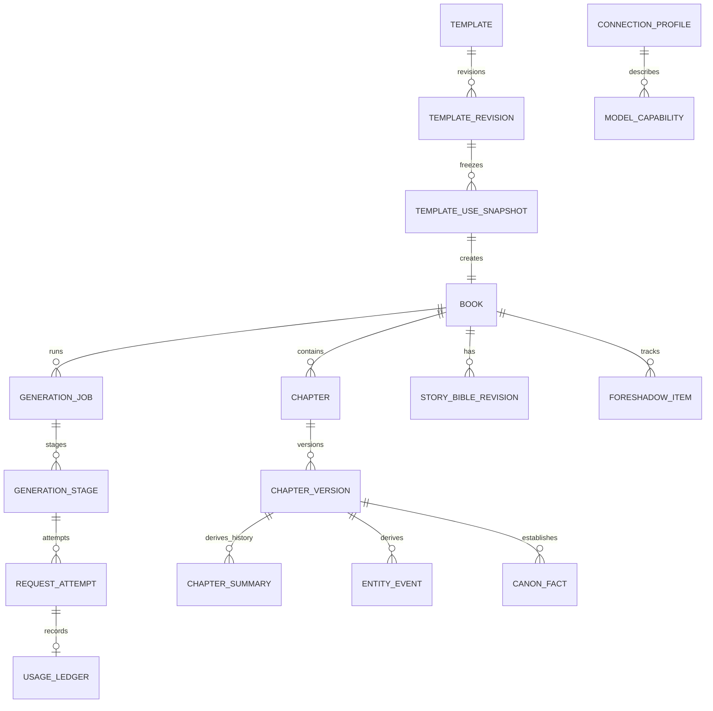

# 织卷本地数据模型

## 1. 总体关系

## 2. 标识与通用字段

- 主键使用随机 UUID/ULID，不用会暴露数量且难合并的自增 ID 作为跨包标识。
- 所有可同步/备份对象具有 `createdAt`、`updatedAt`；不可变对象无 `updatedAt`。
- 软删除字段 `archivedAt/deletedAt` 只用于有引用关系的核心对象。
- JSON 扩展字段必须带 schema 版本，不能成为逃避建模的万能字段。
- 时间以 UTC epoch 保存，界面按本地时区显示；故事内时间单独建模。

## 3. 核心实体

### DATA-001 `Book`

| 字段 | 说明 |
|---|---|
| `bookId` | 主键 |
| `title` / `titleSource` | 当前标题及人工/AI/系统规则推导来源 |
| `status` | DRAFT/GENERATING/PAUSED/COMPLETED/ARCHIVED/ERROR |
| `lengthMode` | SHORT/MEDIUM/LONG；长篇目标由 `targetChapters` 表达，不再另设 CUSTOM 模式 |
| `minimumChapters` / `targetChapters` | 规划下限与目标；短篇 80/80、中篇 300/300、长篇 301/用户目标 |
| `lengthPolicySchemaVersion` | 篇幅规则版本；首版为 1，旧书不随未来规则静默变化 |
| `targetCharacters` | 可空的字数估算目标，不替代章节规则 |
| `currentPlanRevisionId` | 当前规划 |
| `currentBibleRevisionId` | 当前故事圣经 |
| `templateUseSnapshotId` | 创建时不可变模板快照 |
| `branchedFromBookId/chapterVersionId` | 仅书分支使用 |
| `completedChapterCount` | 事务维护的快速字段 |
| `lastReadChapterId/offset` | 最近阅读位置 |
| `generationStatusSummary` | 可重建的显示摘要 |

### DATA-002 `BookCreationSnapshot`

保存用户原始输入、五组可选补充、标准化字段、自动推断字段及其来源、题材、篇幅模式、最低章数、目标章数、篇幅规则版本、呈现维度、模型偏好、schema 和提示版本。创建后不可变；重大设定编辑进入故事圣经新版本，不回写它。TASK-036 已把原始草稿与标准化结果分开：原始 JSON 保留用户提交文本，标准化 JSON 使用 NFC、统一换行和空白并加入规则推导书名；题材按显式选择、确定性关键词、系统默认三级来源解析；连接快照只保存 connection/model 引用，不保存地址或密钥。

所有影响后续生成的 JSON 与 schema 进入固定顺序的哈希载荷，保存 64 位小写 SHA-256；随机 ID 和创建时间不进入内容哈希，因此相同内容的重新建书可比较但仍是不同实体。`promptBundleVersion=unassigned-before-generation` 是明确的创建期未分配哨兵，不冒充已经绑定的 `zhijuan.prompt-bundle.v1`；真正发起生成时必须由 Job/Stage 另行冻结实际版本。

TASK-037 没有新增表或复制快照字段。确认页使用只读投影 `StoredBookCreationSummary` 联合读取 `Book + BookCreationSnapshot`，并要求书、快照、目标章数和 64 位小写 SHA-256 都可用；UI 只接收必要摘要。进程保存的只是 `bookId`，模型 ID 每次从冻结的 `modelPreferenceJson` 解析，避免当前连接变化后悄悄改写已创建书的选择。确认占位不写 `GenerationJob`、`GenerationStage`、`RequestAttempt` 或 `UsageLedger`。

TASK-035 的呈现数据分两层：

- `ContentPresentationDirective` 保存外部三档、总体细节、亲密细节、淡出策略、四个可空覆盖字段、`presentationMappingSchemaVersion` 与 `contentControlSchemaVersion`；覆盖字段为空明确表示继承题材基线，不表示 0；
- `ContentControlProfile` 在标准化阶段把题材基线解析为六个 0–4 数值和淡出策略。解析器只接受已知 schema，未知版本失败关闭；
- 成年人门禁不写死在书级预设里，具体场景使用 `CONFIRMED_ADULTS / NOT_CONFIRMED / UNKNOWN` 重新判断。后两种返回阻断结果，不静默降低细节继续生成；
- `intimacyDetailLevel=4 + AVOID + CONFIRMED_ADULTS` 解析为严格身体与感官连续性、100% 关键过程覆盖和禁止淡出替代；该策略不包含正文或提示词文本。

### DATA-003 `Chapter`

| 字段 | 说明 |
|---|---|
| `chapterId` / `bookId` | 主键/外键 |
| `chapterIndex` | 书内稳定顺序，唯一索引 |
| `plannedTitle` / `displayTitle` | 计划标题和当前标题 |
| `status` | PLANNED/GENERATING/DRAFT_READY/CHECKING/REVISING/READY/ERROR/EDITED/CONSISTENCY_UNKNOWN |
| `currentVersionId` | 当前正式版本 |
| `consistencyStatus` | VALID/UNKNOWN/ISSUES |

### DATA-004 `ChapterVersion`

不可变。字段：`chapterVersionId`、`chapterId`、`versionNo`、加密正文引用/内容、字符数、内容哈希、生成/人工来源、父版本、生成阶段、实际模型快照、创建时间。人工编辑总是新版本。

TASK-015 采用“加密库内内容”方案：正式正文仍直接存于 `ChapterVersion.content`，但生产库必须通过 `EncryptedZhijuanDatabaseFactory` 以 SQLCipher 打开，因此主库、WAL/SHM 和索引处于同一加密边界。它不会同时建立正文文件副本。设备测试写入唯一正文 canary，在数据库打开与关闭时扫描全部同名物理文件均为 0 命中，并能用同一 Keystore 包装的数据库口令重开读取。

### M1 / TASK-010 已实现基线

正式 `ZhijuanDatabase` schema v1 已落地 `book_creation_snapshot`、`book`、`chapter`、`chapter_version` 四张表：

- 创建快照与书一对一，快照及章节版本由数据库触发器禁止原地更新；
- `(bookId, chapterIndex)` 与 `(chapterId, versionNo)` 唯一；
- 章节的 `currentVersionId` 使用 `(chapterId, versionId)` 复合外键，不能误指向另一章版本；父版本使用同样复合外键，不能形成跨章父链；
- 版本提交在单事务内创建不可变版本、比较并交换当前版本、更新章节可读状态，并仅在首个正式版本时增加全书完成章数；
- 过期写入拒绝并回滚，不留下孤立版本；同一生成阶段与内容哈希的成功提交可幂等复用；
- 书分支必须同时记录来源书与来源章节版本，并验证两者归属；来源仍被引用时禁止单边硬删除；
- 核心内容外键不做级联删除；删除必须经过后续显式清理流程；
- 字符数按 Unicode code point 计算，避免 emoji 等代理对导致 Kotlin 与 SQLite 计数不一致；
- schema 导出到 `core/database/schemas/app.zhijuan.core.database.ZhijuanDatabase/1.json`。

Job/Stage 已由 TASK-011 加入，Bible/Outline/Memory 已由 TASK-012 加入；Template/Revision/Snapshot/Tag 留给 TASK-013。M0 搜索表仍是技术尖峰，不冒充已经接入正式书库；正式 FTS 同步在后续检索任务完成。

### DATA-005 `StoryBibleRevision`

不可变。包含稳定人物、成人年龄确认、世界规则、主题、禁改事实、文风、内容维度及来源。记录父修订和内容哈希。

### DATA-006 `OutlineRevision`

不可变的总纲、分卷和分章计划集合。具体计划节点使用 `OutlineNode` 表，支持局部重规划和来源追踪。

### DATA-007 `ChapterSummary`

引用唯一 `chapterVersionId`，含 schema、结构化摘要、重要度、状态 `VALID/STALE/FAILED` 和提取模型快照。

### DATA-008 `Entity`

统一人物、地点、物品、组织等稳定标识，字段含类型、标准名、别名、稳定定义、来源版本。人物包含明确的成人状态：`CONFIRMED_ADULT/UNKNOWN/NOT_ADULT`；涉及亲密内容时只允许第一种。

### DATA-009 `EntityEvent`

由章节版本导出的状态事件：实体、属性、旧值/新值、故事内时间、置信度、事实等级、来源证据、失效状态。

### DATA-010 `CanonFact`

事实三元/文本表达、等级 `HARD_CANON/STORY_CANON/PLAN_ONLY/INFERRED`、适用范围、来源对象、有效时间和冲突组 ID。

### DATA-011 `TimelineEvent`

事件名称、参与实体、地点、故事内时间表达、排序键、前置/后置约束、来源和有效状态。

### DATA-012 `ForeshadowItem`

伏笔描述、状态、计划/实际埋设章、目标回收窗口、实际回收章、可见角色、重要度和来源。

### M1 / TASK-012 已实现基线

正式 `ZhijuanDatabase` schema v3 已通过显式 `MIGRATION_2_3` 加入版本化故事资料和派生记忆：

- 故事圣经与大纲采用不可变修订；书只通过 `BookMemoryHead` 指向当前修订，历史版本不被覆盖；
- 大纲节点由复合外键限制在同一大纲修订内，不能跨版本挂接父节点；
- 章节摘要、人物事件、事实、时间线、伏笔、聚合状态、上下文快照和一致性报告均记录明确来源版本；数据库触发器拒绝跨书引用和伪造章节序号；
- 人物内部保存结构化成年状态和年龄事实。`CONFIRMED_ADULT` 必须有不小于 18 的年龄，未成年人、未知状态及非人物实体采用互斥组合；界面仍使用克制、隐蔽的呈现名称；
- 替换第 N 章版本时，旧版本直接派生数据、N 章起的聚合状态和 N 章之后的上下文/检查报告会进入 `STALE`；后续已有正文只进入 `CONSISTENCY_UNKNOWN`，不删除也不改写；
- 伏笔只要其来源、实际埋设或实际回收引用了被替换版本，就会失效，避免只检查“创建来源”漏掉后续状态；
- 失效事务可重复执行，第二次不会制造额外变更；传入错误书 ID 会在任何写入前拒绝；
- v2→v3 迁移保留原书库，并由 Room 对 13 张新表、索引、外键和保护触发器进行设备级结构校验。

当前失效事务已可由业务层调用，但“章节新版本提交成功后自动触发失效事务”的最终编排仍属于 TASK-061；正式中文检索索引同步也尚未接入。

## 4. 模板实体

### DATA-020 `Template`

稳定逻辑对象：`templateId`、显示名、说明、来源类型、根来源、当前修订、收藏、置顶、归档和时间。

### DATA-021 `TemplateRevision`

不可变：

- `templateRevisionId/templateId/revisionNo`；
- `parentTemplateRevisionId`；
- `sourceBookId/sourceBookTitleSnapshot`；
- `originRootId/originChainJson`；
- `payloadEncrypted`、`contentHash`；
- `templateSchemaVersion/promptBundleVersion/contentControlSchemaVersion`；
- `createdByAppVersion/createdAt`；
- `extractionModelSnapshot`（若由 AI 辅助提取）。

### DATA-022 `TemplateUseSnapshot`

创建书时的不可变最终合并结果：来源修订、合并覆盖项、最终 payload、内容哈希、能力解析结果、创建时间。与 `Book` 一对一。

### DATA-023 `TemplateTag`

系统/用户标签、维度、标准值、显示名、来源、置信度。联合唯一索引避免重复标签。

### M1 / TASK-013 已实现基线

正式 schema v4 已通过显式 `MIGRATION_3_4` 落地四类模板实体：

- `Template` 的来源类型和系统预设键不可变，名称、说明、收藏、置顶和归档可独立修改；
- `TemplateRevision` 不可变，父修订、来源根、书名快照、幂等提取键和内容哈希完整保存；内容按允许类别分列，没有正文、日志、费用、密钥或阅读状态字段；
- `TemplateUseSnapshot` 与新书一对一并不可变，冻结使用模式、用户覆盖、来源、最终允许字段、能力解析和 schema 版本；
- `TemplateTag` 由复合外键保证推导修订属于同一模板，来源身份不可改，置信度和主标签规则由触发器校验；
- 来源书 ID 是可失联的历史标识而非强外键：创建书源修订时核对真实来源书和标题，来源书删除后仍保留 ID/标题快照；
- 同一 `derivationKey` 只产生一条书源修订；`contentHash` 不唯一，避免把不同来源链误合并；
- 从模板创建书的事务只写创建快照、空白新书和模板使用快照，不复制章节、派生记忆、任务、请求或用量。

正式提取器的完整排除清单、规范化哈希和 `STYLE_ONLY` 清洗仍由 TASK-071/072/076 完成；本阶段不把数据库字段白名单冒充已经完成 AI 提取。

## 5. 生成和请求实体

### DATA-030 `GenerationJob`

一本书的一次长任务：`jobId`、类型、状态、用户意图、预算快照、提示版本快照、起止时间、当前阶段、暂停/终止原因、租约信息。

`pauseOrStopReason` 只允许稳定枚举来源：用户暂停、取消当前章、用户停止。`PAUSING/STOPPING` 表示控制已持久但执行器尚未完成安全点；`PAUSED/STOPPED` 才表示 Attempt/Stage/Usage 已与控制结果一致。继续会清除可恢复原因并回到 `READY`，不会签发网络发送权。

### DATA-031 `GenerationStage`

阶段实例：`stageId`、`jobId`、类型、目标对象、状态、依赖版本哈希、幂等键、attempt 次数、最大次数、输入来源清单、输出引用、错误和时间。

幂等键建议由 `(jobId, stageType, targetId, inputVersionHash)` 计算。同一输入版本只能有一个成功提交阶段。

### DATA-032 `RequestAttempt`

每次真实外部调用：`attemptId`、阶段、请求意图时间、发送时间、providerRequestId、连接/模型/协议快照、终态、标准错误、HTTP 状态、输入/输出哈希、流式草稿引用、重试父 attempt。

`streamDraftRef` 只保存 `AndroidProtectedArtifactStore` 生成的随机 UUID 引用，不保存路径、书名、章节名或明文。TASK-043 已完成正式接线：引用在 RequestIntent 之前分配并与 Attempt/未知 Usage/Stage 原子绑定；artifact 带认证类型与单调修订号，调用方通过 expectedRevision 写检查点，旧网络回调冲突后立即栅栏。成功提交草稿保留 24 小时，失败/未知保留 7 天，孤立 artifact 保留 24 小时；重复引用、完整性冲突和仍在恢复期的草稿不自动清理。草稿不属于 `ChapterVersion`，正式正文仍只能由 TASK-045 的章节提交事务产生。

TASK-055 不增加表或字段：正文 `LENGTH` 使用既有 `standardErrorCode=OUTPUT_TRUNCATED`，格式/锚点失败使用 `FORMAT_INVALID`，两者与 Attempt `SUCCEEDED`、`outputHash` 和 Stage `VALIDATING` 同事务落库。续接 Attempt 的 `retryParentAttemptId` 必须指向同 Stage 最新的成功截断 Attempt；`inputHash` 绑定 Stage 原输入、父输出、锚点和序号。每个 Attempt 保持独立 `UsageLedger` 和独立受保护草稿；后一个草稿含累计正文，但不会复用父 artifact 引用。

TASK-044 把正常 `STOP` 的完整响应记录为 Attempt `SUCCEEDED`、`outputHash=SHA-256(草稿原始字节)` 和 Stage `VALIDATING`。若结构无效，Attempt 保持已收到响应的事实，同时写入 `standardErrorCode=FORMAT_INVALID`；该持久标记既允许它成为唯一一次格式修复的 `retryParentAttemptId`，也让后续 attempt 跨进程识别“已经修过一次”。成功校验只把 Stage 推进到 `COMMITTING`，正式版本仍不存在。

### DATA-033 `UsageLedger`

每个 attempt 最多一条：提供方报告用量、估计用量、币种、估算费用、价格表版本、准确度、计入单书/每日预算的数值、最终状态。即使取消或失败也保留已报告用量。

主动暂停、取消或停止在途请求时，Attempt 进入 `CANCELLED`，对应 Usage 必须在同一事务进入 `FINAL`。已有 Provider 总量时记 `PROVIDER_REPORTED`；只有可推导的部分量时记 `ESTIMATED`；完全未知时保持数值为空且来源 `UNKNOWN`，绝不写成 0。

### DATA-034 `ContextSnapshot`

章前实际采用的来源 ID、版本、排序、裁剪原因、token 估计和内容哈希。默认不重复保存完整明文内容，用于复现“用过哪些记忆”。

### DATA-035 `ConsistencyReport`

目标章节版本、检查器版本、问题列表、严重度、证据、修复候选和状态；编辑源章后可标记 stale。

### M1 / TASK-011 已实现基线

正式 `ZhijuanDatabase` schema v2 已通过显式 `MIGRATION_1_2` 加入 `generation_job`、`generation_stage`、`request_attempt`、`usage_ledger`：

- Job 的 `currentStageId` 使用 `(jobId, stageId)` 复合外键，不能指向另一任务的阶段；
- Stage 的 `idempotencyKey` 唯一，`attemptCount` 不能超过 `maxAttempts`；任务和阶段租约只能由专用 compare-and-set 事务领取；
- Attempt 同时由 `(jobId, stageId)` 外键验证归属，`(stageId, attemptNo)` 唯一，重试父 attempt 由复合外键限制在同一阶段；
- 请求发送前先在单事务中创建 `INTENT_RECORDED` attempt、`UNKNOWN/PROVISIONAL` usage 台账，并把 Stage 推进到 `REQUEST_INTENT_RECORDED`；事务任一步失败会整体回滚；
- 发送、正常结果、可重试失败和结果未知均同时更新 Attempt 与 Stage，旧状态不匹配时拒绝覆盖；
- 每个 attempt 恰有至多一条 UsageLedger；未知用量使用 `NULL`，不伪装成 0；金额使用整数 micros；
- 最终台账通常不可变，但允许一次从 `UNKNOWN/ESTIMATED` 升级为迟到的 `PROVIDER_REPORTED`，之后永久冻结；
- v1→v2 迁移保留既有书库并验证四张新增表、索引、外键和保护触发器。

预算的并发预留/结算计数器仍由 TASK-084 完成；本阶段冻结预算快照并建立 request/usage 审计事实，不提前声称已经具备费用硬上限的完整持久化实现。

TASK-040 没有新增 schema，而是收紧 schema v2 已有字段的唯一写入语义：Job/Stage 状态转换要求旧状态 CAS 与时间单调；Job 完成前查询同任务的全部 Stage；等待、需处理和终态清除租约；重试时间与错误证据成对保存。对模块外只提供 `StoredGenerationJobState`、`StoredGenerationStageState` 只读投影，不把 Room Entity 或底层更新语句交给执行器。RequestIntent、Attempt 与 Usage 的发送前原子审计仍沿用 TASK-011，TASK-042 将继续扩展正式发送编排，但不能绕过本轮建立的专用事务边界。

TASK-041 继续复用 schema v2 已有的 `leaseOwnerId/leaseAcquiredAt/leaseHeartbeatAt`，没有新增列或迁移。三字段必须全有或全无；读取到部分缺失时 Repository 失败关闭。`ownerId + acquiredAt` 组成不可重放的 `GenerationLeaseToken`，`heartbeatAt` 决定 60 秒到期边界。`StoredGenerationJobState/StoredGenerationStageState` 只增加安全凭证与心跳投影，不暴露数据库实体。请求前过期回队会在同一 CAS 中清空三字段；请求意图之后不自动改变持久状态，保留现场给 TASK-047 审计。

TASK-042 同样不新增 schema：正式 `RequestIntentDraft` 映射到 schema v2 的 Attempt 与 UsageLedger，并由现有 `recordRequestIntent` 事务写入。对模块外只返回 `StoredRequestAttemptAudit`、`StoredUsageLedgerAudit` 和内部构造的一次性发送 permit，不返回连接/模型/协议 JSON 原文。审计快照限制为每项最多 65,536 字符的 JSON Object，递归拒绝可直接携带密钥的字段；`inputHash` 必须是 64 位小写 SHA-256。Usage 在发送前必须保持 `UNKNOWN/PROVISIONAL` 且 token/金额为 `NULL`，不能用 0 假装已知。

## 6. 连接、安全和配置实体

### DATA-040 `ConnectionProfile`

非密钥配置。敏感内容只保存 `secretRefId`。删除连接前检查运行任务；历史请求只保留脱敏快照，不保留可用密钥。

同时保存 `normalizedDestination`、`dataDisclosureVersion`、`dataDisclosureAcceptedAt` 和 `dataDisclosureBindingHash`。绑定哈希覆盖 scheme、host、port 和 protocol；任一变化时确认自动失效。测试连接不要求小说内容发送确认，但只能使用固定的无私人信息测试文本。

正式 schema v6 已通过显式 `MIGRATION_5_6` 新增 `connection_profile` 与 `current_connection_selection`：

- `connection_profile` 保存显示名称、服务类型、协议、规范化地址、`secretRefId`、密钥尾四位、选中模型、最多 500 个已发现模型 ID、基础/完整验证状态与时间，以及尚未确认时为空的数据发送确认字段；不保存原始密钥、探针正文、响应正文或服务商错误正文；
- `current_connection_selection` 使用固定单例记录当前连接并以外键约束；插入连接并设为当前、切换当前、编辑以及删除当前后选择确定性后备连接均由 Room 事务完成；
- 向导提交先把非密钥记录与当前选择写入 SQLCipher 主库，再移除 no-backup 临时引用；若进程在边界中断，下次启动先查询数据库引用，已经提交的 secret 不会被误撤销；
- 地址、协议和密钥不允许在普通编辑框中原地覆盖。用户先新增并验证替代连接，再删除旧连接；名称和已发现模型可直接编辑，手填模型继续标记未验证；
- 删除数据库记录后撤销对应 SecretRecord；小说和历史请求只使用脱敏快照，不随连接删除。

正式 schema v7 已通过显式 `MIGRATION_6_7` 为 `book` 增加 `minimum_chapters` 与 `length_policy_schema_version`：

- TASK-036 新建书必须使用 schema v1：SHORT 最低 80、MEDIUM 最低 300、LONG 最低 301，目标不得低于下限且不得超过 10,000；DAO 与数据库插入/更新触发器双层约束；
- v1~v6 旧书原样保留，迁移后标记 `length_policy_schema_version=0`；最低章数按旧目标与当前下限的较小值兼容填写，不把过去合法的 200 章长篇强行改写或清库；
- `BookCreationSnapshot`、`Book` 在一个 Room 事务中创建；任何篇幅、外键、哈希或快照字段失败都会回滚两者，快照更新触发器继续禁止原地修改。

### DATA-041 `SecretRecord`

由安全存储管理：随机 ID、密文、算法/密钥版本、用途、创建/最后使用时间。不可通过普通 Repository 批量列出明文。

TASK-014 已在 `core:security` 落地文件型 SecretRecord：记录包含随机引用、用途、尾四位、ACTIVE/REVOKED、keyVersion、创建/更新/最后使用时间和可选 AES-GCM 密文。每条记录使用独立 Keystore 别名；ACTIVE 必须有密文，REVOKED 必须无密文。它不进入 Room，也不随项目备份迁移。普通调用只能列 descriptor 或按单个引用取得可清零 lease，没有“列出所有明文”接口。

### DATA-042 `ModelCapability`

连接+端点指纹+模型+协议+来源的能力证据、验证时间、过期时间、适配器版本和可选的用户风险确认时间。历史生成引用冻结解析后快照摘要。

正式 schema v5 已通过显式 `MIGRATION_4_5` 新增 `provider_capability`：

- 复合主键为 `connection_id + endpoint_fingerprint + protocol_id + model_id + capability_source`，因此官方元数据、探测值和用户覆盖可以共存，撤销覆盖不会删除自动值；
- 端点只保存规范化地址的 SHA-256 指纹，不保存密钥；连接地址变化后旧记录不命中；
- 三态能力、流格式、上下文/输出上限、tokenizer、来源、`verified_at/expires_at` 和 `adapter_version` 分列存储；请求字段允许/阻止由三态能力导出；
- `risk_acknowledged_at` 只允许出现在用户覆盖领域记录中；不完整或损坏记录在 Room 映射层被丢弃并回退到保守值；
- 同一来源刷新采用事务比较时间，只允许不早于现有记录的证据替换，避免并发迟到结果倒退能力；
- 该表与小说正文同处 SQLCipher 加密主库；密钥仍不进入 Room。

TASK-029 不新增数据库表。模型列表中的上下文/输出上限提示写为既有 `OFFICIAL_METADATA` 来源；成功的 16-token 探针写为既有 `PROBED` 来源，默认 7 天过期。TASK-031 只在运行期持有连接资料与临时 `secretRefId`；TASK-032 已按 schema v6 原子提交为长期连接，TASK-036 已按 schema v7 冻结篇幅规则并将创建页接入加密主库。

### DATA-043 `PriceCatalogEntry`

提供方、模型匹配规则、输入/输出/缓存/推理价格、单位、币种、生效期、来源 URL、更新时间和可信度。价格变动新增条目，不回写历史台账。

### DATA-044 `UserPreferences`

非敏感 UI 和默认行为存在 DataStore；预算、自动继续等影响付费/任务的关键设置同时保存带版本快照到 Job。

### DATA-045 章节提交证据（不新增表）

- `GenerationStage.outputReferenceJson` 在成功提交后保存版本化、无正文的提交证据：最新成功 `attemptId`、原始输出 SHA-256、`chapterVersionId`、章节内容 SHA-256、稳定提交载荷 SHA-256 和可空 `nextStageId`；
- `ChapterVersion.generationStageId` 把一个正式版本唯一绑定到生成 Stage；同一 Stage 只能存在一个正式版本，恢复时必须同时核对输出引用、版本 ID、章节 ID 和内容 hash；
- 提交载荷 hash 覆盖摘要、人物事件、事实、时间线、伏笔和下一 Stage，派生列表先按稳定 ID 排序再逐字段编码；Usage 不进入载荷 hash，以允许未知用量在提交后按既有单向规则升级为更可信来源；
- 正式正文仍只存于 SQLCipher `ChapterVersion.content`，`outputReferenceJson`、异常、报告和普通日志均不得复制正文。

### DATA-046 未知结果恢复证据（不新增表）

TASK-047 复用 schema v7 的既有行，不建立一个可能与真实任务状态分叉的“恢复表”：

- `RequestAttempt` 保存 `INTENT_RECORDED/SENT/STREAMING/SUCCEEDED/UNKNOWN_RESULT/FAILED_RETRYABLE`、远端请求 ID、发送/开始/结束时间和父 attempt；
- `UsageLedger` 保存 PROVISIONAL/FINAL 与 UNKNOWN/ESTIMATED/PROVIDER_REPORTED，未知 token/金额继续为 `NULL`；远端完成证据只允许单向提升可信度；
- `GenerationStage` 保存 `RECOVERY_REQUIRED/UNKNOWN_RESULT/READY` 和受状态机约束的恢复时间；
- `GenerationJob.pauseOrStopReason` 复用稳定枚举名记录“等待远端结果”“需要用户确认”“仅需恢复本地结果”，不保存提供方原始错误正文；
- `streamDraftRef` 指向受保护草稿，其完整性和明文长度只转换为“可读空/已有内容/缺失或冲突”三态供策略使用，恢复日志不读取正文；
- 恢复事务必须比较精确的过期租约或当前活动现场。迟到扫描、控制正在结算、并发用户确认和已完成恢复均失败关闭或返回幂等结果。

## 7. 备份与迁移实体

### DATA-050 `BackupManifest`

备份格式、应用版本、数据库 schema、创建时间、设备无关随机备份 ID、书/模板数量、文件清单、每项哈希、加密/KDF 参数、是否含连接配置、明确 `containsSecrets=false` 默认值。

### DATA-051 `MigrationAudit`

原版本、目标版本、开始/结束、结果、恢复点、错误码和校验摘要。不包含正文。

恢复点字段只保存随机 artifact 引用。对应文件类型固定为 `DATABASE_RECOVERY_POINT`，采用独立 Keystore key 和分块认证密文；恢复流程必须先完整认证到 SQLCipher staging 库并完成结构校验，不能把未验证的部分输出切换成活动库。

## 8. 关键索引和约束

- `Chapter(bookId, chapterIndex)` 唯一；
- `ChapterVersion(chapterId, versionNo)` 唯一；
- `TemplateRevision(templateId, revisionNo)` 唯一；
- `TemplateRevision(derivationKey)` 唯一（仅书源首修订使用，NULL 可重复）；
- `TemplateUseSnapshot(bookId)` 唯一；
- `TemplateTag(templateId, dimension, normalizedValue)` 唯一；
- `GenerationStage(idempotencyKey)` 对成功/运行态唯一；
- `ChapterVersion(generationStageId)` 由提交 Repository 强制至多一条，重放必须精确匹配成功 Stage 的提交证据；
- `UsageLedger(attemptId)` 唯一；
- `RequestAttempt(jobId, createdAt)`；
- `GenerationJob(status, updatedAt)`；
- `TemplateTag(dimension, normalizedValue)`；
- `CanonFact(bookId, entityId, status)`；
- `EntityEvent(bookId, entityId, storyOrder)`；
- `StoryBibleRevision(bookId, revisionNo)` 唯一；
- `OutlineRevision(bookId, revisionNo)` 唯一；
- `OutlineNode(outlineRevisionId, orderKey)` 唯一；
- `ChapterSummary(chapterVersionId)` 唯一；
- `AggregateStateProjection(bookId, throughChapterIndex)` 唯一；
- `Book(updatedAt)`、`Book(status)`。
- `ProviderCapability(connectionId, endpointFingerprint, protocolId, modelId, capabilitySource)` 复合唯一；
- `ProviderCapability(connectionId, protocolId, modelId)`、`expiresAt`、`adapterVersion`。

外键默认启用；核心内容禁止级联硬删除。清理临时草稿可以级联，但必须确认没有正式章节引用。

## 9. 保留策略

- 正式章节版本：保留，除非用户明确清理旧版本。
- 最近 N 个自动章节候选：默认保留 3 个，可设置。
- 临时流草稿：成功提交后 24 小时清理；失败/未知结果保留 7 天供恢复。
- 脱敏诊断：滚动 14 天或 20MB，以先到者为准。
- RequestAttempt/UsageLedger：长期保留，用户可导出并清理，但清理前给出费用审计影响。
- 删除书：先进入本地回收区 7 天（可关闭），到期硬删除正文与派生数据；被引用模板保留来源书名快照。

## 10. 迁移策略

- 每个 schema 版本提供显式 Migration；
- 测试所有仍支持的旧版本到最新版本的完整路径；
- 正式构建禁用破坏性迁移；
- 迁移前检查空间并创建加密恢复点；
- 迁移后校验书数、章节数、当前版本引用、模板哈希和外键；
- 失败不删除旧库，应用进入只读恢复页；
- 恢复点在用户确认新版本稳定和新备份完成后再清理。

## 11. 失败请求证据

`ProviderCallFailure` 和流式 `Failed` 事件包含 `FailureRequestState`：`NOT_SENT`、`PROVIDER_REJECTED`、`RESPONSE_STARTED`、`RESULT_UNKNOWN`。该字段是一次失败的运行时证据，不替代 `RequestAttempt.status`；正式接入 TASK-042 时必须连同标准错误码、是否已收到正文、自动重试次数、累计等待时间和父 attempt 一起持久化，才能在进程重启后保持相同的费用保护决策。

## 12. TASK-048 前台服务数据边界

TASK-048 不新增表和数据库版本：

- 系统前台服务限时复用 `GenerationJob.pauseOrStopReason`，稳定值为 `SYSTEM_FGS_TIMEOUT`；它与 `USER_PAUSE`、`USER_STOP` 分离，不保存 Android 异常原文。
- `SYSTEM_FGS_TIMEOUT` 是可恢复暂停原因；继续事务清除原因并只把 Job 变为 `READY`，Stage Attempt 计数保持不变。
- 前台服务不持久化通知 ID、进程 PID、Service startId、轮询时间或内存 deadline；这些都不是业务事实，进程退出后不得参与恢复判断。
- 新增公开 `GenerationJobSetupRepository` 作为 App 组装 Job/Stage 的安全入口，统一校验 ID、JSON 大小、阶段数量、幂等键和 attempt 上限；Room Entity/DAO 仍不向 App 暴露。

## 13. TASK-049 维护数据边界

TASK-049 不新增表、不提升 schema 版本，也不把 WorkManager 自身状态写成业务状态：

- `leasedStagesForMaintenance` 只按持久租约心跳和单调 `updatedAt` 读取有界候选；业务层继续核对当前 Stage、父 Job、状态集合、双租约凭证和精确到期边界。
- `GenerationMaintenanceCandidate` 暂存 Job/Stage 的精确租约栅栏和最新 Attempt 引用，但默认字符串把所有标识替换为 `identifiers=redacted`，不会进入普通诊断。
- 请求前恢复在同一 Room 事务中把 `PREPARING → READY`、`RUNNING → READY` 并清除 Stage/Job 双租约；任一比较失败整笔回滚，不能留下“Stage 可执行但父 Job 仍被旧租约占用”的半状态。
- RequestIntent 之后不新增恢复字段：继续复用 Attempt、Usage、草稿、提交和稳定错误原因。维护器提供的恢复证据固定为 `NOT_AVAILABLE`，因此不能把本地超时伪装成服务端未执行。
- WorkManager 的 UUID、runAttemptCount、排队/成功/失败和系统 Job ID 不进入 SQLCipher 业务表；它们丢失不会改变小说任务事实。
- 草稿清理继续使用 TASK-043 的二次数据库核对与保留期，候选正在被提交、恢复或引用时跳过，不因“维护成功”删除仍需恢复的 artifact。

## 14. TASK-050 Prompt Bundle 绑定数据边界

TASK-050 不新增表、不提升 Room schema，也不原地更新创建快照：

- `PromptBundleBindingRepository` 读取 Book 与其唯一不可变 CreationSnapshot，要求所有权、schema、64 位小写 SHA-256 来源哈希、篇幅配置、呈现配置、已解析内容配置和题材基线彼此一致。
- 创建快照继续保存 `unassigned-before-generation`。读取绑定产生的 `bundleVersion` 与 `bindingHash` 是派生值；真正执行时由后续 Job 创建事务冻结，不能回写旧快照伪造历史。
- 绑定哈希覆盖 Bundle/契约/快照 schema 版本、来源哈希、篇幅、呈现、题材维度、硬规则和全部阶段模板/指令/输出 schema。相同来源与契约产生相同哈希，任一规则变化必须改变版本或哈希。
- 绑定对象、阶段对象和 Provider 准备对象的默认字符串隐藏来源哈希、绑定哈希和指令正文；数据库层不读取 ConnectionSecret，也不写 Attempt/Usage。

## 15. TASK-051 初始规划持久化映射

- 三阶段 Job 保存冻结 Bundle 版本、阶段顺序、依赖、输入 hash 与幂等键；运行时不能根据模型输出动态重排。
- 故事种子正文留在加密 ArtifactRevision，Stage 成功引用只保存 schema、Attempt/artifact hash 和稳定 ID，不保存明文。
- 故事圣经映射为不可变修订、CHARACTER 实体、成年年龄事实、世界规则和 `HARD_CANON` 硬事实；所有记录保留书籍、生成阶段、修订和来源。
- 全书总纲映射为不可变修订及唯一 BOOK 根节点，根节点定义包含经过严格验证的规范 JSON；覆盖结束章必须等于创建快照目标。
- 映射器在构造提交草稿前再次校验当前结果与所有前序结果。Repository 在 SQLCipher 事务内第三次核对持久事实，防止调用方用手工对象绕过依赖。

## 16. TASK-052 窗口修订数据语义

- master outline 仍为 revision 1；首个窗口以它为 parent，后续窗口以当前 outline head 为 parent，同时一直保留 master revision ID/hash 作为全局承诺证据。
- 每个窗口 revision 只含 1 个 BOOK 根节点、1 个当前 ARC 节点和最多 8 个 CHAPTER 摘要节点。`plannedChapterIndex` 在窗口内连续且唯一。
- `summaryJson` 保存规范 `arc-plan.v1`，revision content hash 覆盖完整结果；ARC 和 CHAPTER 节点分别保存自身规范 JSON/hash。
- 新 revision 的编号必须是当前最大值 + 1，parent 必须是当前 head。精确重放可读取旧 revision，但新提交不能从历史 parent 分叉覆盖当前 head。
- 该方案不需要数据库迁移，也不会为 10,000 章预建 10,000 个 Chapter 或 OutlineNode。

## 17. TASK-053 快车道证据数据语义

- `first-chapter-bootstrap.v1` 正文只保存在 Keystore 加密 ArtifactRevision；成功 Stage 的 output reference 只记录 schema、artifact/revision/hash、固定三章粗计划数量和成年人/硬规则门禁结果。
- 最小包不建立 StoryBibleRevision 或 OutlineRevision，避免把不完整人物/世界/三章粗计划误当长期全书事实。
- 第一章后 Bible 与 Master Stage 的 `inputSourcesJson` 同时冻结种子 stage/raw/content hash 和第一章 ID、当前 ChapterVersion ID、内容 hash；第一章变化后旧规划证据不能放行第二章。
- 章节推进 permit 不是新表。它由当前 Book、Stage/Job output reference、Bible/Outline revision 父链、目标窗口和上一章当前版本即时导出，并以规范 JSON + SHA-256 绑定进现有 Stage 输入。
- 精确重放沿用已有 artifact/output reference；篡改年龄、人物集合、结局方向、章节序列或第一章绑定时，提交/Provider-open/章节提交均失败关闭且不产生半写入。

## 18. TASK-054 上下文快照数据语义

- `ContextSnapshot` 是不可变章前输入，不是可编辑长期记忆。它保存目标书/章、策略版本、模型上下文与输出预留、估算输入/总量、规范 Provider payload、payload hash、manifest 和创建时间。
- `chapter-context-manifest.v1` 的每个已选项保存稳定 ID、种类、优先级、是否必需、完整内容及内容 hash；省略项保存对应元数据与原因，不保存“裁了一半”的内容。
- manifest 同时保存 Prompt Bundle 绑定、Story Bible revision、Outline head、目标卷章、上一章当前版本、推进证据和源数据 hash。Provider-open 以这些来源定位当前数据库事实并重算。
- 成功 `ASSEMBLE_CONTEXT` Stage 的 output reference 只引用 snapshot、manifest/payload hash、选择/省略数量和预算结果；精确重放回读同一快照，不重复插入。
- 该任务不建新表、不迁移 schema。已有 SQLCipher 加密范围覆盖 payload 和 manifest；备份/诊断仍遵守正文与敏感创作资料默认不外泄的规则。

## 19. TASK-056 章节记忆数据语义

- `ChapterSummary.chapterVersionId` 在 schema v11 中是一版本多代历史槽，保存 `chapter-memory.v1` 摘要 JSON、重要度、模型快照和 `VALID/STALE/FAILED` 状态；数据库保证最多一个 `VALID` 当前头。
- `EntityEvent.sourceChapterVersionId` 必填；属性限定为位置、身体、情绪、目标、知识、关系、持有物、承诺、秘密，事件顺序稳定落在章节专属百万跨度内。
- `CanonFact.sourceChapterVersionId` 绑定同一来源，`sourceBibleRevisionId=null`；章节提取只能写 `STORY_CANON/INFERRED`，不能写 `HARD_CANON/PLAN_ONLY`。
- 三类记录的 JSON 元数据包含 schema/kind/confidence/source content hash，但 output reference 只保存 ID、hash 和数量，不复制正文。
- 编辑/切换来源版本时沿用 TASK-012 stale 链；自动挂接所有用户编辑入口仍由 TASK-061 完成。本任务无 Room schema 变化。

## 20. TASK-057 时间线/伏笔数据语义与 schema v8

### DATA-013 `ChapterTrackingProjection`

每个成功投影批次保存书、章节版本/序号、Generation Stage、正文 hash、章节记忆快照 hash、旧伏笔快照 hash、输出规范 hash、payload hash、模型快照、行数和 `VALID/STALE`。Stage 一批唯一，作为跨表完整性头。

### DATA-014 `ForeshadowTransition`

追加式记录 `foreshadowItemId`、书、来源章节版本、Stage、story order、PLANT/DEVELOP/RESOLVE/ABANDON、旧/新状态、短证据和状态。同一伏笔在同一来源章节最多一条转换，不能覆盖历史。

### schema v8 约束

- `foreshadow_item` 增加 `(book_id, foreshadow_item_id)` 唯一父键，用于保证转换与条目属于同一本书。
- 两张新表同时外键绑定 Book、ChapterVersion、GenerationStage；转换还以复合外键绑定 ForeshadowItem。
- 数据库触发器拒绝跨书、错误章节序号、错误阶段、计数越界和非法状态操作；应用事务继续执行更严格的来源 hash、证据 JSON 和状态 CAS 校验。
- v7→v8 是只增表/索引迁移，不改写旧小说内容。v1~v8 全路径迁移在 API 35 与 API 30 通过。

## 21. TASK-058 一致性报告数据语义

- `ConsistencyReport` 继续使用 schema v8 既有表；每条报告绑定一个实际存在的 `ChapterVersion`，状态为 `VALID/ISSUES/STALE/FAILED`，不建立“脱离正文的孤立检查结果”。
- `issuesJson` 保存 checker/schema 版本、候选来源 hash、本地/模型计数、23 项标准结果、严格过程 COVERED/MISSING 结果、问题码、严重度、Unicode 码点范围、已知对象 ID 和固定修订动作。
- `issuesJson` 不保存候选正文、证据原文、自由改写建议、API key 或连接信息；报告 ID 与完整 payload hash 确定性派生，支持最终事务的精确重放。
- TASK-058 只生成报告草稿，因为候选版本尚未写入 `chapter_version`。TASK-059 必须在同一事务中先满足外键并同时提交正文、报告及对应派生数据；单独提前插入属于非法状态。
- 本任务不改变 Room schema，v8 JSON 与迁移基线保持不变。

## 22. TASK-061 Phase 2B1 派生历史语义与 schema v11

- `chapter_summary(chapter_version_id)`、`chapter_tracking_projection(chapter_version_id)`、`aggregate_state_projection(book_id, through_chapter_index)`、`foreshadow_transition(foreshadow_item_id, source_chapter_version_id)` 从唯一索引改为普通索引，允许保留多代 `STALE`。
- `LibraryDatabaseGuards` 在 fresh create、每次 open 和 v10→v11 迁移中安装并发触发器：四类业务槽最多一个 `VALID`，`STALE → VALID` 失败关闭，来源/身份/内容/创建时间不可更新。
- 摘要、人物事件、事实、时间线、tracking、聚合与伏笔转换均为不可删除历史；除内容不变的 `VALID → STALE` 外不得修改。NULL 字段比较使用 SQLite `IS NOT`，避免 NULL 绕过不可变检查。
- tracking 的 `generation_stage_id` 唯一索引保留，Stage 精确 replay 语义不变。v10→v11 只重建四个索引并安装触发器，不复制、删除或改写正文、JSON、模型快照和既有派生行。
- 生产权威查询显式限定 `VALID`；tracking 范围查询还要求 projection 绑定 current chapter version。全部历史只能通过名称明确且稳定排序的 history 查询读取。
- 本阶段没有建立 `foreshadow_item` checkpoint/head 表，也没有执行伏笔 rewind、跨章重建或 Provider 请求，因此不能把 transition 历史槽描述为完整 replay 已实现。

## 23. TASK-061 Phase 2B2A 伏笔投影修订与 schema v12

- 新表 `foreshadow_projection_revision` 对每条 transition 保存唯一 after-state，字段包括 revision/book/item/source chapter version/generation stage/transition、chapter index、story order、snapshot schema、规范 snapshot JSON、SHA-256、`VALID/STALE` 与创建时间。
- snapshot 覆盖 `ForeshadowItemEntity` 的完整状态：描述、伏笔状态、记忆状态、目标章范围、source/planted/resolved 版本、可见实体、重要度、来源和创建/更新时间；严格解析要求字段集合精确、JSON 可规范重编码、visible IDs 唯一有序且全部受限。
- writer 只在 item insert/CAS 与 transition insert 成功后读取数据库真实 current item，再写 revision；两条生产提交路径在各自 Room 事务内共用该 writer。revision ID 从 transition ID 确定性派生，`transition_id` 有唯一索引。
- 外键与触发器复核书、来源版本、Stage、item、transition、章节序号、story order 和创建时间；revision 只允许 `VALID → STALE`，禁止内容/来源修改和 DELETE。若 transition 存在 VALID revision，transition 不能先变为 STALE。
- 编辑旧版本时 stale 级联先失效该来源的 revision，再失效 transition；计数同时进入内部与公开 stale cascade 结果。后续完整 rewind 仍需按受影响章节区间失效依赖链，不能只依赖这一步的直接来源失效。
- v11→v12 不回填历史 after-state。旧库既有 transition 保留、revision 表为空；任何需要该旧代快照的 replay/rewind 都必须失败关闭或从更早可信边界重建。
- 本阶段没有创建新的 current head，也没有执行 rewind、Provider 请求、aggregate 重建或有序 runner。

## 24. TASK-061 Phase 2B2B 受审计伏笔 rewind 与 schema v13

- 新表 `foreshadow_projection_rewind` 保存一次成功 rewind 的不可变审计证据：rewind/plan、书、编辑版本/被替换版本、受影响章节范围、执行前/可信基线/执行后 projection 集合 hash、affected/baseline/absent/stale revision/stale transition 计数、策略版本和创建时间。`plan_hash` 唯一，同一冻结计划不能被两个不同 rewind 身份重复占用。
- 插入触发器复核编辑版本确为 `USER_EDIT`、parent 等于被替换版本、书/章节一致、范围从编辑章开始、hash/计数/策略版本合法且 rewind 时间不早于编辑版本；审计行禁止更新和删除。
- rewind 只信任编辑点之前、绑定当时 current chapter version 且仍为 `VALID` 的最后一条完整 revision。snapshot 经共享 codec、hash 和 transition provenance 全量复核后，才允许作为完整 `foreshadow_item` 基线。
- 受影响区间按固定顺序先将 revision 置为 `STALE`，再失效 transition，并断言该区间 `VALID` 计数为零。可信基线使用包含描述、状态、窗口、版本引用、可见实体、重要度、来源和时间的全字段 CAS 恢复；区间首次 PLANT 的新生 item 只允许转为 `STALE`。
- v11 legacy 区间若缺少可信基线，仅当该 item 在区间第一条历史明确为 `PLANT(null → PLANTED)` 时可证明编辑点前不存在；DEVELOP/RESOLVE/ABANDON 等缺快照历史整笔回滚，不猜测旧 current 状态。
- 执行前删除全部受影响伏笔的 FTS identity，只对可信基线重新索引；最终复算完整 projection set hash 后才写审计。精确 replay 必须再次通过 plan、history、基线、零 VALID 残留和 after-set 全部核对，并且不产生写入。
- 本表不是重建 Job，也不表示 aggregate、context、consistency 或后续 tracking 已重跑；这些仍由下一阶段有序执行链负责。

## 25. TASK-061 Phase 2B3A 聚合 CURRENT_STATE 语义

- 本阶段不改变 Room schema，正式库继续为 v13；只复用既有 `aggregate_state_projection` 多代历史槽。
- `zhijuan.aggregate-state.v1` 是严格 canonical JSON，最多 128 KiB；最多保存 256 个“实体 + 属性”的最新 current-version-bound 事件，以及 128 个当前活动伏笔的完整规范快照。
- payload 明确排除章节正文、摘要历史、时间线历史、Provider/模型、Attempt、Usage、提示词和 API 信息；它是供后续模型消费的紧凑 CURRENT_STATE，不是全历史备份。
- provenance 同时绑定目标 current chapter version/content hash，以及同章有效 tracking projection/stage、memory snapshot、prior foreshadow snapshot、tracking output/payload hash。tracking 换代后旧 aggregate 即使仍为 `VALID` 也不能成为 `ALREADY_SATISFIED`。
- writer 在单事务中重验 Phase 2A 冻结范围和 READY 步骤，旧槽头先 `VALID → STALE`，再插入确定性 ID 的新 `VALID` 代；SQLite 并发冲突只允许退化为同证据精确 replay，不能覆盖或猜测另一代结果。
- Phase 2A 计划 schema/policy 升为 v2，以纳入 aggregate 已满足判定。旧 v1 计划不是持久执行许可，不能在新语义下继续 replay；调用方必须重新规划。

## 26. TASK-061 Phase 2B3B1 执行准备账本与 schema v14

- `chapter_edit_rebuild_execution` 是一次编辑后重建的不可变准备记录，唯一绑定 edited chapter version、被替换 parent、schema v13 rewind、影响区间、`KEEP_EXISTING` 策略、准备时 `planHash`、稳定 fence、策略版本和时间。edited version、rewind、stable fence 均唯一，阻止同一编辑被多份执行身份占用。
- `chapter_edit_rebuild_step` 以 `(execution_id, step_ordinal)` 为主键，并以唯一 `(execution_id, step_type, chapter_index)` 防止重复槽。每行绑定 current chapter/version/content hash，类型仅为 `EDITED_MEMORY/TRACKING/AGGREGATE`，准备状态仅为 `PENDING/SATISFIED`。
- 步骤可选择绑定准备时的 VALID summary、tracking 或 aggregate 头及其 SHA-256 全字段指纹；外键全部为 `RESTRICT`。触发器复核书/章/current version/正文 hash、范围、时间、类型与基线槽一致性，执行和步骤均禁止更新、删除。
- 稳定 fence 不把会随派生进展改变的 `planHash` 当执行主键；它覆盖实际 current 章节、rewind after-state 和所有基线指纹。`initial_plan_hash` 只说明准备时检查了哪一份计划。
- v13→v14 只创建空账本，不根据旧数据自动伪造执行。prepare 把 rewind、来源重验、执行与步骤插入放进同一个 Room 事务；失败时全部回滚。
- 本阶段不创建 generation job/stage/attempt/usage，也没有可变执行状态。动态 Stage 接线会在后续子阶段基于该不可变准备证据追加，不允许提前编造后续章节来源。

## 27. TASK-061 Phase 2B3B2A Stage 内嵌授权（schema 仍为 v14）

- 本阶段不新增表、字段、索引或迁移，正式 Room schema 继续为 v14。远程步骤与 rebuild execution 的关系保存在 `generation_stage.input_sources_json` 的严格 `chapterEditRebuild` 对象中，并由 `input_version_hash` 与唯一 idempotency key 防篡改。
- binding 固定包含 policy version、execution ID、stable fence、step ordinal/type、chapter index、source chapter version 和 content hash，不保存正文、提示词、连接资料、密钥或完整预算内容。
- Job/Stage ID 由 binding 的稳定字段确定性哈希得到；createdAt、随机数和动态 planHash 不参与身份。既有身份只允许全部 immutable setup 相同的精确 replay，部分存在或 provenance 不同均失败。
- v14 step 仍保持不可变 `PENDING/SATISFIED` 准备事实。Phase 2B3B2A 不通过 UPDATE step 表示运行进度；当前首步完成度由绑定 Stage 状态和权威 memory 行共同判断，跨章统一进度模型留给后续 Phase 2B3B2。

### 27.1 Phase 2B3B2B1 tracking 内嵌授权

- tracking Stage 沿用 `generation_stage.input_sources_json` schema v2，在既有 `trackingSource` 旁保存同一个严格 `chapterEditRebuild` binding；正文、摘要 JSON、人物名称、提示词、连接和密钥均不进入 binding。
- tracking 的确定性 Job/Stage ID 使用 ordinal 2 的 ledger step，因此不会与 ordinal 1 memory 或普通 tracking 身份碰撞。重放必须连同用户意图、预算、创建时间和全部 Stage setup 精确一致。
- v14 ledger 不写可变运行结果。准备时 pending 的 memory 是否完成，由其确定性 Job/Stage、最新成功 Attempt、FINAL Usage、严格 output reference 和权威 memory 行共同证明；准备时 satisfied 的 memory 继续使用冻结全字段 fingerprint。
- 本阶段不新增 schema v15。tracking 提交后的 aggregate 代次仍由既有 `AggregateStateWriterRepository` 写入。

### 27.2 Phase 2B3B2B2 tracking 与 aggregate 原子推进

- rebuild tracking commit 在同一 Room 外层事务中依次写 tracking、时间线、伏笔 transition/revision、FTS，并调用既有 aggregate writer；任一步失败会回滚全部业务行、FINAL Usage 和 Stage/Job 完成状态。
- 首次 aggregate 写入要求当前计划中 tracking 为 `ALREADY_SATISFIED`、同章 aggregate 为 `READY`，写后重算计划并要求 aggregate 已满足。
- 成功 Stage replay 不再次调用 writer；它要求当前 tracking 与 aggregate 都严格 `ALREADY_SATISFIED`，避免合法计划状态变化后用另一 planHash 创建重复代次。
- prepared aggregate step 必须仍是 ordinal 3、PENDING、无基线；Stage 创建和 Provider-open 前要求当前同章 aggregate 槽为空，成功 replay 才允许槽中存在刚提交且严格匹配的 aggregate。
- 普通 tracking 没有 rebuild binding 时不触发 aggregate writer；schema 继续为 v14。

## 28. TASK-061 Phase 2B3B2C 后续 tracking 退役证据（schema v15）

- 新表 `chapter_edit_rebuild_tracking_retirement` 以 `(execution_id, step_ordinal)` 为主键，并唯一约束准备时 tracking baseline、replacement Job、replacement Stage 及 `(execution_id, chapter_index)`；全部外键 `RESTRICT`。
- 每行保存准备时 tracking ID/指纹、退役后 tracking 指纹、精确排序且有界的 timeline ID JSON/内容指纹、确定性 replacement 身份、策略版本和退役时间。正文、提示词、人物名称、Provider 响应、连接和密钥不进入该表。
- 表只允许插入一次，禁止更新和删除。插入触发器要求目标是后续 `PENDING` tracking step、current version 仍一致、旧 tracking 已在相同时间转为 `STALE`、replacement Job/Stage 仍为同时间创建的 `CREATED/PENDING`；Room repository 再复核完整指纹、严格 Stage setup 和搜索文档已删除。
- 退役事务顺序固定为：验证 prepared baseline 与 timeline 集合 → 捕获 ID/指纹和搜索 identity → tracking/timeline `VALID→STALE` → 删除旧搜索源 → 读取真实 current tracking source → 创建确定性 Job/Stage → 插入 retirement → 写后回读。任一步失败都回滚到旧 tracking/timeline/search 仍有效且无 replacement 的状态。
- Phase 2B3B2C 当时只对编辑章后的第一章建立 retirement；单条证据仅表示“旧基线已退役且有可恢复 Stage”，不单独表示 replacement tracking 或 aggregate 已成功。通用区间完成身份见 28.2。

### 28.1 Phase 2B3B2D replacement 完成身份（schema 仍为 v15）

- 本阶段不新增表、字段、索引或迁移。replacement 的完成事实由既有不可变 retirement、确定性 Job/Stage、`chapter_tracking_projection.generation_stage_id` 和同章 aggregate provenance 联合表达。
- planner 只接受 retirement 所指 replacement Stage 生成的 `VALID` projection；Stage 必须绑定同一 execution/step/current version，旧 baseline 与 timeline 必须仍为精确 `STALE` 集合且搜索源缺席。
- 首次 tracking commit 与 aggregate 写入共享外层 Room 事务。aggregate 失败时不会留下新 projection/timeline/FINAL Usage 或完成状态；retirement 不在该事务中回滚，因为它是此前已完成的可恢复准备事实。
- 成功 replay 要求 Stage `SUCCEEDED`、Job `COMPLETED`、tracking 与 aggregate 都仍是当前计划的 `ALREADY_SATISFIED`，不会写第二代。

### 28.2 Phase 2B3B2E 通用区间身份（schema 仍为 v15）

- 通用循环不增加表、字段、索引或迁移；`chapter_edit_rebuild_step` 的偶数 ordinal 表示 tracking，紧随的奇数 ordinal 表示同章 aggregate。
- retained target 必须是 ordinal 4、6、8……，实际 chapter index 由编辑章位置和 ledger ordinal 唯一推导；命令不能覆盖 ledger 中的章节、类型或来源版本。
- `chapter_edit_rebuild_tracking_retirement` 必须形成从 ordinal 4 开始连续、章节递增且 `retired_at` 单调不减的前缀。较后 evidence 的存在不能修补较早缺口。
- 直接前驱完成事实继续由既有 Job/Stage、`chapter_tracking_projection.generation_stage_id`、aggregate provenance 与时间戳联合表达；不复制一份可漂移的 step-completed 标志。
- execution 保持 `PREPARED` 不可变准备证据。其冻结 memory/tracking/aggregate 是否全部满足由 planner 从权威业务表重新计算；total runner 的调度游标和恢复状态留给 TASK-064 设计。

## 29. TASK-062 生成时序事件（schema v16）

`generation_timing_event` 是正式 SQLCipher 主库中的追加事件表：

- 主键：64 位十六进制 `event_id`；身份覆盖 phase、milestone、run/book/job/stage/attempt 指纹和 attemptNo。
- 分类：`phase`、`milestone`、可空有限 `outcome`。
- 时钟：展示用 `occurred_epoch_millis`、持续时间用 `occurred_elapsed_realtime_millis`、24 位 `boot_fingerprint`。
- 关联：run/book 必需，job→stage→attempt 按层级可空；连接与模型只存独立域指纹。
- 指标：可空非负字符数和 input/output/total token 数；没有正文、人物、提示词、端点、Provider request id、异常文本、secret、原始 ID 或原始内容 hash 字段。

索引覆盖 `(run_fingerprint, elapsed)`、`(stage_fingerprint, phase, milestone)`、`(attempt_fingerprint, phase, milestone)` 和 `(boot_fingerprint, elapsed)`。UPDATE/DELETE 一律拒绝；插入触发器验证 phase/milestone、固定阶段、终态、前驱和同 boot 单调性。v15→v16 只创建空时序表与保护结构，不为旧 Job/Stage 猜测历史事件。

## 30. TASK-064 Phase 2E4B 目的地确认字段语义（schema 仍为 v16）

- `normalized_destination` 现在正式定义为 canonical origin：小写 scheme/host、显式 effective port；请求 path 不属于接收方身份。
- `data_disclosure_version` 必须等于当前 disclosure 文案/数据类别版本；版本升级后旧确认失效。
- `data_disclosure_accepted_at` 是用户接受该 binding 的非负时间，不等于连接测试或模型验证时间。
- `data_disclosure_binding_hash` 覆盖 policy version、disclosure version、canonical origin 与 protocol ID；字段缺失、部分存在或任一当前事实不匹配都不能作为发送证据。
- 本阶段复用既有列，schema 仍为 v16，无 migration；历史未确认连接保持 null，历史非规范 destination 在首次接受时改写为 canonical 值。

## 31. TASK-083 schema v17 预算数据方向

- `budget_policy_revision`：不可变 BOOK/DAILY 策略修订，保存连续 parent/revision、稳定 scope key、token/金额/币种、daily zone、版本和创建时间；同链禁止换身份/zone、fork、UPDATE 和 DELETE。
- `budget_policy_head`：`(scope, scopeKey)` 唯一当前指针；新 revision 与 CAS 推进同事务，旧 revision 永久保留。
- `request_budget_reservation`：每个 enforcement v1 Attempt 唯一预留，冻结 request estimate/limit、book/daily policy、daily period 与目的地 binding；状态只允许 RESERVED→SETTLED/RELEASED 和有高可信 usage 证据的 RELEASED→SETTLED。
- `request_attempt` 增加 budget enforcement version 与 reservation 身份；v16 行为 v0、不得再次 Provider-open，新行必须为 v1。
- reservation 的 identity/estimate/policy/destination 不可变且禁止删除；accounted 只在有限结算事务按终值改变。UsageLedger 继续保存用量精度事实，不兼任余额。

### 31.1 Phase 2 已实现结构

- schema v17、`MIGRATION_16_17`、三张预算表、Attempt v0/null兼容列和Room schema导出已经落地；迁移不修改旧Usage或伪造旧reservation。
- policy repository只通过单事务追加连续revision并CAS推进head；daily zone链内固定，重复ID、分叉、倒退时间和错误book均回滚。
- reservation INSERT只能创建`RESERVED`且accounted精确等于estimate；Job所属Book、BOOK policy、DAILY policy/period和目的地证据同时绑定。identity/estimate/policy/destination不可修改，DELETE禁止。
- trigger有限状态允许`RESERVED→SETTLED/RELEASED`、同一`SETTLED`终值修正和保留release证据的`RELEASED→SETTLED`；高可信Usage来源判定仍必须由下一阶段唯一结算事务执行，不能只靠表状态自证。
- Phase 2保留旧RequestIntent为v0/null以维持现有离线路径；新v1 reservation写入、三层聚合、Provider-open阻断和Usage结算尚未接线。

### 31.2 Phase 3A 原子预留语义

- 内部reservation入口用一个Room事务包住policy/disclosure读取、canonical日键派生、candidate INSERT、book/daily聚合和RequestIntent写入；candidate必须在任何余额聚合前插入并被聚合包含。
- BOOK按`book_id`、DAILY按`daily_period_key`聚合全部非`RELEASED`行，不按`book_policy_id`或`daily_policy_id`过滤；策略换版不能重置已占用余额。
- token使用Long SUM并包含候选自身。配置金额上限时，同scope任一accounted cost/currency缺失或币种不同均拒绝；不换汇，也不允许只累加匹配币种行。
- 成功Attempt写`budget_enforcement_version=1`和精确reservation引用；reservation、Attempt、UNKNOWN/PROVISIONAL Usage与Stage同事务提交。拒绝或任何后续写入失败时四者零写入。
- 单Room与双Room同WAL文件竞争、关闭重开后的余额拒绝均已有数据库证据；公开RequestIntent路径已由 Phase 3B 接线，Usage终值结算、跨日重预留和实际Provider目的地匹配仍待后续完成。

### 31.3 Phase 3B 公开 RequestIntent v1 与发送许可

- 公开 `RequestIntentDraft` 不再接受 caller daily key；streaming 与 continuation prepare 必须显式接收每Attempt唯一的 `RequestBudgetReservationDraft`，没有v0 overload、默认budget或nullable fallback。
- 公开audit只调用Phase3A原子reservation入口；正式`src/main`中低层`GenerationDao.recordRequestIntent`只由该入口调用。完整reservation/Attempt/UNKNOWN PROVISIONAL Usage/Stage提交后才签发permit。
- permit与claimed request内部绑定精确reservation ID。claim、mark sent和mark stream started都会回读Attempt/Usage/Job/Stage/reservation，并验证enforcement v1、精确身份、`RESERVED`、daily key与状态顺序；legacy v0/null Attempt永久不能Provider-open。
- policy repository与脱敏结果类型成为跨模块可用的公开合同，结果构造仍受限；policy revision、CAS、校验、toString与schema均未改变。
- Phase3B没有改变reservation结算状态机。FINAL/UNKNOWN/RELEASED/迟到Usage、跨午夜重预留和实际profile/adapter canonical destination匹配仍由后续事务完成。

### 31.4 Phase 4A Usage 与 reservation 唯一结算

- enforcement v1 的 reservation 不由各提交/失败/取消仓库分别结算；现有 `GenerationDao.recordUsage` 是唯一入口，Usage 和 reservation 共享同一个 Room 事务。
- PROVISIONAL Usage 保持 reservation 为 `RESERVED` 且 accounted 等于初始 estimate；FINAL UNKNOWN 推进为 `SETTLED` 但保留 estimate；FINAL ESTIMATED/PROVIDER_REPORTED 用终值确定性替换 accounted，禁止 delta 累加。
- FINAL UNKNOWN/ESTIMATED 的迟到 Provider 报告同时升级 Usage 与 `SETTLED` reservation；`settledAt` 保留首次封账时间，只单调推进 `updatedAt`。
- v1 结算前后均核对 reservation ID、Attempt/Job/Stage、Book、daily period、旧状态、旧更新时间和旧 accounted；CAS 或回读不一致使整笔事务回滚。legacy v0 没有 reservation，继续沿用原 Usage 行为。
- Phase4A没有实现 `RELEASED` 入口、跨午夜重预留或运行时 profile/adapter 匹配；这些不能由普通 Usage 结算猜测。

### 31.5 Phase 4B 已证实未执行的释放与迟到回补

- 只有 `UnknownResultRecoveryPolicy` 已裁决为 `REQUEUE_PROVEN_NOT_EXECUTED` 的私有恢复分支，才能调用专用 `finalizeUsageAndReleaseReservationAfterProviderProof` 事务；普通 `recordUsage` 没有 release 参数或错误码捷径。
- release 前必须同时满足：Attempt 已在同一外层事务按同一审计时间 CAS 为 `FAILED_RETRYABLE`，Usage 仍为 UNKNOWN/PROVISIONAL 且全部用量/金额字段为空，v1 reservation 仍为同 Attempt 的 `RESERVED` 且 accounted 精确等于 estimate。
- 专用事务把 Usage 变为 UNKNOWN/FINAL，并把 reservation 精确推进为 `RELEASED`、accounted token=0、cost/currency=null、`releasedAt/updatedAt`=审计时间；随后 Stage/Job 回到 READY。任何 CAS 或回读不一致会使 Attempt、Usage、reservation、Stage、Job 五类状态整笔回滚。legacy v0 只封账 Usage，不创建伪 reservation。
- `RELEASED` 不再进入 book/daily 聚合。若之后到达更高可信的 FINAL `PROVIDER_REPORTED`，现有 `recordUsage` 会在同一事务把 Usage 升级并将 reservation 恢复为 `SETTLED`，按终值重新计入、保留原 `releasedAt`、以迟到时间设置首次 `settledAt`；UNKNOWN/ESTIMATED 不得复活。
- Phase4B没有实现跨午夜未发送重预留或实际 profile/adapter canonical destination 匹配；TASK-083 仍未关闭。

### 31.6 Phase 5B Provider-open 换日释放

- `claimForProviderOpen` 在签发一次性发送许可前，使用当前 DAILY head/revision 的持久 IANA zone 与 `validatedAt` 重算日键；同日继续既有精确许可校验，日键不同则绝不打开草稿或 Provider。
- 换日使用独立于 Provider-proof 的事务入口。旧 v1 Attempt 必须仍为未发送 `INTENT_RECORDED`，Usage 必须 UNKNOWN/PROVISIONAL 且全部值为空，reservation 必须仍为 `RESERVED` 且 accounted 精确等于 estimate；Stage、Job、最新 Attempt 与精确租约也必须一致。
- 成功事务把旧 Attempt 标记为 `FAILED_RETRYABLE/DAILY_BUDGET_PERIOD_EXPIRED_BEFORE_SEND`，Usage 封为 UNKNOWN/FINAL，旧 reservation 变为 `RELEASED` 且 accounted 清零；有剩余次数时 Stage/Job 回 `READY`，次数耗尽时二者进入 `NEEDS_ACTION`。所有租约清空，五类状态任一 CAS/回读失败则整笔回滚。
- 旧 reservation 的日键和 Attempt 序号永不修改或复用，旧加密草稿也不删除。Phase 5B 只完成旧请求的原子结束与重新排队；新日新 reservation、新 Attempt 和非空续写种子的受保护复制属于 Phase 5C。
- 实际 profile/adapter 与 reservation 冻结目的地的 Provider-open 精确匹配仍未完成，TASK-083 保持进行中。

### 31.7 Phase 5C 新日替代请求准备

- 本阶段不增加表、字段、索引、trigger 或 migration。旧 Attempt、Usage、旧日 reservation 和旧受保护草稿保持不可变；替代请求使用既有 v17 行表达新的 Attempt、Usage 和 reservation。
- 专用入口只接受 Phase 5B 形成的最新父 Attempt：`FAILED_RETRYABLE/DAILY_BUDGET_PERIOD_EXPIRED_BEFORE_SEND`、未发送、UNKNOWN/FINAL 空 Usage、`RELEASED/accounted=0` reservation，并要求时间和 release/finish/finalize 字段精确一致。
- runner 必须先重新领取当前 Job 与 Stage：Job=`RUNNING`、Stage=`PREPARING`、相同 owner 的精确双 lease token、当前 cursor 与未过期 heartbeat。调用方不能只传一组父 ID 充当执行授权。
- 新 Attempt 必须使用 `attemptNo=parent+1`、唯一 Attempt/Usage/reservation/受保护 artifact 身份，并保留父请求的 connection/model/protocol/input 快照、request limit、estimate、connection 和 `retryParentAttemptId`。当前 disclosure 可以更新接受时间，但 destination/protocol/version/binding 必须与旧 reservation 相同。
- 新请求时间必须晚于父请求结束时间，并从当前 DAILY policy 重新派生不同日键；旧日 reservation 不修改。新的 reservation 重新进入 book 聚合，只进入新日 daily 聚合，因此换日不会清零单书累计。
- 旧草稿无论空或非空都复制为一个新的 `STREAM_DRAFT` 受保护工件，禁止共享引用或落明文临时文件。数据库失败删除新工件；数据库提交前崩溃留下的加密 orphan 由既有清理策略回收，提交后的工件已有新 Attempt 引用。
- 普通 `prepareBeforeSend` 发现最新父 Attempt 是换日终态时直接失败，防止绕过专用父证据、双租约和种子复制。实际 Provider profile/adapter 与 reservation 冻结目的地的匹配仍待后续完成。

### 31.8 Phase 5D Provider-open 实际目的地证据

- 新增短生命周期 `ProviderOpenDestinationEvidence`，只保存 connection ID、canonical destination 与 protocol ID；canonical 规则复用 `ExternalDataDestinationBindingV1`，不会保留原始 base URL、path、查询参数或凭据。
- `claimForProviderOpen` 不再存在无 evidence 的生产重载。事务会同时比较实际 evidence、当前连接的动态 disclosure，以及 reservation 冻结的 connection/destination/protocol/disclosure version/binding/acceptedAt。
- 当前 disclosure 的接受时间允许晚于 reservation 的冻结时间，但不能早于冻结时间；endpoint、protocol、disclosure version 或 binding 的任何漂移都失败关闭。
- 实际目的地校验发生在同日 heartbeat 写入和跨日 release 之前。目的地不匹配时 Attempt、Usage、reservation、Stage、Job 均为零写入，原 permit 仍可在正确 profile 下重试。
- claimed send 与后续 `mark sent`、`mark stream started` 继续绑定同一实际目的地证据，防止 claim 后在不同连接、origin 或 protocol 上打开 Provider。
- `ProviderOpenDestinationEvidence`、不匹配原因和异常字符串均脱敏；不会输出 connection ID、host、protocol、binding hash 或原始 URL。本阶段不增加 schema、migration、表、列或索引。
