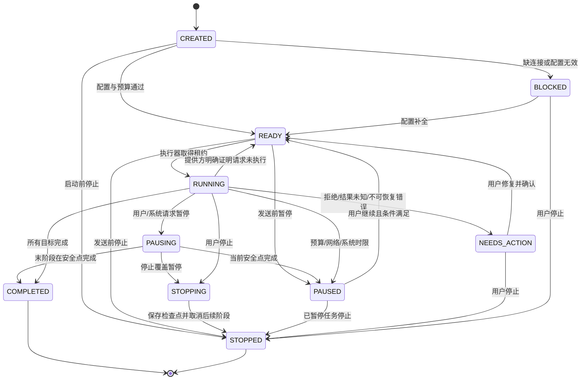
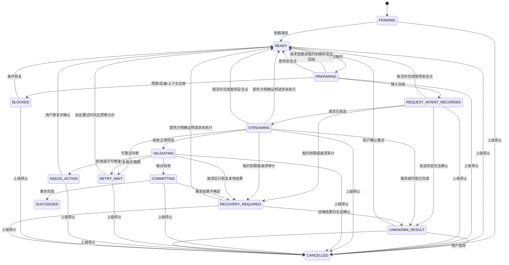
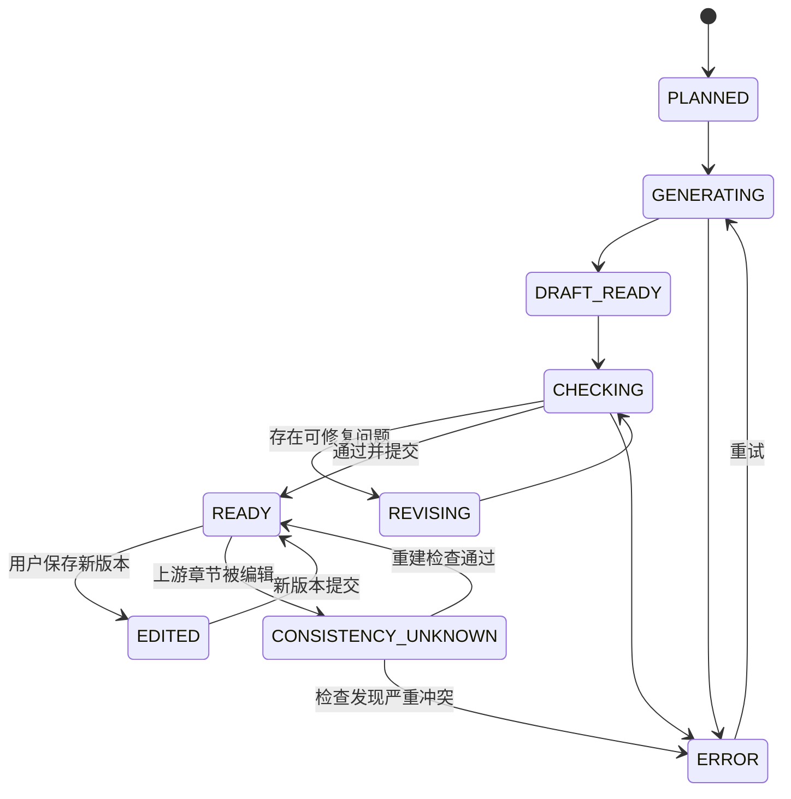
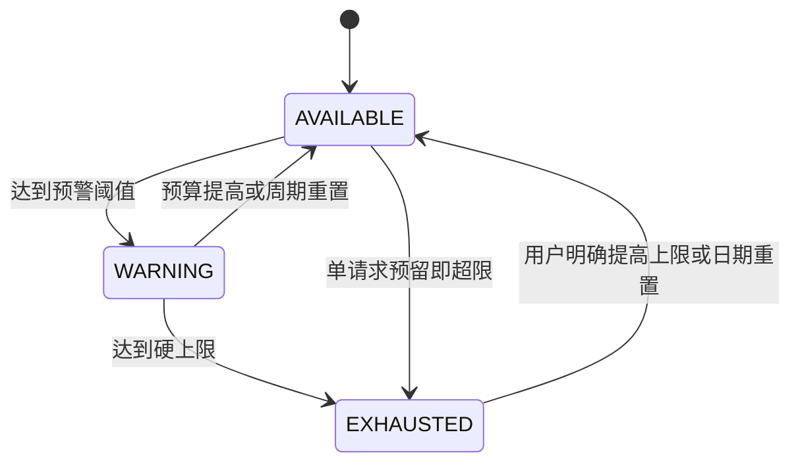
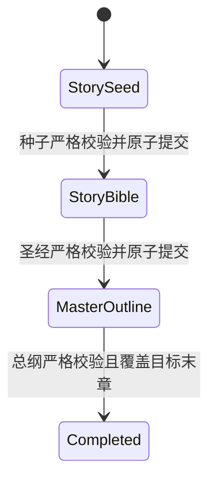
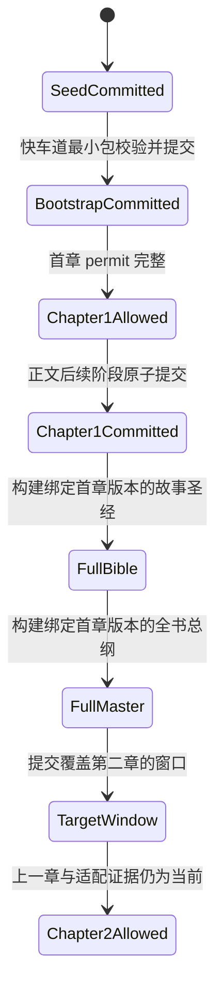
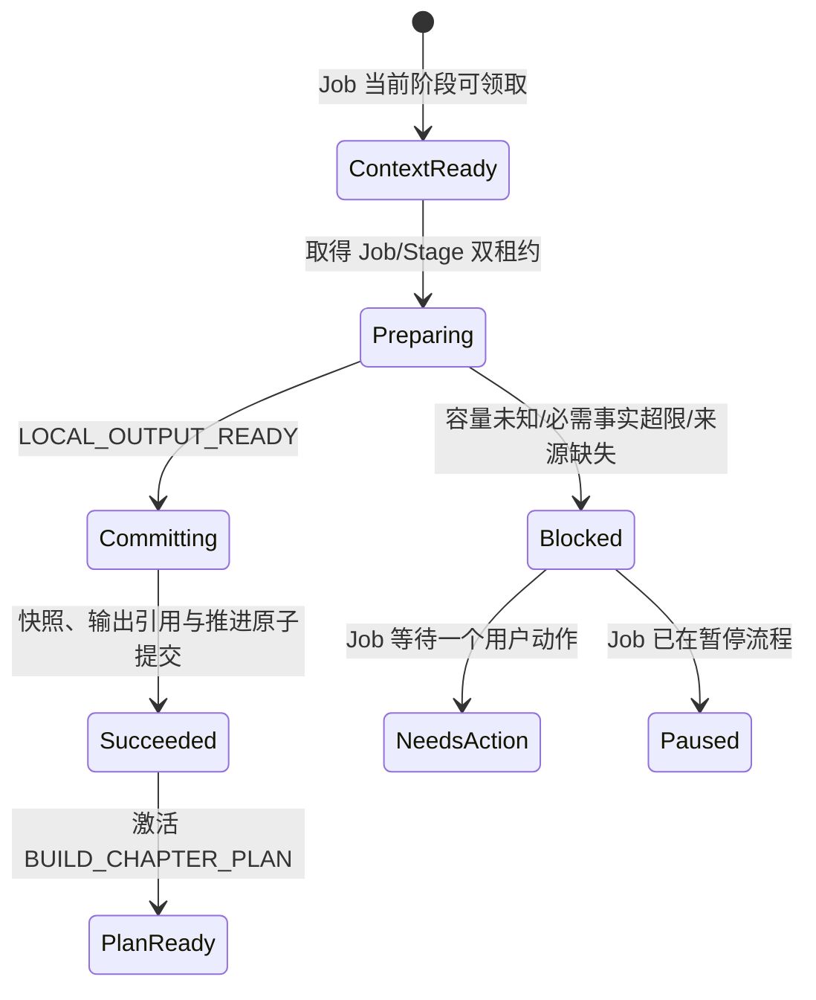
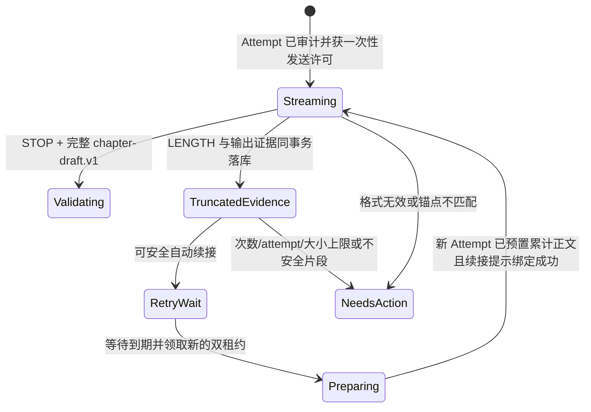

# 织卷状态机与幂等规则

## 1. 为什么必须有状态机

生成小说跨越网络、模型、数据库、Android 进程和用户操作。只用“正在生成/没在生成”会导致重复请求、章节覆盖、费用重复和崩溃后无法解释。本文件中的状态是数据库事实，前台服务与 UI 只是执行器和观察者。

## 2. 长任务 `GenerationJob`



终态：`COMPLETED`、`STOPPED`。暂停不等于失败；停止不删除已完成内容。

## 3. 阶段 `GenerationStage`



`SUCCEEDED/CANCELLED` 为终态；`NEEDS_ACTION` 可由用户修复后重新进入 READY，但恢复原因属于未知结果时必须走专用确认事务，并在后续执行时使用新 attempt。

## 4. 章节状态



UI 只有 `READY` 章节默认进入正常阅读目录。`DRAFT_READY/CHECKING` 可显示“即将完成”，但不冒充可读完成章。

## 5. RequestAttempt 状态

| 状态 | 含义 | 可否自动重试 |
|---|---|---:|
| `INTENT_RECORDED` | 本地已准备但不确定是否发送 | 否，先恢复判断 |
| `SENT` | 请求已发出 | 否，等待终态/超时 |
| `STREAMING` | 正在接收 | 否 |
| `SUCCEEDED` | 收到可验证正常结束 | 终态 |
| `FAILED_RETRYABLE` | 确认可重试 | 是，受限制 |
| `FAILED_FINAL` | 不可重试 | 终态 |
| `REFUSED` | 服务策略拒绝 | 终态 |
| `CANCELLED` | 用户/系统取消 | 终态；仍可能有费用 |
| `UNKNOWN_RESULT` | 可能已执行但结果不可确认 | 必须用户确认 |

M1 / TASK-011 已将该状态机落入正式加密库：请求意图先于网络发送入库；Attempt 与 Stage 的发送、终态和结果未知转换在同一事务中比较旧状态后提交。`UNKNOWN_RESULT` 不能直接创建新 attempt，必须先经过用户确认使 Stage 回到 READY，再领取新租约；新 attempt 保留旧 attempt 作为来源，不复用旧记录。

### 5.1 TASK-040 持久转换收口

- TASK-040 起点为 Job 13 个、Stage 21 个合法转换；经租约、控制和恢复扩展后当前为 Job 22 个、Stage 42 个，全部使用完整矩阵测试，所有其他状态/事件组合一律非法。
- 数据库写入要求“记录当前状态 = 调用方预期状态”，并以 CAS 更新；状态或时间过期均失败，不允许最后写入者静默获胜。
- `ALL_STAGES_COMPLETED` 不是信任调用方的提示：数据库确认同一 Job 没有任何非 `SUCCEEDED` Stage 后才允许 Job 完成。
- READY、等待、需处理、恢复和终态会释放租约；新执行器不能把旧 owner 当成活动所有权。
- `LEASE_ACQUIRED`、`INPUT_FROZEN`、`REQUEST_SENT`、`RESULT_UNCERTAIN`、流结果、`COMMIT_SUCCEEDED` 和 `PARENT_STOPPED` 不允许走通用 Stage 更新；它们必须分别与租约、Attempt/Usage、输出提交或任务停止事实原子写入。
- `NEEDS_ACTION → READY` 现在有显式 `ISSUE_RESOLVED` 事件；修复前不能直接重试，修复后旧错误会被清除。

### 5.2 TASK-041 租约与执行器隔离

- Stage 新增第 22 个合法转换：`PREPARING + LEASE_EXPIRED_BEFORE_REQUEST → READY`。它只能由过期回收事务触发，不能走通用状态更新。
- 领取生成 `(ownerId, acquiredAt)` 凭证；心跳和运行中转换必须同时匹配两者。仅知道 stageId 或当前状态不足以推进任务。
- 默认心跳间隔 15 秒、超时 60 秒；第 60 秒边界即过期。到期后心跳和普通业务动作都不能复活旧租约。
- 两个执行器并发领取同一 READY Stage 时只有一个 CAS 成功；安全回队后新租约会栅栏化旧执行器的所有迟到动作。
- RequestIntent 之后的过期阶段不自动回 READY。扫描结果为 `RECOVERY_AUDIT_REQUIRED`，必须先审计 Attempt、远端结果、草稿和提交事实，不能用“租约过期”推导“请求没有发生”。

### 5.3 TASK-042 发送授权顺序

```text
PREPARING + 当前租约
  → 单事务：Attempt(INTENT_RECORDED)
           + Usage(UNKNOWN/PROVISIONAL, token/cost=NULL)
           + Stage(REQUEST_INTENT_RECORDED, attemptCount+1)
  → 回读三项证据
  → 一次性 PersistedRequestSendPermit
  → claim 前再次核对证据并刷新当前租约心跳
  → 才允许 Provider open
  → Attempt(SENT) + Stage(STREAMING) 原子提交
```

- 任一审计写入失败不会得到 permit；任一 claim 校验失败不会得到 `ClaimedRequestSend`。
- permit 只可 claim 一次，进程重启不会从 `INTENT_RECORDED` 自动重造发送授权；必须进入 TASK-047 的恢复审计。
- Claim 后、发送标记前崩溃仍可能形成结果未知，因此数据库保留 RequestIntent 与未知 Usage，不把它回滚成“从未发送”。
- 连接/模型/协议快照只保存非密钥配置和 secret 引用；真实密钥不属于 RequestIntent 数据。

### 5.4 TASK-043 受控流式草稿生命周期

```text
PREPARING + 当前租约
  → 创建空的加密 STREAM_DRAFT artifact
  → TASK-042 原子审计绑定唯一 streamDraftRef
  → claim 时复核 Attempt/Usage/Stage/租约/artifact
  → 一次性打开草稿 buffer
  → 才调用 ProviderAdapter.generate
  → Started：Attempt(SENT) + Stage(STREAMING)
  → Text/Structured delta：仅追加到加密草稿
  → 每 2 秒或待写 32 KiB 原子检查点；异常/取消尽力 flush
  → 正常 STOP：停止心跳后固化哈希，Attempt(SUCCEEDED) + Stage(VALIDATING)
  → TASK-044 严格校验：合法进入 COMMITTING；首次可修复错误进入 RETRY_WAIT
  → 第二次/不可修复错误：Attempt(FORMAT_INVALID) + Stage(NEEDS_ACTION)
  → TASK-045 正式提交后按提交时间保留 24 小时再清理
```

- Provider 事件到达前由独立心跳协程维护租约；Provider 停顿不能阻塞心跳。
- `Started` 之前出现正文增量时协议失败，草稿仍为 0 字节，不能把乱序内容当成有效输出。
- revision CAS 失败会永久栅栏当前 writer 并清零其内存；旧执行器之后不能继续 flush。
- 崩溃后发现草稿只说明存在待审计输出，不证明请求成功、失败或可安全重发。RequestIntent 后仍由 TASK-047 做恢复裁决。
- 成功、失败/未知和孤立草稿分别使用 24 小时、7 天、24 小时保留期；清理必须复核数据库引用，重复引用或完整性冲突失败关闭。
- Attempt 的 `SUCCEEDED` 只证明完整响应已经持久化，不等于正式章节成功；只有 TASK-045 完成后 Stage 才可正式 `SUCCEEDED`。

### 5.5 TASK-044 结构化校验状态

```text
Attempt(STREAMING) + Stage(STREAMING) + 完整 STOP 草稿
  → 校验修订/长度/hash
  → Attempt(SUCCEEDED) + Stage(VALIDATING)
  → 严格解析、版本迁移、契约校验
      → 合法：Stage(COMMITTING)
      → 首次且可修复、仍有 attempt 名额：Attempt(FORMAT_INVALID) + Stage(RETRY_WAIT)
      → 第二次/不可修复/无名额：Attempt(FORMAT_INVALID) + Stage(NEEDS_ACTION)
```

- 修复次数取同一 Stage 持久 Attempt 链中既有 `FORMAT_INVALID` 数量，不使用进程内布尔值。
- 只有 `SUCCEEDED + FORMAT_INVALID` 的父 attempt 可作为格式修复父链；普通成功响应不能被当成重试来源。
- 校验和失败记录均要求当前租约、最新 attempt、唯一草稿引用及相同 output hash，迟到或并发校验只有一个能成功。

### 5.6 TASK-045 章节提交状态

```text
Attempt(SUCCEEDED) + Stage(COMMITTING) + 当前有效租约 + ValidatedOutputCommitPermit
  → 单一 SQLCipher 事务
      → ChapterVersion + 摘要/事件/事实/时间线/伏笔
      → Chapter 当前版本 CAS + Book 进度
      → Usage(FINAL)
      → Stage(SUCCEEDED)
      → 有 next：预冻结 Stage(PENDING → READY) + Job.currentStageId 前移
      → 无 next：确认无未成功 Stage + Job(COMPLETED)
```

- permit 必须仍对应最新成功 Attempt、同一 artifact 修订/hash 和当前租约；`COMMITTING` 之外不能首次提交。
- 完全相同的已成功提交返回同一 `ChapterVersion` 且不重复插入派生数据；重放数据不一致失败关闭。
- 当前章节版本在生成后被用户修改时，提交拒绝覆盖并保持 Stage 为可恢复的 `COMMITTING`；并发提交只有一次能写入。
- 下一 Stage 不是临时新建，而是 Job 创建时冻结的同 Job `PENDING` Stage；只允许经 `DEPENDENCIES_SATISFIED` 进入 `READY`，时间不得倒退。
- 任何数据库约束、Usage、Stage、Job 或章节 CAS 失败都会回滚正文与派生数据；不能出现 `ChapterVersion` 成功但 Stage 未成功的半提交。

### 5.7 TASK-047 未知结果恢复状态

```text
请求/流/校验/提交阶段 + 到期租约或异常
  → RECOVERY_REQUIRED
  → 本地完整响应：保持成功 Attempt，只恢复校验/提交
  → 远端仍运行/查询无结论：保持原 Attempt，等待再次对账
  → 远端明确未执行 + 空草稿 + 无已知用量 + 发送证据一致：READY
  → 其余：Attempt/Stage UNKNOWN_RESULT + Job NEEDS_ACTION
  → 用户明确确认：Stage/Job READY（不创建 Attempt、不联网）
```

- `RECOVERY_AUDIT_REQUIRED`、`PROVIDER_CONFIRMED_NOT_EXECUTED`、`RESULT_UNCERTAIN` 和 `USER_CONFIRMED_RETRY` 只能由专用恢复 Repository 消费；通用转换入口明确拒绝；
- 仅有 RequestIntent 仍可能处于“许可已 claim、远端已接收、Started 尚未落库”的崩溃窗口，不能自动回队；
- Provider 的“未执行”与本地正文或已知 usage 矛盾时，以风险更高的本地证据为准，进入用户确认；
- 远端查询只对原请求做对账，不是生成重试；`RECOVERY_REQUEUED` 只解除执行门禁，后续仍需完整领取与发送流程；
- 用户双击或两个界面并发确认时，数据库 CAS 保证只有一次从 UNKNOWN 回 READY，不会产生两个新 Attempt。

## 6. 暂停、停止、取消

- **暂停**：控制意图先写 Job。发送前立即把 Stage 回到 READY；RequestIntent/流已存在时进入 PAUSING，取消 Provider、刷新加密草稿、取消 Attempt、结算 Usage 后才进入 PAUSED。
- **继续**：只允许带用户暂停/取消来源的 PAUSED Job 回到 READY；不直接发请求，必须重新领取租约并重新经过发送审计。
- **停止全书**：STOP 可覆盖 PAUSING；活动网络先到安全点，随后所有非 SUCCEEDED Stage 原子进入 CANCELLED，Job 进入 STOPPED。保留已完成章节、计划、模板快照、草稿和台账；以后可新建续写任务。
- **取消当前章**：只适用于 PREPARING/REQUEST_INTENT_RECORDED/STREAMING；安全点后当前 attempt 进入 CANCELLED、Stage 回 READY、Job PAUSED，并记录独立来源，用户继续后才可重试。
- **本地校验/提交中的暂停**：不撕裂事务；校验失败先保留错误与修复资格再暂停，当前章提交成功后冻结下一 Stage，末 Stage 成功则允许任务正常完成。
- **迟到回调**：父 Job 已非 RUNNING、Stage 已回队/取消、Attempt 已终态或租约变化时，发送、流开始与完成回调全部拒绝，不能复活任务。
- **删除书**：独立的数据生命周期动作，不是生成状态动作。

## 7. 幂等规则

### 7.1 逻辑阶段幂等

`stageIdempotencyKey = hash(jobId + stageType + targetId + inputVersionHash)`。

- 发现同键 `SUCCEEDED`：复用已提交输出，不再发请求。
- 发现同键活动租约：不抢占。
- 发现同键 `UNKNOWN_RESULT`：要求用户决策。
- 输入版本变更：产生新键，旧阶段标记 superseded。

### 7.2 章节提交幂等

- `ChapterVersion.contentHash + generationStageId` 唯一；
- 重放同一成功事务返回既有版本；
- 不以标题/章号判断重复；
- 正式版本切换和派生数据写入同一事务。

### 7.3 用量幂等

- `UsageLedger.attemptId` 唯一；
- 流中多次 usage update 只更新同一记录，终态冻结；
- 对未知结果保存已知最小用量，并标 `UNKNOWN/ESTIMATED`，不得记成 0；
- 重试产生新 attempt 和新台账记录。

## 8. 租约与崩溃恢复

执行器领取阶段时写 `leaseOwnerId`、`leaseAcquiredAt`、`leaseHeartbeatAt`。心跳超时后：

1. 若阶段未记录请求意图，安全回到 READY；
2. 已记录意图但未确认发送，进入恢复审计；
3. 已开始流但无服务终态，按草稿和网络证据决定 `RETRY_WAIT` 或 `UNKNOWN_RESULT`；
4. 已进入 COMMITTING，先查询章节版本/台账/阶段是否事务成功，再决定，不直接重发。

## 9. 预算状态机



发请求前先创建预算预留；请求结束按实际/估计用量结算并释放差额。无价格时必须使用 token 预留，不可因为“算不出钱”而无限调用。

TASK-011 已实现“每个请求意图立即拥有一条未知用量台账”和迟到服务方 usage 的单向精度升级；三层预算计数器的数据库原子竞争仍属于 TASK-084，不因已有 UsageLedger 而提前标为完成。

## 10. 备份状态机

```text
CREATED → COLLECTING → ENCRYPTING → VERIFYING → COMPLETED
                         ↘ FAILED
```

恢复：

```text
SELECTED → MANIFEST_VERIFIED → DECRYPTING_TEMP → MIGRATING_TEMP
→ INTEGRITY_CHECKED → CURRENT_SNAPSHOT_CREATED → ATOMIC_SWITCH → COMPLETED
```

任何失败均不得覆盖当前库。只有 `ATOMIC_SWITCH` 成功后才把新库设为活动库。

## 11. 禁止状态转换

- `STREAMING → SUCCEEDED`：必须经过 VALIDATING/COMMITTING。
- `UNKNOWN_RESULT → READY`：没有用户确认或提供方查询证据不得自动发生。
- `READY Chapter → PLANNED`：不可静默丢正文。
- `TemplateRevision` 修改：不可变对象没有编辑转换，只能创建新修订。
- `BUDGET_EXHAUSTED → 发请求`：只有新预算快照生效后才可恢复。
- `RUNNING Job → COMPLETED`：数据库中仍有任一非 `SUCCEEDED` Stage 时禁止。
- 通用 `Stage → READY/REQUEST_INTENT_RECORDED/STREAMING/SUCCEEDED`：其中租约到期回 READY、请求审计、发送和输出成功均禁止绕过各自专用事务。
- `RETRY_WAIT → READY`：未到 `nextRetryAt` 或缺少错误证据时禁止。

## 12. 失败后的动作决策

失败不是直接回到 `READY`。业务层先把标准错误、请求送达状态、是否已收到正文、预算状态、已用重试/修复次数和剩余等待预算交给统一策略，再得到以下一种动作：等待网络、延时重试、一次修复、专用续写、要求用户确认或停止。

只有 `NOT_SENT` 的网络/DNS 故障和 `PROVIDER_REJECTED` 的限流/过载可以进入普通自动重试；`RESULT_UNKNOWN` 不得自动创建新 attempt。流中断在没有正文时可按有界策略重连，但必须记录“可能已计费”；已有正文则进入用户确认，避免重复章节和重复费用。

## 13. TASK-048 服务生命周期不是任务状态机

- 前台服务仅在 Job 为 `READY`、`RUNNING`、`PAUSING` 或 `STOPPING` 时保持运行；`PAUSED`、`STOPPED`、`COMPLETED`、`FAILED`、`NEEDS_ACTION` 立即退出。
- Android `Service` 的创建、销毁和 startId 不写入 Job/Stage 状态，也不能推动 Stage 进入 `PREPARING`、`STREAMING` 或 `SUCCEEDED`。
- `onTimeout` 请求 `SYSTEM_FGS_TIMEOUT` 暂停：请求前 `READY` 可原子到 `PAUSED`；若已有活动 Attempt，则沿既有 `PAUSING → PAUSED` 安全点结算。服务必须先按系统宽限退出，持久原因由独立协调器完成。
- `PAUSED(SYSTEM_FGS_TIMEOUT) → READY` 合法且不创建 Attempt；`STOPPED → READY` 仍非法。
- 服务被杀或通知权限变化不等于 Job 完成或失败；下一执行机会必须重新从数据库解释现场。

## 14. TASK-049 维护决策不是新状态机

维护器只根据已有 Job/Stage 状态选择现有专用事务，不引入 `WORKING/WORKER_SUCCESS` 等平行状态：

| 父 Job | 当前 Stage | 持久证据 | 维护动作 |
|---|---|---|---|
| `RUNNING` | `PREPARING` | Job/Stage 双租约过期，无新 Attempt | 双租约原子回收并回 `READY` |
| `RUNNING` | `REQUEST_INTENT_RECORDED/STREAMING` | 有最新 Attempt | 无 Provider 证据的未知结果审计，绝不自动重发 |
| `RUNNING` | `VALIDATING/COMMITTING` | 有最新 Attempt | 只走既有本地恢复审计，不创建请求 |
| `PAUSING/STOPPING` | `REQUEST_INTENT_RECORDED/STREAMING` | 有最新 Attempt、双租约过期 | 结算既有控制安全点 |
| `PAUSING/STOPPING` | `VALIDATING/COMMITTING` | 本地证据不足 | 延后，等待实际本地流水线恢复 |
| 任意其他组合 | 任意 | 不完整、活动或已经变化 | 不操作或按并发过期处理 |

扫描、Worker 重试和周期调度都不触发状态转换。只有表中明确的 Repository 事务成功后，Job/Stage 才发生既有合法转换；Worker 被系统取消时不写假失败。

## 15. TASK-050 阶段准备不是 Job 状态推进

- `bindForBook` 只生成不可变 Prompt Bundle 派生对象，不创建或推进 Job/Stage。
- `prepare` 只返回 `LocalOnly`、`Blocked` 或 `Remote`。`Blocked` 尤其用于相关场景成年人门禁失败；它不会把 Stage 偷偷改为成功，也不会自动降级后继续。
- `Remote` 只描述未来调用所需层、schema 与流式模式，不等同 `REQUEST_INTENT_RECORDED`，不创建 Attempt，不获得租约或发送 permit。
- TASK-051 及后续执行器必须在持久 Job 当前阶段匹配时消费该契约，并继续复用 TASK-041~047 的合法状态转换；Prompt Bundle 不能成为第二套内存状态机。

## 16. TASK-051 三阶段推进



- 每次提交复用 `VALIDATING → COMMITTING → SUCCEEDED`，并在同一事务激活唯一预冻结的下一 Stage；不存在“内存里已经进入下一阶段、数据库还没提交当前阶段”的窗口。
- 精确重放保持原成功状态和 FINAL Usage，不重复插入修订、实体或事实。
- 下一 Stage 缺失、跨 Job、非 PENDING、目标类型错误，或当前 Job 指针不一致时整笔回滚，Stage 保持可恢复的 `COMMITTING`，不得猜测新建。

## 17. TASK-052 窗口 Job 状态

- 每个补窗是独立 `CONTINUE_BOOK` Job，仅含一个 `BUILD_ARC_PLAN / OUTLINE` Stage；成功提交 revision 后 Stage 与 Job 在同一事务完成。
- 下一窗口不是当前 Job 的动态 Stage。它只在本地补窗条件满足后创建新 Job，从而让每次费用、租约和失败位置独立可审计。
- 当前窗口提交时 outline head 已变化，Stage 保持 `COMMITTING` 并整笔回滚；不得自动改 parent 或把旧窗口覆盖到新 head 上。
- 精确重放已完成 Job 时不要求旧 revision 仍是当前 head，只要求持久 output reference、revision 和节点完全一致，因此后续窗口不会破坏旧任务恢复。

## 18. TASK-053 快车道与章节推进状态



- 快车道只改变第一章的前置证据，不新增 Job/Stage 枚举或平行状态机；所有阶段仍走既有租约、Attempt、流式、校验、提交和 Usage 状态。
- 第二章的 `READY` 或界面显示“可生成”不等于可联网。Provider-open claim 必须重新签发数据库 permit；证据变化时保持当前可恢复状态并失败关闭。
- 正式章节提交只接受 `DRAFT_CHAPTER` 或 `REVISE_CHAPTER`，并再次验证相同推进证据；不能拿 bootstrap 阶段或规划阶段直接提交正文。
- 完整规划模式从 Seed 进入既有 Bible → Master → Window 后再授权第一章，不经过 BootstrapCommitted。

## 19. TASK-054 本地上下文阶段状态



- `LOCAL_OUTPUT_READY` 只允许 `PREPARING → COMMITTING`，为不产生 Attempt 的本地确定性产物提供正式提交边界。
- 成功与阻断都要求当前 Job/Stage、相同 owner 的有效双租约和冻结输入 hash；迟到执行器不能提交。
- 成功事务同时写 snapshot、Stage `SUCCEEDED`、下一 Stage `READY` 和 Job 当前阶段；任一步失败全部回滚。
- 阻断事务不创建 snapshot、Attempt 或 Usage，下一远程 Stage 保持 `PENDING`。已成功 Stage 的重放只回读旧快照。

## 20. TASK-055 章节正文截断与续接状态



- `LENGTH` 先持久化为 Attempt `SUCCEEDED + OUTPUT_TRUNCATED`、Stage `VALIDATING`、确定的输出 hash 和成功响应证据，再由结算事务进入 `RETRY_WAIT` 或 `NEEDS_ACTION`；崩溃不会留下“响应已经成功但本地不知道为什么结束”的歧义。
- `FORMAT_INVALID` 同样与成功响应证据一起持久化，结算后进入 `NEEDS_ACTION`。锚点错误不会触发猜测性重试或覆盖已保存正文。
- 自动续接沿用同一个逻辑 Stage，但必须新建 Attempt、Usage 和 artifact，`retryParentAttemptId` 指向最新截断父 Attempt；最多 3 次自动续接来自持久父链而非内存计数。
- 终态结算前崩溃可调用本地 `recoverPendingSettlement`；它只验证加密 artifact、修订、hash、UTF-8 和当前父链，不持有 Provider 许可，也不创建请求。
- `STOP` 只进入 `VALIDATING`，等待后续编排调用 TASK-056/057 记忆与追踪契约、TASK-058 检查并由 TASK-059 完成有限修订/最终提交；它不是“章节已经公开阅读”的状态。

## 21. TASK-056 章节记忆状态

正式版本重建的单阶段路径为：

```text
PENDING → READY → PREPARING → REQUEST_INTENT_RECORDED → STREAMING
→ VALIDATING → COMMITTING → SUCCEEDED
```

- `PREPARING` 写 RequestIntent 后，Provider-open 再验证来源仍为当前正式版本；来源变化时保持旧 Attempt 证据并失败关闭，不打开网络。
- 严格校验成功只签发内部提交许可；摘要/事件/事实尚未落库。提交事务成功后 Stage/Job 才完成。
- 首次结构无效：Attempt 标记 `FORMAT_INVALID`、Usage `FINAL`、Stage `RETRY_WAIT`；第二次或不可修复结果进入 `NEEDS_ACTION`。
- 同一成功 Stage 的完全相同提交为 replay；来源、payload、存储行或 next stage 任一不一致都拒绝。
- 正常候选生成的检查已由 TASK-058 冻结；“可能修订→修订后重提取→最终提交”由 TASK-059 完成，不通过本重建 Job 提前发布。

## 22. TASK-057 伏笔投影状态与任务状态

伏笔允许转换：

```text
null --PLANT--> PLANTED
PLANTED --DEVELOP--> DEVELOPING
DEVELOPING --DEVELOP--> DEVELOPING
PLANTED/DEVELOPING --RESOLVE--> RESOLVED
PLANNED/PLANTED/DEVELOPING --ABANDON(明确不可能)--> ABANDONED
```

- `RESOLVED` 与 `ABANDONED` 是终态，不能被后续模型重新打开。单章内同一伏笔最多操作一次。
- Provider 结果校验通过仍不改变伏笔；只有 COMMITTING 事务中的期望旧状态 CAS 成功后，当前投影和追加台账才同时生效。
- tracking 重建 Job 沿用 TASK-056 的远程 Stage 状态链；格式失败最多一次修复，来源变化在 Provider-open 或提交点失败关闭。
- 旧章节替换会把相关当前投影标为 STALE；TASK-061 完成自动顺序重建前，不允许跳过后续已提交章节直接重建中间章。

## 23. TASK-058 检查与接受状态

```text
冻结候选 → 本地检查
  ├─ BLOCKER/MAJOR → REVISE_CANDIDATE
  ├─ 成年门禁阻断 → SCENE_BLOCKED
  └─ 本地通过 → REQUEST_INTENT_RECORDED → STREAMING → VALIDATING
       ├─ 首次格式无效 → RETRY_WAIT（仅一次格式修复）
       ├─ 再次无效/来源变化 → NEEDS_ACTION
       ├─ BLOCKER/MAJOR → REVISE_CANDIDATE
       └─ MINOR/无问题 → ACCEPT_CANDIDATE
```

- `ACCEPT_CANDIDATE` 不是正式章节状态，只是允许 TASK-059 尝试最终提交。
- 本地 blocker/major 和 `SCENE_BLOCKED` 都发生在 Provider 打开前；不得为了继续流水线把严格场景降级。
- 检查结果来源 hash、本地快照 hash、场景契约 hash 或持久 input hash 任一不一致，都不能从旧结果继续。
- `REVISE_CANDIDATE` 的次数和后续再检查由 TASK-059 的有限状态机冻结，TASK-058 不自行循环改稿。
