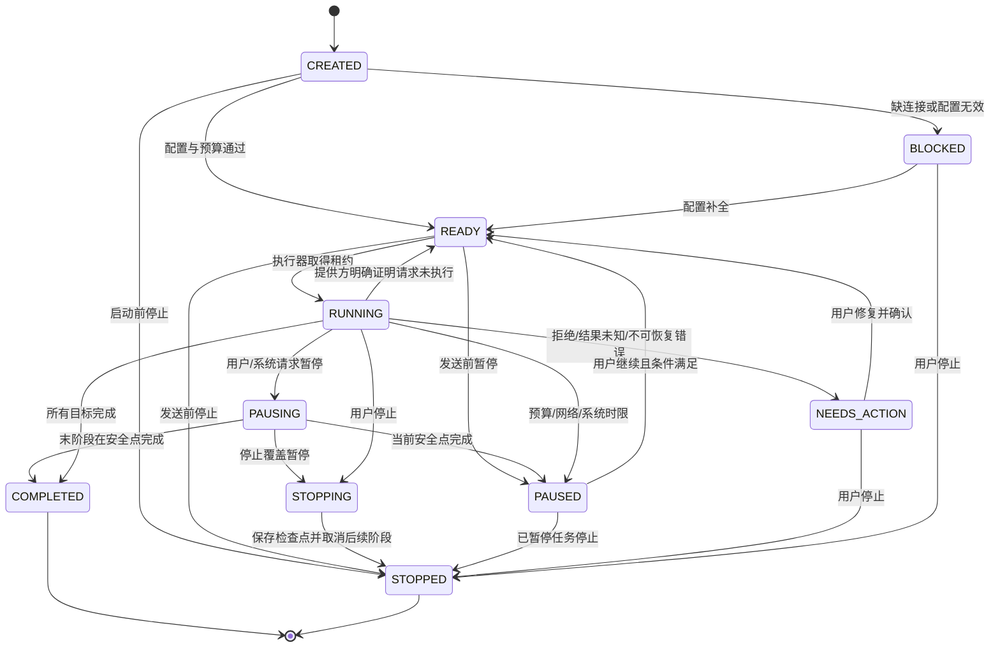
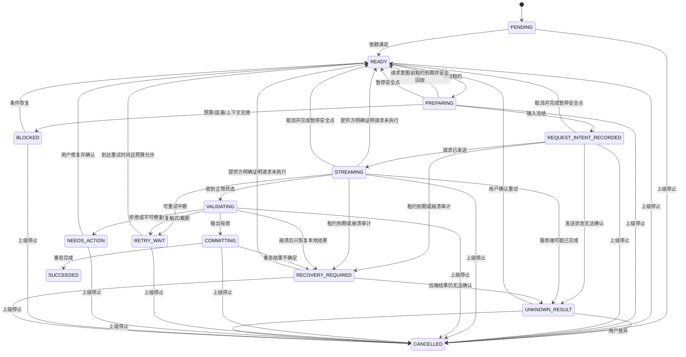
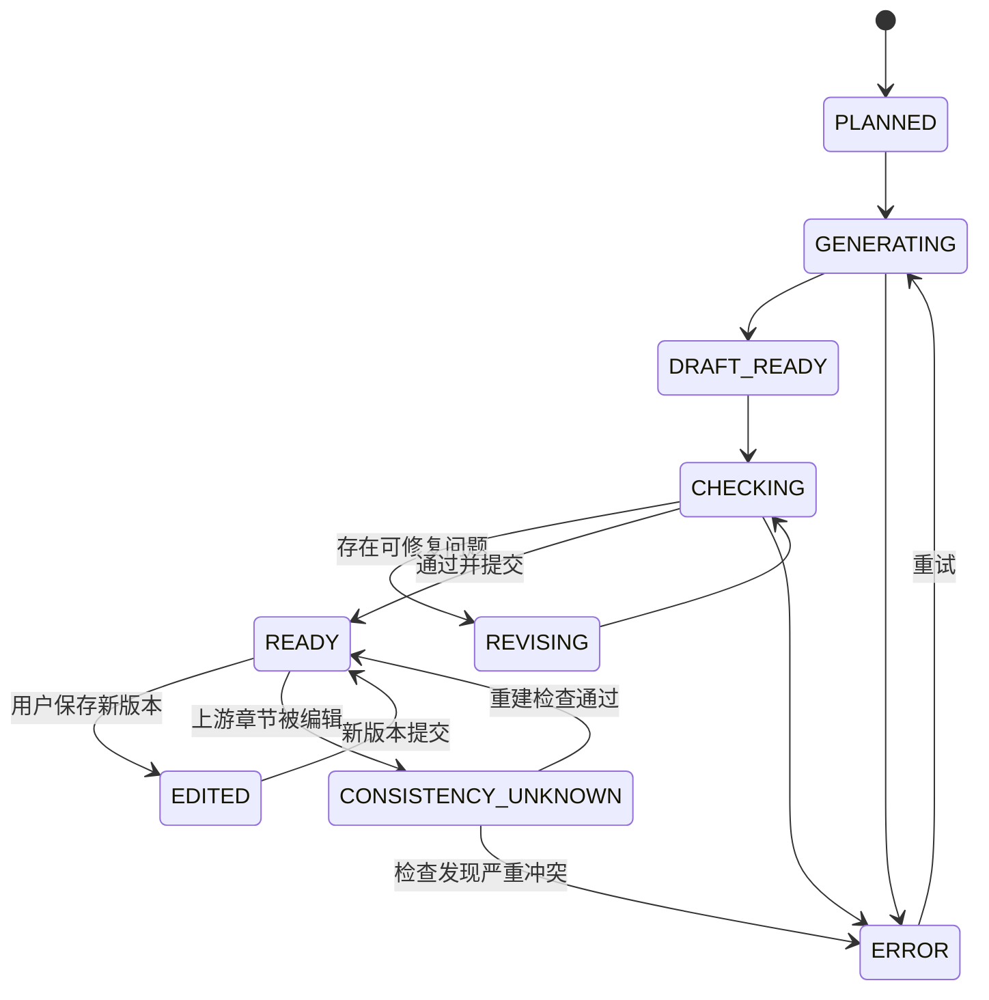
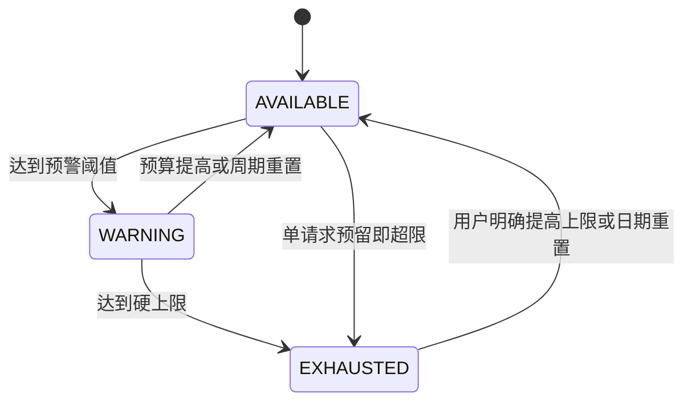
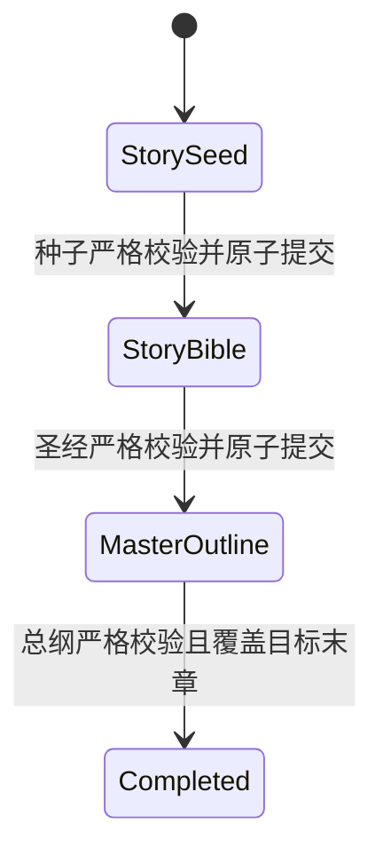
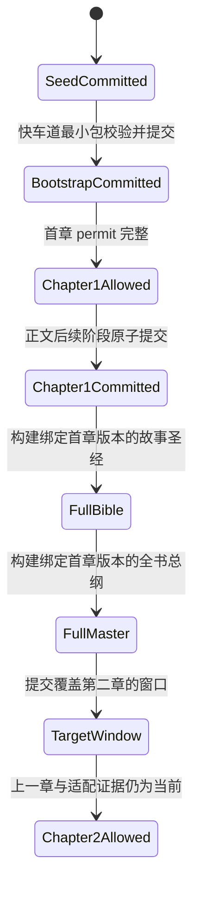
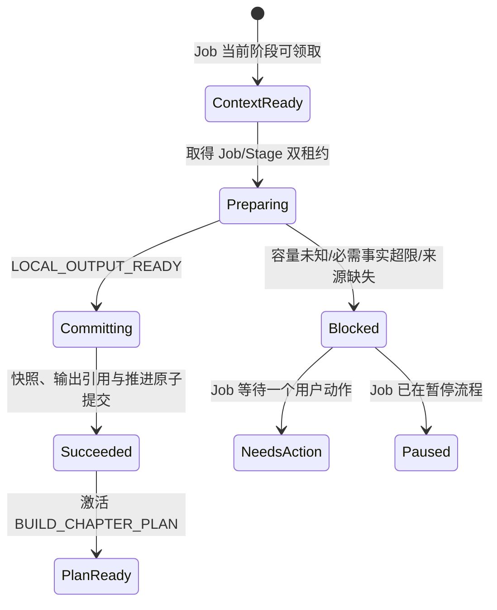
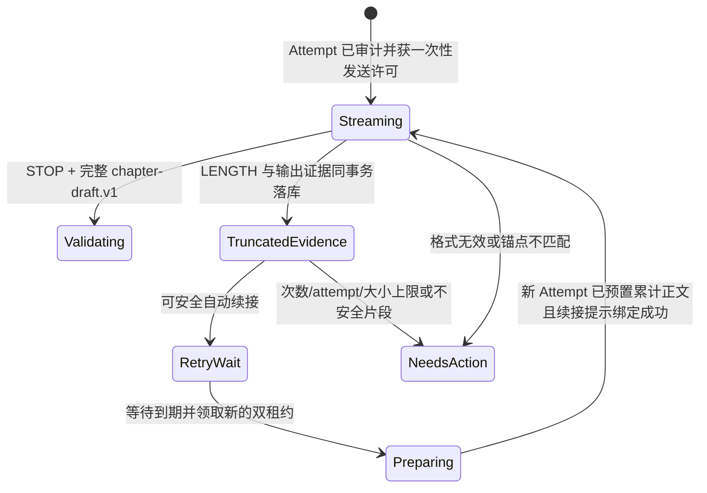

# 织卷状态机与幂等规则

## 1. 为什么必须有状态机

生成小说跨越网络、模型、数据库、Android 进程和用户操作。只用“正在生成/没在生成”会导致重复请求、章节覆盖、费用重复和崩溃后无法解释。本文件中的状态是数据库事实，前台服务与 UI 只是执行器和观察者。

## 2. 长任务 `GenerationJob`



终态：`COMPLETED`、`STOPPED`。暂停不等于失败；停止不删除已完成内容。

## 3. 阶段 `GenerationStage`



`SUCCEEDED/CANCELLED` 为终态；`NEEDS_ACTION` 可由用户修复后重新进入 READY，但恢复原因属于未知结果时必须走专用确认事务，并在后续执行时使用新 attempt。

## 4. 章节状态



UI 只有 `READY` 章节默认进入正常阅读目录。`DRAFT_READY/CHECKING` 可显示“即将完成”，但不冒充可读完成章。

## 5. RequestAttempt 状态

| 状态 | 含义 | 可否自动重试 |
|---|---|---:|
| `INTENT_RECORDED` | 本地已准备但不确定是否发送 | 否，先恢复判断 |
| `SENT` | 请求已发出 | 否，等待终态/超时 |
| `STREAMING` | 正在接收 | 否 |
| `SUCCEEDED` | 收到可验证正常结束 | 终态 |
| `FAILED_RETRYABLE` | 确认可重试 | 是，受限制 |
| `FAILED_FINAL` | 不可重试 | 终态 |
| `REFUSED` | 服务策略拒绝 | 终态 |
| `CANCELLED` | 用户/系统取消 | 终态；仍可能有费用 |
| `UNKNOWN_RESULT` | 可能已执行但结果不可确认 | 必须用户确认 |

M1 / TASK-011 已将该状态机落入正式加密库：请求意图先于网络发送入库；Attempt 与 Stage 的发送、终态和结果未知转换在同一事务中比较旧状态后提交。`UNKNOWN_RESULT` 不能直接创建新 attempt，必须先经过用户确认使 Stage 回到 READY，再领取新租约；新 attempt 保留旧 attempt 作为来源，不复用旧记录。

### 5.1 TASK-040 持久转换收口

- TASK-040 起点为 Job 13 个、Stage 21 个合法转换；经租约、控制和恢复扩展后当前为 Job 22 个、Stage 42 个，全部使用完整矩阵测试，所有其他状态/事件组合一律非法。
- 数据库写入要求“记录当前状态 = 调用方预期状态”，并以 CAS 更新；状态或时间过期均失败，不允许最后写入者静默获胜。
- `ALL_STAGES_COMPLETED` 不是信任调用方的提示：数据库确认同一 Job 没有任何非 `SUCCEEDED` Stage 后才允许 Job 完成。
- READY、等待、需处理、恢复和终态会释放租约；新执行器不能把旧 owner 当成活动所有权。
- `LEASE_ACQUIRED`、`INPUT_FROZEN`、`REQUEST_SENT`、`RESULT_UNCERTAIN`、流结果、`COMMIT_SUCCEEDED` 和 `PARENT_STOPPED` 不允许走通用 Stage 更新；它们必须分别与租约、Attempt/Usage、输出提交或任务停止事实原子写入。
- `NEEDS_ACTION → READY` 现在有显式 `ISSUE_RESOLVED` 事件；修复前不能直接重试，修复后旧错误会被清除。

### 5.2 TASK-041 租约与执行器隔离

- Stage 新增第 22 个合法转换：`PREPARING + LEASE_EXPIRED_BEFORE_REQUEST → READY`。它只能由过期回收事务触发，不能走通用状态更新。
- 领取生成 `(ownerId, acquiredAt)` 凭证；心跳和运行中转换必须同时匹配两者。仅知道 stageId 或当前状态不足以推进任务。
- 默认心跳间隔 15 秒、超时 60 秒；第 60 秒边界即过期。到期后心跳和普通业务动作都不能复活旧租约。
- 两个执行器并发领取同一 READY Stage 时只有一个 CAS 成功；安全回队后新租约会栅栏化旧执行器的所有迟到动作。
- RequestIntent 之后的过期阶段不自动回 READY。扫描结果为 `RECOVERY_AUDIT_REQUIRED`，必须先审计 Attempt、远端结果、草稿和提交事实，不能用“租约过期”推导“请求没有发生”。

### 5.3 TASK-042 发送授权顺序

```text
PREPARING + 当前租约
  → 单事务：Attempt(INTENT_RECORDED)
           + Usage(UNKNOWN/PROVISIONAL, token/cost=NULL)
           + Stage(REQUEST_INTENT_RECORDED, attemptCount+1)
  → 回读三项证据
  → 一次性 PersistedRequestSendPermit
  → claim 前再次核对证据并刷新当前租约心跳
  → 才允许 Provider open
  → Attempt(SENT) + Stage(STREAMING) 原子提交
```

- 任一审计写入失败不会得到 permit；任一 claim 校验失败不会得到 `ClaimedRequestSend`。
- permit 只可 claim 一次，进程重启不会从 `INTENT_RECORDED` 自动重造发送授权；必须进入 TASK-047 的恢复审计。
- Claim 后、发送标记前崩溃仍可能形成结果未知，因此数据库保留 RequestIntent 与未知 Usage，不把它回滚成“从未发送”。
- 连接/模型/协议快照只保存非密钥配置和 secret 引用；真实密钥不属于 RequestIntent 数据。

### 5.4 TASK-043 受控流式草稿生命周期

```text
PREPARING + 当前租约
  → 创建空的加密 STREAM_DRAFT artifact
  → TASK-042 原子审计绑定唯一 streamDraftRef
  → claim 时复核 Attempt/Usage/Stage/租约/artifact
  → 一次性打开草稿 buffer
  → 才调用 ProviderAdapter.generate
  → Started：Attempt(SENT) + Stage(STREAMING)
  → Text/Structured delta：仅追加到加密草稿
  → 每 2 秒或待写 32 KiB 原子检查点；异常/取消尽力 flush
  → 正常 STOP：停止心跳后固化哈希，Attempt(SUCCEEDED) + Stage(VALIDATING)
  → TASK-044 严格校验：合法进入 COMMITTING；首次可修复错误进入 RETRY_WAIT
  → 第二次/不可修复错误：Attempt(FORMAT_INVALID) + Stage(NEEDS_ACTION)
  → TASK-045 正式提交后按提交时间保留 24 小时再清理
```

- Provider 事件到达前由独立心跳协程维护租约；Provider 停顿不能阻塞心跳。
- `Started` 之前出现正文增量时协议失败，草稿仍为 0 字节，不能把乱序内容当成有效输出。
- revision CAS 失败会永久栅栏当前 writer 并清零其内存；旧执行器之后不能继续 flush。
- 崩溃后发现草稿只说明存在待审计输出，不证明请求成功、失败或可安全重发。RequestIntent 后仍由 TASK-047 做恢复裁决。
- 成功、失败/未知和孤立草稿分别使用 24 小时、7 天、24 小时保留期；清理必须复核数据库引用，重复引用或完整性冲突失败关闭。
- Attempt 的 `SUCCEEDED` 只证明完整响应已经持久化，不等于正式章节成功；只有 TASK-045 完成后 Stage 才可正式 `SUCCEEDED`。

### 5.5 TASK-044 结构化校验状态

```text
Attempt(STREAMING) + Stage(STREAMING) + 完整 STOP 草稿
  → 校验修订/长度/hash
  → Attempt(SUCCEEDED) + Stage(VALIDATING)
  → 严格解析、版本迁移、契约校验
      → 合法：Stage(COMMITTING)
      → 首次且可修复、仍有 attempt 名额：Attempt(FORMAT_INVALID) + Stage(RETRY_WAIT)
      → 第二次/不可修复/无名额：Attempt(FORMAT_INVALID) + Stage(NEEDS_ACTION)
```

- 修复次数取同一 Stage 持久 Attempt 链中既有 `FORMAT_INVALID` 数量，不使用进程内布尔值。
- 只有 `SUCCEEDED + FORMAT_INVALID` 的父 attempt 可作为格式修复父链；普通成功响应不能被当成重试来源。
- 校验和失败记录均要求当前租约、最新 attempt、唯一草稿引用及相同 output hash，迟到或并发校验只有一个能成功。

### 5.6 TASK-045 章节提交状态

```text
Attempt(SUCCEEDED) + Stage(COMMITTING) + 当前有效租约 + ValidatedOutputCommitPermit
  → 单一 SQLCipher 事务
      → ChapterVersion + 摘要/事件/事实/时间线/伏笔
      → Chapter 当前版本 CAS + Book 进度
      → Usage(FINAL)
      → Stage(SUCCEEDED)
      → 有 next：预冻结 Stage(PENDING → READY) + Job.currentStageId 前移
      → 无 next：确认无未成功 Stage + Job(COMPLETED)
```

- permit 必须仍对应最新成功 Attempt、同一 artifact 修订/hash 和当前租约；`COMMITTING` 之外不能首次提交。
- 完全相同的已成功提交返回同一 `ChapterVersion` 且不重复插入派生数据；重放数据不一致失败关闭。
- 当前章节版本在生成后被用户修改时，提交拒绝覆盖并保持 Stage 为可恢复的 `COMMITTING`；并发提交只有一次能写入。
- 下一 Stage 不是临时新建，而是 Job 创建时冻结的同 Job `PENDING` Stage；只允许经 `DEPENDENCIES_SATISFIED` 进入 `READY`，时间不得倒退。
- 任何数据库约束、Usage、Stage、Job 或章节 CAS 失败都会回滚正文与派生数据；不能出现 `ChapterVersion` 成功但 Stage 未成功的半提交。

### 5.7 TASK-047 未知结果恢复状态

```text
请求/流/校验/提交阶段 + 到期租约或异常
  → RECOVERY_REQUIRED
  → 本地完整响应：保持成功 Attempt，只恢复校验/提交
  → 远端仍运行/查询无结论：保持原 Attempt，等待再次对账
  → 远端明确未执行 + 空草稿 + 无已知用量 + 发送证据一致：READY
  → 其余：Attempt/Stage UNKNOWN_RESULT + Job NEEDS_ACTION
  → 用户明确确认：Stage/Job READY（不创建 Attempt、不联网）
```

- `RECOVERY_AUDIT_REQUIRED`、`PROVIDER_CONFIRMED_NOT_EXECUTED`、`RESULT_UNCERTAIN` 和 `USER_CONFIRMED_RETRY` 只能由专用恢复 Repository 消费；通用转换入口明确拒绝；
- 仅有 RequestIntent 仍可能处于“许可已 claim、远端已接收、Started 尚未落库”的崩溃窗口，不能自动回队；
- Provider 的“未执行”与本地正文或已知 usage 矛盾时，以风险更高的本地证据为准，进入用户确认；
- 远端查询只对原请求做对账，不是生成重试；`RECOVERY_REQUEUED` 只解除执行门禁，后续仍需完整领取与发送流程；
- 用户双击或两个界面并发确认时，数据库 CAS 保证只有一次从 UNKNOWN 回 READY，不会产生两个新 Attempt。

## 6. 暂停、停止、取消

- **暂停**：控制意图先写 Job。发送前立即把 Stage 回到 READY；RequestIntent/流已存在时进入 PAUSING，取消 Provider、刷新加密草稿、取消 Attempt、结算 Usage 后才进入 PAUSED。
- **继续**：只允许带用户暂停/取消来源的 PAUSED Job 回到 READY；不直接发请求，必须重新领取租约并重新经过发送审计。
- **停止全书**：STOP 可覆盖 PAUSING；活动网络先到安全点，随后所有非 SUCCEEDED Stage 原子进入 CANCELLED，Job 进入 STOPPED。保留已完成章节、计划、模板快照、草稿和台账；以后可新建续写任务。
- **取消当前章**：只适用于 PREPARING/REQUEST_INTENT_RECORDED/STREAMING；安全点后当前 attempt 进入 CANCELLED、Stage 回 READY、Job PAUSED，并记录独立来源，用户继续后才可重试。
- **本地校验/提交中的暂停**：不撕裂事务；校验失败先保留错误与修复资格再暂停，当前章提交成功后冻结下一 Stage，末 Stage 成功则允许任务正常完成。
- **迟到回调**：父 Job 已非 RUNNING、Stage 已回队/取消、Attempt 已终态或租约变化时，发送、流开始与完成回调全部拒绝，不能复活任务。
- **删除书**：独立的数据生命周期动作，不是生成状态动作。

## 7. 幂等规则

### 7.1 逻辑阶段幂等

`stageIdempotencyKey = hash(jobId + stageType + targetId + inputVersionHash)`。

- 发现同键 `SUCCEEDED`：复用已提交输出，不再发请求。
- 发现同键活动租约：不抢占。
- 发现同键 `UNKNOWN_RESULT`：要求用户决策。
- 输入版本变更：产生新键，旧阶段标记 superseded。

### 7.2 章节提交幂等

- `ChapterVersion.contentHash + generationStageId` 唯一；
- 重放同一成功事务返回既有版本；
- 不以标题/章号判断重复；
- 正式版本切换和派生数据写入同一事务。

### 7.3 用量幂等

- `UsageLedger.attemptId` 唯一；
- 流中多次 usage update 只更新同一记录，终态冻结；
- 对未知结果保存已知最小用量，并标 `UNKNOWN/ESTIMATED`，不得记成 0；
- 重试产生新 attempt 和新台账记录。

## 8. 租约与崩溃恢复

执行器领取阶段时写 `leaseOwnerId`、`leaseAcquiredAt`、`leaseHeartbeatAt`。心跳超时后：

1. 若阶段未记录请求意图，安全回到 READY；
2. 已记录意图但未确认发送，进入恢复审计；
3. 已开始流但无服务终态，按草稿和网络证据决定 `RETRY_WAIT` 或 `UNKNOWN_RESULT`；
4. 已进入 COMMITTING，先查询章节版本/台账/阶段是否事务成功，再决定，不直接重发。

## 9. 预算状态机



发请求前先创建预算预留；请求结束按实际/估计用量结算并释放差额。无价格时必须使用 token 预留，不可因为“算不出钱”而无限调用。

TASK-011 已实现“每个请求意图立即拥有一条未知用量台账”和迟到服务方 usage 的单向精度升级；三层预算 reservation 的数据库原子竞争仍属于 TASK-083，不因已有 UsageLedger 而提前标为完成。

## 10. 备份状态机

```text
CREATED → COLLECTING → ENCRYPTING → VERIFYING → COMPLETED
                         ↘ FAILED
```

恢复：

```text
SELECTED → MANIFEST_VERIFIED → DECRYPTING_TEMP → MIGRATING_TEMP
→ INTEGRITY_CHECKED → CURRENT_SNAPSHOT_CREATED → ATOMIC_SWITCH → COMPLETED
```

任何失败均不得覆盖当前库。只有 `ATOMIC_SWITCH` 成功后才把新库设为活动库。

## 11. 禁止状态转换

- `STREAMING → SUCCEEDED`：必须经过 VALIDATING/COMMITTING。
- `UNKNOWN_RESULT → READY`：没有用户确认或提供方查询证据不得自动发生。
- `READY Chapter → PLANNED`：不可静默丢正文。
- `TemplateRevision` 修改：不可变对象没有编辑转换，只能创建新修订。
- `BUDGET_EXHAUSTED → 发请求`：只有新预算快照生效后才可恢复。
- `RUNNING Job → COMPLETED`：数据库中仍有任一非 `SUCCEEDED` Stage 时禁止。
- 通用 `Stage → READY/REQUEST_INTENT_RECORDED/STREAMING/SUCCEEDED`：其中租约到期回 READY、请求审计、发送和输出成功均禁止绕过各自专用事务。
- `RETRY_WAIT → READY`：未到 `nextRetryAt` 或缺少错误证据时禁止。

## 12. 失败后的动作决策

失败不是直接回到 `READY`。业务层先把标准错误、请求送达状态、是否已收到正文、预算状态、已用重试/修复次数和剩余等待预算交给统一策略，再得到以下一种动作：等待网络、延时重试、一次修复、专用续写、要求用户确认或停止。

只有 `NOT_SENT` 的网络/DNS 故障和 `PROVIDER_REJECTED` 的限流/过载可以进入普通自动重试；`RESULT_UNKNOWN` 不得自动创建新 attempt。流中断在没有正文时可按有界策略重连，但必须记录“可能已计费”；已有正文则进入用户确认，避免重复章节和重复费用。

## 13. TASK-048 服务生命周期不是任务状态机

- 前台服务仅在 Job 为 `READY`、`RUNNING`、`PAUSING` 或 `STOPPING` 时保持运行；`PAUSED`、`STOPPED`、`COMPLETED`、`FAILED`、`NEEDS_ACTION` 立即退出。
- Android `Service` 的创建、销毁和 startId 不写入 Job/Stage 状态，也不能推动 Stage 进入 `PREPARING`、`STREAMING` 或 `SUCCEEDED`。
- `onTimeout` 请求 `SYSTEM_FGS_TIMEOUT` 暂停：请求前 `READY` 可原子到 `PAUSED`；若已有活动 Attempt，则沿既有 `PAUSING → PAUSED` 安全点结算。服务必须先按系统宽限退出，持久原因由独立协调器完成。
- `PAUSED(SYSTEM_FGS_TIMEOUT) → READY` 合法且不创建 Attempt；`STOPPED → READY` 仍非法。
- 服务被杀或通知权限变化不等于 Job 完成或失败；下一执行机会必须重新从数据库解释现场。

## 14. TASK-049 维护决策不是新状态机

维护器只根据已有 Job/Stage 状态选择现有专用事务，不引入 `WORKING/WORKER_SUCCESS` 等平行状态：

| 父 Job | 当前 Stage | 持久证据 | 维护动作 |
|---|---|---|---|
| `RUNNING` | `PREPARING` | Job/Stage 双租约过期，无新 Attempt | 双租约原子回收并回 `READY` |
| `RUNNING` | `REQUEST_INTENT_RECORDED/STREAMING` | 有最新 Attempt | 无 Provider 证据的未知结果审计，绝不自动重发 |
| `RUNNING` | `VALIDATING/COMMITTING` | 有最新 Attempt | 只走既有本地恢复审计，不创建请求 |
| `PAUSING/STOPPING` | `REQUEST_INTENT_RECORDED/STREAMING` | 有最新 Attempt、双租约过期 | 结算既有控制安全点 |
| `PAUSING/STOPPING` | `VALIDATING/COMMITTING` | 本地证据不足 | 延后，等待实际本地流水线恢复 |
| 任意其他组合 | 任意 | 不完整、活动或已经变化 | 不操作或按并发过期处理 |

扫描、Worker 重试和周期调度都不触发状态转换。只有表中明确的 Repository 事务成功后，Job/Stage 才发生既有合法转换；Worker 被系统取消时不写假失败。

## 15. TASK-050 阶段准备不是 Job 状态推进

- `bindForBook` 只生成不可变 Prompt Bundle 派生对象，不创建或推进 Job/Stage。
- `prepare` 只返回 `LocalOnly`、`Blocked` 或 `Remote`。`Blocked` 尤其用于相关场景成年人门禁失败；它不会把 Stage 偷偷改为成功，也不会自动降级后继续。
- `Remote` 只描述未来调用所需层、schema 与流式模式，不等同 `REQUEST_INTENT_RECORDED`，不创建 Attempt，不获得租约或发送 permit。
- TASK-051 及后续执行器必须在持久 Job 当前阶段匹配时消费该契约，并继续复用 TASK-041~047 的合法状态转换；Prompt Bundle 不能成为第二套内存状态机。

## 16. TASK-051 三阶段推进



- 每次提交复用 `VALIDATING → COMMITTING → SUCCEEDED`，并在同一事务激活唯一预冻结的下一 Stage；不存在“内存里已经进入下一阶段、数据库还没提交当前阶段”的窗口。
- 精确重放保持原成功状态和 FINAL Usage，不重复插入修订、实体或事实。
- 下一 Stage 缺失、跨 Job、非 PENDING、目标类型错误，或当前 Job 指针不一致时整笔回滚，Stage 保持可恢复的 `COMMITTING`，不得猜测新建。

## 17. TASK-052 窗口 Job 状态

- 每个补窗是独立 `CONTINUE_BOOK` Job，仅含一个 `BUILD_ARC_PLAN / OUTLINE` Stage；成功提交 revision 后 Stage 与 Job 在同一事务完成。
- 下一窗口不是当前 Job 的动态 Stage。它只在本地补窗条件满足后创建新 Job，从而让每次费用、租约和失败位置独立可审计。
- 当前窗口提交时 outline head 已变化，Stage 保持 `COMMITTING` 并整笔回滚；不得自动改 parent 或把旧窗口覆盖到新 head 上。
- 精确重放已完成 Job 时不要求旧 revision 仍是当前 head，只要求持久 output reference、revision 和节点完全一致，因此后续窗口不会破坏旧任务恢复。

## 18. TASK-053 快车道与章节推进状态



- 快车道只改变第一章的前置证据，不新增 Job/Stage 枚举或平行状态机；所有阶段仍走既有租约、Attempt、流式、校验、提交和 Usage 状态。
- 第二章的 `READY` 或界面显示“可生成”不等于可联网。Provider-open claim 必须重新签发数据库 permit；证据变化时保持当前可恢复状态并失败关闭。
- 正式章节提交只接受 `DRAFT_CHAPTER` 或 `REVISE_CHAPTER`，并再次验证相同推进证据；不能拿 bootstrap 阶段或规划阶段直接提交正文。
- 完整规划模式从 Seed 进入既有 Bible → Master → Window 后再授权第一章，不经过 BootstrapCommitted。

## 19. TASK-054 本地上下文阶段状态



- `LOCAL_OUTPUT_READY` 只允许 `PREPARING → COMMITTING`，为不产生 Attempt 的本地确定性产物提供正式提交边界。
- 成功与阻断都要求当前 Job/Stage、相同 owner 的有效双租约和冻结输入 hash；迟到执行器不能提交。
- 成功事务同时写 snapshot、Stage `SUCCEEDED`、下一 Stage `READY` 和 Job 当前阶段；任一步失败全部回滚。
- 阻断事务不创建 snapshot、Attempt 或 Usage，下一远程 Stage 保持 `PENDING`。已成功 Stage 的重放只回读旧快照。

## 20. TASK-055 章节正文截断与续接状态



- `LENGTH` 先持久化为 Attempt `SUCCEEDED + OUTPUT_TRUNCATED`、Stage `VALIDATING`、确定的输出 hash 和成功响应证据，再由结算事务进入 `RETRY_WAIT` 或 `NEEDS_ACTION`；崩溃不会留下“响应已经成功但本地不知道为什么结束”的歧义。
- `FORMAT_INVALID` 同样与成功响应证据一起持久化，结算后进入 `NEEDS_ACTION`。锚点错误不会触发猜测性重试或覆盖已保存正文。
- 自动续接沿用同一个逻辑 Stage，但必须新建 Attempt、Usage 和 artifact，`retryParentAttemptId` 指向最新截断父 Attempt；最多 3 次自动续接来自持久父链而非内存计数。
- 终态结算前崩溃可调用本地 `recoverPendingSettlement`；它只验证加密 artifact、修订、hash、UTF-8 和当前父链，不持有 Provider 许可，也不创建请求。
- `STOP` 只进入 `VALIDATING`，等待后续编排调用 TASK-056/057 记忆与追踪契约、TASK-058 检查并由 TASK-059 完成有限修订/最终提交；它不是“章节已经公开阅读”的状态。

## 21. TASK-056 章节记忆状态

正式版本重建的单阶段路径为：

```text
PENDING → READY → PREPARING → REQUEST_INTENT_RECORDED → STREAMING
→ VALIDATING → COMMITTING → SUCCEEDED
```

- `PREPARING` 写 RequestIntent 后，Provider-open 再验证来源仍为当前正式版本；来源变化时保持旧 Attempt 证据并失败关闭，不打开网络。
- 严格校验成功只签发内部提交许可；摘要/事件/事实尚未落库。提交事务成功后 Stage/Job 才完成。
- 首次结构无效：Attempt 标记 `FORMAT_INVALID`、Usage `FINAL`、Stage `RETRY_WAIT`；第二次或不可修复结果进入 `NEEDS_ACTION`。
- 同一成功 Stage 的完全相同提交为 replay；来源、payload、存储行或 next stage 任一不一致都拒绝。
- 正常候选生成的检查已由 TASK-058 冻结；“可能修订→修订后重提取→最终提交”由 TASK-059 完成，不通过本重建 Job 提前发布。

## 22. TASK-057 伏笔投影状态与任务状态

伏笔允许转换：

```text
null --PLANT--> PLANTED
PLANTED --DEVELOP--> DEVELOPING
DEVELOPING --DEVELOP--> DEVELOPING
PLANTED/DEVELOPING --RESOLVE--> RESOLVED
PLANNED/PLANTED/DEVELOPING --ABANDON(明确不可能)--> ABANDONED
```

- `RESOLVED` 与 `ABANDONED` 是终态，不能被后续模型重新打开。单章内同一伏笔最多操作一次。
- Provider 结果校验通过仍不改变伏笔；只有 COMMITTING 事务中的期望旧状态 CAS 成功后，当前投影和追加台账才同时生效。
- tracking 重建 Job 沿用 TASK-056 的远程 Stage 状态链；格式失败最多一次修复，来源变化在 Provider-open 或提交点失败关闭。
- 旧章节替换会把相关当前投影标为 STALE；TASK-061 完成自动顺序重建前，不允许跳过后续已提交章节直接重建中间章。

### 22.1 编辑后的受审计 rewind 特例

普通生成仍严格遵守上述单向业务状态机，不能把 `RESOLVED/ABANDONED` 重新打开。唯一回退入口是 TASK-061 schema v13 的数据库内部 rewind 事务，它不是一次模型状态转换，而是把“被编辑区间的投影历史”撤销到编辑点前最后一个可证明的完整 revision：

```text
冻结且重验 plan
  → revision VALID → STALE
  → transition VALID → STALE
  → 区间 VALID 计数必须为 0
  → 可信旧 item 全字段 CAS 恢复 / 区间新生 item → STALE
  → 删除并重建受影响 FTS
  → 写不可变 rewind 审计
```

任一步、任何 legacy 基线、CAS、hash、范围或版本栅栏不一致都回滚整个事务。精确 replay 只核验证据并返回，不重新改写 current item 或时间戳。该特例完成后仍需从编辑点按章节顺序生成新的 tracking/aggregate 等派生头，不能直接跳到后续章。

### 22.2 聚合状态单章写入

```text
冻结计划中的 aggregate READY
  → 重验完整 current 章节范围
  → 重验目标章有效 tracking 代次
  → 有界读取最新实体属性 + 当前活动伏笔
  → 规范编码并计算内容 hash
  → 精确 replay？是：零写入返回
  → 当前槽旧 VALID 头转 STALE
  → 插入新 VALID aggregate
  → 精确回读
```

任何来源超界、未来/旧版本伏笔、tracking 换代、坏旧聚合、时间倒退、并发不同证据或非 READY 步骤都会在事务内失败关闭。新聚合写成后，计划重算会把该步识别为 `ALREADY_SATISFIED`，下一章只有在 tracking 与上一章 aggregate 都已满足时才可能解锁。该 writer 不自行创建远程 Job/Stage，也不构成跨章 runner。

## 23. TASK-058 检查与接受状态

```text
冻结候选 → 本地检查
  ├─ BLOCKER/MAJOR → REVISE_CANDIDATE
  ├─ 成年门禁阻断 → SCENE_BLOCKED
  └─ 本地通过 → REQUEST_INTENT_RECORDED → STREAMING → VALIDATING
       ├─ 首次格式无效 → RETRY_WAIT（仅一次格式修复）
       ├─ 再次无效/来源变化 → NEEDS_ACTION
       ├─ BLOCKER/MAJOR → REVISE_CANDIDATE
       └─ MINOR/无问题 → ACCEPT_CANDIDATE
```

- `ACCEPT_CANDIDATE` 不是正式章节状态，只是允许 TASK-059 尝试最终提交。
- 本地 blocker/major 和 `SCENE_BLOCKED` 都发生在 Provider 打开前；不得为了继续流水线把严格场景降级。
- 检查结果来源 hash、本地快照 hash、场景契约 hash 或持久 input hash 任一不一致，都不能从旧结果继续。
- `REVISE_CANDIDATE` 的次数和后续再检查由 TASK-059 的有限状态机冻结，TASK-058 不自行循环改稿。

## 24. TASK-061 Phase 2B3B1 执行准备状态

```text
冻结计划 + 用户编辑 current
  → 同事务 audited rewind
  → 重验完整 current 范围与时间
  → 写入 PREPARED execution + immutable prepared steps
      ├─ 已有且严格有效的基线 → SATISFIED
      └─ 尚待真实计算/模型结果 → PENDING
```

- v14 的 `PREPARED`、`PENDING`、`SATISFIED` 是不可变准备事实，不是远程执行租约或完整 runner 状态；数据库拒绝 UPDATE/DELETE。
- stable fence 是执行身份；`planHash` 是准备时快照，不能作为长期身份，因为合法写入 summary/tracking/aggregate 后计划步骤状态会变化。
- prepare 任意位置失败都回滚 rewind 与账本，不能留下没有执行凭据的投影回退。
- 下一阶段必须从 ledger 的第一个 `PENDING` 关键步骤开始，只在直接前驱真实落库后创建对应 Stage。普通 tracking 顺序保护继续有效，只有受 stable fence、精确基线和同事务提交保护的重建入口可以使用专门许可。
- 当前尚无 `PREPARED → RUNNING/NEEDS_ACTION/COMPLETED` 持久转换，也没有总 phase dispatcher；这些状态不能被文档或 UI 预先宣称。

### 24.1 Phase 2B3B2A 首个远程步骤

```text
PREPARED execution + first PENDING = EDITED_MEMORY
  → 同事务重验完整 current 范围与 initial plan
  → 创建确定性 CREATED Job + PENDING memory Stage
      ├─ 相同 immutable setup 已存在 → exact replay
      └─ 身份部分存在/来源不同 → fail closed
  → 正式 Job/Stage/Attempt/Usage 状态机继续推进
  → Provider-open 再验 rebuild binding + memory source
  → COMMITTING 时再验 rebuild binding + memory source
```

- rebuild ledger 不获得伪造的 RUNNING 状态；远程生命周期继续只由现有 Job/Stage 状态机、lease、Attempt 和 Usage 表表示。
- Stage 成功后的 commit replay 可回读同一成功输出；未成功 Stage 若 summary 已被其他路径写入，或完整 current 范围改变，则拒绝继续。
- 本入口遇到首个实际 PENDING 已是 tracking 时明确停止，不能借机提前创建 tracking；下一子阶段必须使用 memory 的真实落库快照生成 tracking source。

### 24.2 Phase 2B3B2B1 第一 tracking 步骤

```text
PREPARED execution + ordinal 2 = TRACKING
  → ordinal 1 memory 是准备时 SATISFIED 且指纹未变？
      ├─ 是：继续
      └─ 否：要求绑定 memory Job COMPLETED
              + Stage SUCCEEDED
              + latest Attempt SUCCEEDED
              + Usage FINAL
              + output reference 与权威 memory 行一致
  → 重验完整 current 范围与当前 plan blocker
  → TASK-061 专用来源读取，冻结正文/memory/伏笔/实体快照
  → 创建确定性 CREATED Job + PENDING tracking Stage
  → Provider-open/commit 前再次重验 binding、前驱和来源
```

- 普通 tracking 顺序保护没有状态迁移捷径；只有上述专用许可可以在保留后续已提交正文时通过。
- immutable ledger step 仍不更新为 `RUNNING/SUCCEEDED`；真实完成度继续由绑定 Stage 和业务表权威证据推导。

### 24.3 Phase 2B3B2B2 第一 tracking→aggregate 原子提交

```text
tracking Stage COMMITTING + rebuild binding
  → 重验 execution / stable fence / memory predecessor / current range
  → 写 tracking / timeline / foreshadow transition+revision / FTS
  → 当前计划 tracking = ALREADY_SATISFIED
  → 同事务写 aggregate
  → 当前计划 aggregate = ALREADY_SATISFIED
  → FINAL Usage + Stage SUCCEEDED + Job COMPLETED
      ├─ aggregate 任一步失败 → 整笔回滚，Stage 仍 COMMITTING
      └─ SUCCEEDED replay → 只验证 tracking+aggregate，不重复写入
```

- Stage 创建后但 Provider-open 前若同章 aggregate 槽被占用，旧 Stage 失败关闭且不创建 Attempt。
- 普通 tracking 路径不经过本状态分支。
- 下一阶段只能在本章 aggregate 严格满足后处理下一保留章节；后续章节循环和 TEST-033 尚未完成。

### 24.4 Phase 2B3B2C 第一个保留章节的退役准备

```text
prepared later tracking VALID + exact timeline/search set
  → 重验 first tracking+aggregate 已完成、current range 与 prepared baseline
  → tracking/timeline VALID → STALE + 删除旧搜索源
  → 读取退役后的真实 current source
  → 创建确定性 replacement Job CREATED / Stage PENDING
  → 插入 immutable retirement evidence
      ├─ 任一步失败或身份碰撞 → 整笔回滚到旧基线仍 VALID
      └─ exact replay → 复核 stale 历史、搜索缺席、Job/Stage 与命令 provenance，零写入
```

- 当前只允许 ordinal 4，即编辑章后的第一章；不会自动跳到更后章节。
- retirement 行本身没有可变 `RUNNING/SUCCEEDED` 状态。后续完成度必须由同一 deterministic Stage、权威 tracking projection 和 aggregate 共同证明。
- Provider-open/commit 仍未泛化到该分支；在下一阶段完成前，新 Stage 会保持可恢复但不能发起 Provider 请求。

### 24.5 Phase 2B3B2D 第一个保留章节完成

```text
immutable retirement + replacement Stage PENDING
  → 重验 execution/current range/first tracking+aggregate/retirement/source
  → Provider-open + Fake/正式适配器响应处理
  → Stage COMMITTING
  → 写 replacement tracking/timeline/foreshadow/search
  → planner 以 exact replacement identity 认定 tracking ALREADY_SATISFIED
  → 同事务写同章 aggregate
  → FINAL Usage + Stage SUCCEEDED + Job COMPLETED
      ├─ aggregate 失败 → 本次新 projection 与结算回滚，retirement 保留，Stage COMMITTING
      └─ exact replay → 只复核 tracking+aggregate，不重复写入
```

- retained 分支允许显式 ordinal 4、6、8……；每一步必须证明直接前驱 tracking+aggregate 已完成，不能伪造 ordinal、跳章或提前创建未来 Stage。
- retirement 是可恢复准备事实，不会因一次 Provider 后本地提交失败而恢复旧 tracking 为 `VALID`。

### 31.1 通用 retained-step 推进

```text
PREPARED execution
  → 选择显式目标偶数 ordinal（4/6/8/...）
  → 校验前驱 ordinal-2 tracking 与 ordinal-1 aggregate 完成及时间下界
  → 校验 retirement evidence 为连续前缀
  → 同事务退役目标旧 tracking/timeline/search + 创建 replacement Job/Stage + 写 evidence
  → Provider-open 重验相同 fence/前驱/前缀/source
  → tracking commit 与同章 aggregate 原子完成
  → 下一目标才可解锁
      ├─ 前驱未完成或时间倒退 → 失败关闭，零新 Stage
      ├─ retirement 前缀有缺口 → 较后 projection 不获授权
      └─ exact ordinal replay → 返回原 Stage，不猜测别的章节
```

execution 本身不转换到人工维护的 `COMPLETED`。当冻结 memory/tracking/aggregate 全部被权威 planner 判定为 `ALREADY_SATISFIED` 时，TASK-061 执行原语已闭合；持续自动调度和重启游标由 TASK-064 runner 状态机负责。

## 32. TASK-062 时序证据状态机

```text
CHAPTER_REQUESTED
  → CONTEXT/STAGE_QUEUED → CONTEXT/STAGE_STARTED → LOCAL_CONTEXT_READY
  → BODY/PROVIDER_OPENED
      ├─ FIRST_BYTE → FIRST_FULL_PARAGRAPH → BODY_STREAM_ENDED(SUCCEEDED/TRUNCATED/...)
      └─ 无响应失败/暂停/取消 → BODY_STREAM_ENDED(FAILED_CLOSED/UNKNOWN/NEEDS_ACTION/CANCELLED)
  → MEMORY_STARTED → MEMORY_ENDED(outcome)
  → TRACKING_STARTED → TRACKING_ENDED(outcome)
  → CONSISTENCY_STARTED → CONSISTENCY_ENDED(outcome)
  → [REVISION_STARTED → REVISION_ENDED(outcome)]
  → COMMIT_STARTED → FORMAL_COMMIT(SUCCEEDED)
  → [NEXT_CHAPTER_STARTED]
```

- 同一逻辑事件的确定性 ID 只允许精确 replay；同 ID 不同 mark/outcome/count 失败关闭。
- 结束事件必须有对应开始/Provider-open；首完整段落还必须有同 Attempt 首字节。
- 同一 run+boot 的新事件不得比已写事件更早；正式提交成功后除 `NEXT_CHAPTER_STARTED` 外不接受迟到事件。
- 跨 boot 的事件可以保留审计，但跨 boot duration 明确不可计算。可选修订未开始时报告 `NotApplicable`，不是缺事件错误。

## 33. TASK-064 Phase 1A 空闲 Job lease 恢复

```text
Job READY + current Stage READY(no lease)
  → acquire Job lease
Job RUNNING + current Stage READY(no lease)
  ├─ acquire Stage lease → Stage PREPARING（正常执行）
  ├─ Job lease 未过期 → maintenance 不处理
  └─ 进程崩溃且 Job lease 到期
       → exact scan candidate
       → transaction re-read
       ├─ Stage 仍 READY 且无 lease、Job lease/currentStage/heartbeat 全匹配
       │    → RUNNING + RECOVERY_REQUEUED → READY，清 Job lease
       └─ 任一证据变化 → StaleGenerationStateException，零写入
```

恢复不转换 Stage，不创建或修改 Attempt，不增加 attempt count。若扫描后另一个执行器已经取得 Stage lease，专用 CAS 的 `EXISTS` 条件失败，维护器不能抢占活跃执行。

## 34. TASK-064 Phase 1B runner queue 与 Job token 续跑

```text
Job READY + current Stage READY + Job/Stage no lease
  → bounded observedAt scan candidate
  → transaction exact re-read
     ├─ evidence changed → stale-fail, zero writes
     └─ evidence exact → Job lease CAS
          → Job RUNNING + Job lease(token J)
          → current Stage remains READY + no Stage lease

RUNNING Job(token J) + current Stage A
  → heartbeat J + load A
  → business commit atomically advances currentStage A → B
  → heartbeat same J + load B
     ├─ wrong/expired J → stale-fail, no revival
     └─ exact active J → continue without reacquiring Job
```

token J 只能由当前运行实例持有；重启后不能按 owner 字符串收养。两个 runner 对同一 READY candidate 并发 claim 时，Room 事务与 Job CAS 保证精确一个成功。Phase 1B 不触发 Stage `READY→PREPARING`，因此尚未形成完整双层 heartbeat 状态机。

## 35. TASK-064 Phase 1C 原子 current Stage lease

```text
Job RUNNING(token J, currentStage=S) + Stage S READY(no lease)
  → transaction verify J/currentStage/owner/time
  → heartbeat Job J
  → acquire Stage S lease(token S)
     ├─ second step fails → rollback Job heartbeat, Stage unchanged
     └─ success → Job RUNNING(J) + Stage PREPARING(S)

Active Job(J) + current leased Stage(S)
  → transaction verify same owner + currentStage
  → heartbeat Job J
  → heartbeat Stage S
     ├─ wrong/expired S or cursor changed → rollback both
     └─ success → both heartbeatAt advance together
```

`PAUSING/STOPPING` 可以续正在执行的两层 lease 以到达安全点，但不能通过 acquire 接口开启新 READY Stage。业务提交推进 cursor 后，旧 Stage 的双 heartbeat 必须 stale-fail；runner 回到 Phase 1B 的 Job heartbeat/load 再读取新 current Stage。

## 36. TASK-064 Phase 1D heartbeat envelope 生命周期

```text
start Stage action + schedule next heartbeat
  ├─ action completes/fails first → cancel waiter, return/propagate action result, no late beat
  └─ tick first → atomic Job+Stage heartbeat
       ├─ success → schedule next tick
       └─ failure → inspect authoritative Job
            ├─ same token + cursor A→B → durable handoff; stop old beats, await action
            ├─ COMPLETED/PAUSED/STOPPED/NEEDS_ACTION/BLOCKED + no lease
            │    → durable boundary; stop old beats, await action
            └─ still same Stage / token lost / inspection failed
                 → cancel action, propagate heartbeat failure
```

parent cancellation 始终由结构化并发向 action 与 waiter 传播。该 envelope 不实现 5 分钟慢服务 watchdog；action 在 durable commit 后异常长时间不返回仍由 TASK-066 处理。

## 37. TASK-064 Phase 2A 派生 route 失败关闭

```text
persisted Stage input_sources_json
  → strict JSON object + string sourcePolicyVersion
  → select exactly one authoritative frozen-source parser
       ├─ memory v1 / memory rebuild v2
       ├─ tracking v1 / tracking rebuild v2
       ├─ candidate role + phase finite mapping
       └─ final commit v3
  → full parser succeeds → one finite route enum
  → unknown/malformed/conflicting/hash-stale → fail; no fallback, no state write
```

`EXTRACT_MEMORY` 只能在 memory 或 tracking 的完整来源合同验证后分流。route identity 本身不触发 `READY→PREPARING`、Attempt、Provider 或 commit；这些状态变化仍需 current lease 证明和唯一 executor。

## 38. TASK-064 Phase 2B current route 授权边界

```text
Job RUNNING + currentStageId=S + exact live Job token
Stage S PREPARING + belongs to Job + exact live Stage token
same owner + time monotonic + attempts remaining
  → authoritative frozen contract parser
  → route + exact dual-lease snapshot

any mismatch / PAUSING / STOPPING / request already recorded /
timeout boundary / malformed contract
  → fail closed; zero database writes; zero Provider calls
```

route binding 只发生在 Stage lease 已从 `READY→PREPARING` 后、请求意图尚未落库前。到达 `REQUEST_INTENT_RECORDED` 后，恢复逻辑必须沿 Attempt/UNKNOWN 合同处理，不能重新 route 并开启第二次请求。

## 39. TASK-064 Phase 2C2 final commit exact-token 状态边界

```text
bound FINAL route + exact Stage token T
  ├─ PREPARING(T, live) → coordinator → COMMITTING(T) → atomic commit
  ├─ COMMITTING(T, live) → coordinator deterministic resume
  ├─ SUCCEEDED → AlreadySucceeded; zero artifact/commit
  └─ READY / other status / token != T / expired / backwards time
       → fail before coordinator; zero commit
```

owner 相同不等于 token 相同。任何 acquiredAt 变化都代表新的租约身份，旧绑定快照不能跟随它继续执行。

## 40. TASK-064 Phase 2C3 最小 registry 分发边界

```text
database-bound route snapshot + live exact dual lease
  → registry rechecks RUNNING + PREPARING + same owner + time
  → exhaustive finite route dispatch
       ├─ FINAL_CHAPTER_COMMIT_V3
       │    → executeBound(stageId, exact Stage token, requestedAt)
       └─ other 9 known remote routes
            → RouteNotRegistered; zero executor/Attempt/Provider/state write
```

registry 不把“已知 route”解释为“已有生产执行权限”。未注册路线必须显式失败；只有在对应 adapter 的输入、恢复、UNKNOWN 与防重复发送边界都经过独立验收后，才能改变注册集合。

## 41. TASK-064 Phase 2D1 initial draft 失败关闭边界

```text
initial DRAFT before Provider
  ├─ candidate output version/hash do not exist yet
  ├─ bound candidate BODY guard requires REVISE_CHAPTER
  └─ seal/recovery treat revisionIndex=0 DRAFT as unbound root

therefore:
  CANDIDATE_CHAPTER_DRAFT_V1 → keep unregistered
  no Provider open / no Attempt send / no cursor advance
```

新的 initial-draft route 必须从请求前已经持久化的 planning/context/scene contract 形成可验证 input hash。它不能引用本次请求尚未产生的正文 hash；request intent、Provider-open、validation、seal 和 crash recovery 必须对同一冻结身份达成对称解释。

## 42. TASK-064 Phase 2D2 context route 身份边界

```text
ASSEMBLE_CONTEXT + CHAPTER + maxAttempts=1
  → exact sourcePolicyVersion
  → strict root/context fields + empty dependencies
  → budget/prompt/progression self-hash + chapter id/index + input hash
       ├─ all valid → CHAPTER_CONTEXT_ASSEMBLY_V1
       └─ any mismatch → fail closed; zero state write

registry in Phase 2D2
  ├─ FINAL_CHAPTER_COMMIT_V3 → registered
  └─ CHAPTER_CONTEXT_ASSEMBLY_V1 → explicitly not registered
```

route 识别不执行 `PREPARING→SUCCEEDED`，也不激活 chapter-plan successor。现有 `ChapterContextAssemblyRepository` 事务继续是业务状态变更的唯一入口；exact-token bound adapter 与 registry 注册留给 Phase 2D3。

## 43. TASK-064 Phase 2D3 context exact-token 状态边界

```text
bound CHAPTER_CONTEXT_ASSEMBLY_V1 snapshot
  → same Room transaction re-reads Job + Stage
  ├─ RUNNING Job + current PREPARING Stage
  ├─ exact Job/Stage tokens + same owner
  ├─ monotonic live heartbeats + attempts remaining
  │    → shared context assembly
  │    ├─ Ready → snapshot + context SUCCEEDED + plan READY + cursor advance
  │    └─ Blocked → existing BLOCKED/NEEDS_ACTION transaction
  ├─ Stage already SUCCEEDED → durable read-only replay
  └─ any changed evidence → fail before business write

registry
  ├─ FINAL_CHAPTER_COMMIT_V3 → registered local executor
  ├─ CHAPTER_CONTEXT_ASSEMBLY_V1 → registered local executor
  └─ remaining nine remote routes → explicitly not registered
```

bound 入口不创建 Attempt、Usage 或 Provider 请求。context 成功后激活的 `BUILD_CHAPTER_PLAN` 仍没有已注册 route，runner 必须在下一轮解析时失败关闭，直到 chapter-plan 独立合同与 executor 完成。

## 44. TASK-064 Phase 2E1 chapter-plan 失败关闭与持久交接

```text
context SUCCEEDED → BUILD_CHAPTER_PLAN READY
  ├─ 当前无 sourcePolicyVersion / route / output contract
  │    → resolver fail closed; zero Provider / Attempt / Usage write
  └─ future complete path
       → exact source + exact dual lease + destination/budget reserve
       → audited structured Provider attempt
       → strict chapter-plan.v1 parse + business validation
       → one Room commit
            ├─ Usage FINAL + plan Stage SUCCEEDED
            ├─ canonical bounded plan frozen into new initial DRAFT input
            ├─ plan output reference binds Attempt/raw/canonical hashes/DRAFT id
            └─ Job cursor advances to initial DRAFT
```

plan artifact 只用于提交时证明；即使成功 artifact 按 24 小时策略清理，initial DRAFT 仍必须依靠自身不可变 SQLCipher 输入恢复。任何输入 identity、context/progression 权威事实、预算/目的地、artifact hash 或 DRAFT successor 冲突都会在推进 cursor 前整笔失败。

## 45. TASK-064 Phase 2E2 chapter-plan route 识别边界

```text
BUILD_CHAPTER_PLAN frozen input
  → strict JSON object + exact sourcePolicyVersion
  → exact root/version/schema/context dependency
  → context input hash + progression self-hash/target/index
  → full inputVersionHash
       ├─ all valid → CHAPTER_PLAN_V1
       │    → registry explicitly notRegistered
       └─ any mismatch → fail closed
```

route 成功只说明冻结合同可识别，不转换 Stage、不创建 Attempt/Usage、不读取连接且不打开 Provider。context currentness、exact 双租约、目的地、预算和输出合同仍是后续独立门禁。

## 46. TASK-064 Phase 2E3 chapter-plan 输出校验边界

```text
future audited Provider result bytes
  → 48 KiB / UTF-8 / JSON bounds scanner
  → exact chapter-plan.v1 schema + local typed parser
  → canonical object-key ordering + content hash
  → dynamic expectation validation
       ├─ exact chapter/context identity
       ├─ known character + POV/participant binding
       ├─ NotApplicable / Allowed / Blocked scene policy
       └─ adult-fictional gate + strict process/aftermath rules
            ├─ valid → finite canonical ChapterPlanV1 (not yet committed)
            └─ invalid → finite structural or cross issue; zero business write
```

Phase 2E3 只建立上述纯函数校验层，不改变现有 Job/Stage。`CHAPTER_PLAN_V1` 仍在 registry 中显式未注册，因此当前不会真的取得 Provider result。后续 executor 即使收到结构合法输出，也必须在同一发送/提交链重新验证 exact lease、context currentness、目的地、预算、Attempt/artifact 和 DEC-068 的 initial DRAFT 原子 successor，不能把 parser 成功直接等同于 Stage 成功。

## 47. TASK-064 Phase 2E4A 发送许可前置状态边界

```text
bound CHAPTER_PLAN_V1 snapshot
  -> destination disclosure binding valid?
       no  -> NEEDS_ACTION / zero Attempt / zero Provider open
       yes -> atomically reserve request + book + daily budget
                insufficient -> BUDGET_EXCEEDED / zero RequestIntent
                reserved -> in the same transaction create RequestIntent
                              + Attempt + UNKNOWN/PROVISIONAL Usage
                              -> exact one-shot provider-open permit
```

`budgetSnapshotJson` 不能从“记录”升级成隐式计数器；预算 reservation 也不能早于或晚于 RequestIntent 单独提交，否则崩溃会留下“扣了预算但没有请求”或“有请求但没扣预算”的半状态。目的地确认绑定失效、预算不足或 exact lease 改变时必须在打开 Provider 前结束，不得先发请求再补记录。

## 48. TASK-064 Phase 2E4B 目的地确认状态边界

```text
new connection
  -> canonical destination stored
  -> disclosure fields = null
       -> fixed non-story connection test remains allowed
       -> story request remains blocked

explicit accept(connectionId, acceptedAt)
  -> transaction reads current base URL + protocol
  -> canonical binding v1
  -> CAS update on same connection/base URL/protocol
  -> immediate dynamic read-back verification
       -> ACCEPTED evidence (not a send permit)

later read
  -> recompute from current endpoint/protocol/version
       -> exact match: evidence may enter later atomic send gate
       -> any drift/corruption/missing field: fail closed and request one new confirmation
```

同 origin 的 path/大小写/默认端口变化不打扰用户；host、scheme、非默认端口、Provider protocol 或 disclosure version 变化必须重新确认。读取证据不创建 Attempt/Usage，不推进 Job/Stage，也不打开 Provider。

## 49. TASK-083 reservation 与结算状态冻结

```text
candidate reservation inserted inside write transaction
  -> aggregate includes candidate
       over any hard limit -> rollback reservation + Attempt + Usage + Stage
       allowed -> RESERVED + INTENT_RECORDED

RESERVED
  -> FINAL known/estimated -> SETTLED(accounted = terminal value)
  -> FINAL unknown -> SETTLED(accounted = original estimate)
  -> provider proved not executed -> RELEASED(accounted = 0)

SETTLED unknown/estimated -> late provider report -> SETTLED(recomputed terminal value)
RELEASED -> late provider report -> SETTLED(recomputed terminal value)
```

accounted 永远按当前终值重算，不做 delta 累计。PROVISIONAL usage 不释放预留；实际超过预留仍必须提交真实 Usage，再由新的 reservation 检查阻断后续请求。跨午夜但尚未发送的旧日 reservation 不能直接打开 Provider，必须按新日重新预留。

## 50. TASK-083 Phase 5B Provider-open 换日状态机

```text
claim unsent v1 permit
  -> recompute current DAILY key from persisted zone + validatedAt
       same key -> exact Job/Stage/lease checks -> heartbeat -> one-shot claimed permit
       different key -> one Room transaction
           Attempt INTENT_RECORDED -> FAILED_RETRYABLE(daily-period-expired)
           Usage UNKNOWN/PROVISIONAL -> UNKNOWN/FINAL
           reservation RESERVED -> RELEASED(accounted=0)
           attempts remaining?
             yes -> Stage READY + Job READY + clear leases
             no  -> Stage NEEDS_ACTION + Job NEEDS_ACTION(reason=daily-period-expired)
           commit -> throw redacted rollover-required signal
```

业务异常必须在 Room 事务提交后抛出，否则会把正确释放一起回滚。旧 permit 重放因持久证据已变化而失败；并发 claim 最多一个完成换日事务。换日不能借用“Provider 已证实未执行”的事件或 DAO，也不能修改旧日键、复用旧 Attempt、在 claim 内直接创建替代请求。

## 51. TASK-083 Phase 5C 新日替代请求状态机

```text
Phase 5B committed old request release
  -> Job READY + Stage READY + no lease
  -> persistent queue scans and claims Job
  -> exact current Stage lease acquired
       Job RUNNING + Stage PREPARING + same-owner double lease
  -> dedicated rollover preparation
       revalidate latest parent Attempt/Usage/RELEASED reservation
       revalidate exact Job+Stage tokens/current cursor/heartbeat
       copy old protected seed into a distinct protected artifact
       derive current policy and a different daily period
       atomically compete for request/book/new-daily budget
          rejected -> no new Attempt/Usage/reservation; Stage remains PREPARING
          accepted -> new Attempt(parent+1, retryParent=old)
                      + UNKNOWN/PROVISIONAL Usage
                      + new RESERVED reservation
                      + Stage REQUEST_INTENT_RECORDED
  -> later Provider-open gate (not executed by this phase)
```

普通 prepare 不能承接 Phase 5B 父 Attempt；即使调用方传入 `retryParentAttemptId` 也必须失败，避免生成一个没有复制种子、没有双租约证据的替代请求。两个并发专用 prepare 最多一个提交；另一个因最新 Attempt/Stage 已变化而回滚并删除自己的新工件。空种子也必须分配新工件，不能把“内容为空”解释为“可以共享旧引用”。

## 52. TASK-083 Phase 5D Provider-open 目的地匹配门

```text
audited executor receives immutable ProviderConnectionProfile + adapter
  -> profile.protocol == adapter.protocol ?
       no  -> fail before claim / artifact open / adapter call
       yes -> derive short-lived canonical ProviderOpenDestinationEvidence
              -> claimForProviderOpen transaction
                   compare actual connection + origin + protocol
                   compare current accepted disclosure
                   compare frozen reservation disclosure/destination
                     mismatch -> zero writes, permit remains retryable
                     exact match -> same-day heartbeat or existing rollover branch
              -> re-derive evidence from the same immutable profile
                   mismatch -> fail before protected draft/provider
                   exact match -> open protected draft -> adapter.generate
```

目的地门必须先于同日 heartbeat 和跨日 release，避免错误 profile 触发任何持久副作用。`mark sent` 与 `mark stream started` 还会重验 claimed evidence 对 reservation 的绑定；因此一次 claim 不能被换接到其他连接、origin 或 protocol。

## 53. TASK-064 Phase 2E5A chapter-plan 请求准备状态门

```text
Job RUNNING + current plan Stage PREPARING
  -> resolveCurrentStageRoute => CHAPTER_PLAN_V1 + exact Job/Stage snapshot
  -> prepareBoundChapterPlanBeforeSend
       re-read Job + Stage in the RequestIntent transaction
       verify current cursor / route / exact dual lease / heartbeat / attempts
         mismatch -> delete new protected draft; zero DB writes
         exact match -> atomically create RESERVED reservation
                        + INTENT_RECORDED Attempt
                        + UNKNOWN/PROVISIONAL Usage
                        + Stage REQUEST_INTENT_RECORDED
  -> later Provider-open executor (not implemented by this phase)
```

普通 Stage-token prepare 对普通 plan 必须拒绝；它不能形成 reservation、Attempt 或 Usage，也不能消耗 attempt。首章 bootstrap 继续沿用其既有合同。换日替代的 bound API 复用同一 snapshot 复核，但本阶段的新增专项主要证明首次准备和通用旁路关闭。
