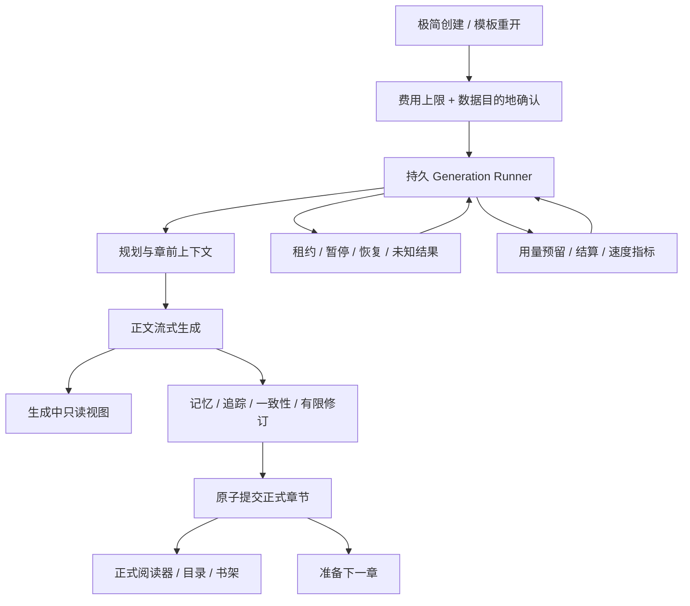

# 织卷可靠性、生成速度与后续开发路线

> 状态：用户已确认，执行中  
> 规划日期：2026-08-06  
> 适用项目：`D:\gptuser\projects\ai-novel-reader-app2`  
> 本文只规定产品与开发路线，不表示对应功能已经实现。

## 1. 本次重排的结论

后续开发不再以“尽快把页面和现有组件拼起来”为主线，而按以下顺序推进：

1. 先守住数据、费用、恢复和来源绑定，再接总执行器；
2. 把章节生成速度提升为 P0 发布门槛，不用“已经能看到半章”掩盖整章过慢；
3. 用可重复的基准证明速度，再决定并行、模型分工和预取，禁止凭感觉优化；
4. 先完成一条可恢复、可计费、可阅读的纵向闭环，再扩模板、分页、导出等横向功能；
5. 应用锁、生物识别、`FLAG_SECURE` 和最近任务缩略图遮挡全部取消，不再开发或验收。

最后一项不取消数据库加密、密钥保护、系统备份排除、脱敏日志、远程目的地确认和手动加密备份。这些仍是正式版的可靠性与安全底线。

## 2. 当前系统的真实位置

### 2.1 已经有的可靠底座

- API 适配、能力证据、连接测试和安全传输底层；
- SQLCipher 数据库、显式迁移、Keystore secret、加密草稿和安全扫描；
- Job / Stage / Attempt / Usage 状态机、租约、发送前审计、未知结果保护；
- 故事种子、圣经、总纲、窗口计划、首章快车道和第二章硬门禁；
- 章前上下文、正文流与有限续接、记忆、故事追踪、一致性检查、有限修订和最终原子提交底层；
- 中文 FTS 多路召回，以及 TASK-061 已完成的编辑失效、重建计划、伏笔回退、聚合 writer 和执行准备账本。

### 2.2 仍然没有的产品闭环

- 没有统一的全阶段 dispatcher / total runner，现有 Stage 能力尚未串成一条生产执行链；
- 开始前确认页尚未接入真实预算、数据目的地和生成入口；
- 没有把加密流式草稿转换成可安全阅读的“生成中正文”；
- 没有完成阅读器、书架生成状态和目录接线；
- 没有受控真实服务基准，因此不能声称某个模型能稳定在几分钟内完成一章；
- TASK-061 的动态逐章重建和 TEST-033 已完成；尚缺的是把这些原语接入 TASK-064 total runner。

因此当前代码是扎实的生成底座，不是已经可以日常使用的 App。下一阶段不能跳过 runner、预算和恢复，直接把按钮连到 Provider。

## 3. 后续总体结构

### 3.1 五个职责层

| 层 | 只负责什么 | 不允许做什么 |
|---|---|---|
| 产品界面 | 一句话创建、一个主状态、一个推荐动作、阅读 | 直接决定 Stage 成功或自行重发请求 |
| 应用编排 | 领取下一 Stage、检查依赖、调用唯一执行入口 | 绕过预算、目的地、RequestIntent 或租约 |
| 生成领域 | 规划、正文、派生数据、检查、修订、提交 | 直接保存密钥或依赖某个厂商 SDK |
| 可靠性与台账 | 状态、幂等、用量、恢复、速度事件 | 保存正文到普通日志或猜测远端结果 |
| Provider 适配 | 协议编码、流解析、取消、usage、错误分类 | 自行决定重试、费用或章节是否发布 |

## 4. “边生成边阅读”的正式定义

一章存在两个不同的可读状态，界面必须明确区分：

1. **生成中正文**：只读展示已经完整解码并写入加密草稿的完整段落；末尾可继续增长。它不是正式 `ChapterVersion`，不能进入后续章上下文、模板、导出或全文索引。
2. **正式章节**：记忆、追踪、一致性、必要修订和最终事务全部通过后，才成为目录中的已完成章节。

实现约束：

- 只展示完整 UTF-8 码点和完整段落，正在变化的尾部单独标识；
- 进程重启后只能从已落盘草稿恢复，不从 UI 内存猜正文；
- 检查要求修订时，界面显示“正在修整本章”，不能静默把生成中正文冒充最终版；
- 正式提交后按段落锚点恢复阅读位置，避免整页跳回开头；
- 生成中正文发生取消、失败或结果未知时继续保留为受保护草稿，并清楚显示未完成状态；
- 用户无需逐段确认，也不需要理解 Stage、Attempt 或 token。

## 5. 章节速度指标

### 5.1 测量口径

性能必须同时记录以下时间点：

- 用户开始或上一章提交；
- Stage 进入可执行队列；
- 本地上下文准备完成；
- Provider 连接打开；
- 首字节、首个完整段落、正文流结束；
- 记忆/追踪/检查/修订分别开始与结束；
- 正式章节提交；
- 下一章开始。

只记录时间、阶段、结果、字符数、token 数和脱敏模型/连接指纹，不记录正文、人物名、提示词、地址或密钥。

### 5.2 固定参考负载

速度验收使用固定参考负载，避免用 500 字短章冒充正常网文章节：

- 后续普通章目标为 2,500–4,000 个中文字符；
- 已具备有效圣经、当前窗口、上一章摘要和常规记忆上下文；
- 无格式修复、无网络重试、无人工暂停；
- “需要一次内容修订”另作慢路径，不混入正常章统计；
- 至少连续生成 20 章，报告 P50、P95 和最慢值，不能只报最好的一次。

### 5.3 拟定发布门槛

以下数值先作为实现目标；TASK-062/063 会用固定 Fake Provider 和后续受控真实模型校准，但不得把上限放宽到 10 分钟：

| 指标 | 正常后续章目标 | 说明 |
|---|---:|---|
| 本地调度到 Provider 打开 P95 | ≤ 2 秒 | 前置计划和预算已就绪时，只计算 App 自身开销 |
| Provider 打开到首个完整段落 P95 | ≤ 20 秒 | 用户真正看到可读内容的时间 |
| 正文流结束 P50 / P95 | ≤ 120 / 180 秒 | 参考章长、受支持默认模型档案 |
| 正式章节提交 P95 | ≤ 240 秒 | 包含正常记忆、追踪、检查和本地提交 |
| 第一章首个完整段落 P95 | ≤ 90 秒 | 包含首章必要的最小规划快车道 |
| 第一章正式提交 P95 | ≤ 300 秒 | 不把完整长篇规划挡在首段之前 |
| 任一正常章总耗时 | 5 分钟即判定不达标 | 进入慢服务处理，不继续无提示等待 |
| 10 分钟仍未结束 | P0 发布阻断 | 无论正文是否已显示，都不能算可接受产品表现 |

外部 API、网络和模型速度不受 App 完全控制，所以这不是对任意用户手填模型的虚假保证。正式做法是：

- 只有通过参考负载的模型/连接组合才可成为“推荐”；
- 未验证组合明确标为“速度未验证”，首章自动完成一次无额外用户操作的档案校准；
- 到 5 分钟阈值时停止安排新的远程 Stage；在途请求执行尽力取消、保存检查点并进入可解释暂停或未知结果，禁止自动重发；
- 较慢模型仍可由用户在高级设置中使用，但不能作为默认推荐，也不能让主界面无限显示“正在生成”。

## 6. 速度优化的实施原则

### 6.1 先测关键路径，再改变依赖

当前候选章正式链是 `BODY → MEMORY → TRACKING → CONSISTENCY → 可选 REVISION → FINAL COMMIT`。这些步骤目前按来源绑定串行。第一版 runner 先保持正确顺序，并通过 Fake Provider 注入不同延迟，得到每段真实耗时。

只有满足以下条件才允许并行：

- 两个步骤不读取对方输出；
- 两者都绑定同一个不可变候选版本；
- 任一步失败都不会留下半套正式派生数据；
- 并行不会绕过预算预留或放大不可控费用；
- 串行与并行输出在固定回归集上等价。

禁止为了看起来更快，直接把所有远程步骤并发，也禁止在尚未证明依赖关系前合并 schema。

### 6.2 模型按角色自动分工

正文和修订优先使用创作质量合格的写作模型；规划、记忆、追踪和检查可使用通过结构化输出与速度基准的辅助模型。默认由 App 根据同一连接下的能力证据自动选择，不增加普通用户操作。

自动分工必须同时满足：

- 模型已验证协议、上下文和结构化输出；
- 用户已经确认该远程 host；
- 每个 Attempt 仍独立预留和结算用量；
- 辅助模型不达质量或速度门槛时回到单模型可靠路径；
- 不因为追求速度自动切换到更贵模型或另一个 host。

### 6.3 允许的提前准备

- 当前章提交后立即在本地准备下一章可确定的索引和预算材料；
- 规划只剩 3 章时自动补下一窗口；
- 相同不可变来源的上下文、schema 编码和 tokenizer 估算可以缓存；
- 阅读 UI 与后台生成通过只读状态流连接，不轮询全库或重组整章。

不得在上一章正式记忆尚未提交时提前生成下一章正文，也不得用旧摘要换取速度。

## 7. 可靠性硬规则

以下规则不因速度目标降低：

- RequestIntent、Attempt、初始 Usage 和发送状态必须先原子落库，Provider 才能打开；
- 结果不明时不自动重发；超时不等于“服务端肯定没执行”；
- 正式正文、派生数据、最终 Usage、Stage 和章节进度仍以单事务提交；
- 流式草稿永不覆盖上一正式版本；
- 用户编辑后继续使用旧记忆属于阻断级错误；
- 预算不足、目的地未确认、模型能力未知或必要上下文装不下时都在联网前停止；
- 速度指标不得采集正文或可反推出私人内容的标签；
- 所有恢复测试必须覆盖崩溃、断网、取消、迟到响应、重复回调和数据库写入失败。

## 8. 开发顺序

### 阶段 A：收完当前可靠性工作（已完成）

**TASK-061 完成结果**

- 已动态创建并执行编辑后 memory / tracking Stage；
- 已在 tracking 成功后用专用重建许可原子推进 aggregate；
- 已按显式 ordinal 和直接前驱证明走完整影响区间；
- 已完成 TEST-033、replay、回滚和并发身份边界；
- 未接真实 Provider，未改阅读 UI。

退出条件：编辑第 N 章后，后续正文保留，派生数据按正确新版本顺序重建；任一步失败可从账本恢复。

### 阶段 B：生成速度和 runner 新任务定义（TASK-062～069，分批执行）

| 任务 | 交付 | 关键验收 |
|---|---|---|
| TASK-062 | 脱敏生成时序事件、基准时钟和报告器 | 能精确算出排队、首段、正文、检查和提交耗时；0 正文泄漏 |
| TASK-063（已完成） | 固定延迟/断流/慢流 Fake Provider 与 BODY 速度基准 | 20 个参考 BODY、虚拟 5 分钟、取消/未知结果可重复；正式提交/主动 watchdog 留给 064/066 |
| TASK-064（进行中） | 全阶段 dispatcher 与持久 total runner（仅 Fake） | Phase1A～2E4B已完成恢复/双lease/route binding、final/context本地执行、chapter-plan严格合同及目的地确认内核；plan仍未注册。下一步实现持久三层reservation+RequestIntent；仍需exact-token远程执行、提交/initial DRAFT、其余remote route、多阶段循环和完整第一章 |
| TASK-065 | 生成中正文只读投影和恢复契约 | 完整段落可读，尾部/失败/修订状态明确，不进入正式索引和后续上下文 |
| TASK-066 | 章节 watchdog 与慢服务状态 | 5 分钟停止新阶段并安全处置在途请求；10 分钟不能仍无解释地运行 |
| TASK-067 | 基于测量的关键路径优化和模型角色路由 | 只应用有依赖证明、质量回归和预算证明的优化 |
| TASK-068 | 20 章 Fake Provider 故障注入闭环 | 速度门槛、恢复、费用、连续性、内存和原子提交全部通过 |
| TASK-069 | 受控真实 API 小样本校准 | 用户另行授权后运行；形成推荐模型档案，不把一次快测冒充长期保证 |

实际顺序不是把表中八项一次做完：先执行 TASK-062～066；完成阶段 C 的费用与目的地硬门禁后再执行 TASK-067～068；最小阅读入口完成后才执行 TASK-069。没有用户对真实调用的单独授权时，TASK-069 保持未开始。

### 阶段 C：真实调用前硬门禁

依次完成 TASK-080～085 与 TASK-110：价格/未知价格、usage、Decimal 费用、三层原子预留、开始前估算、达限暂停、远程目的地确认。完成前，生产 runner 只允许 Fake Provider。

退出条件：任何真实请求都能回答“发给谁、最多用多少、已经用了多少、失败是否可能计费”。

### 阶段 D：最小可日常使用纵向闭环

优先完成：

- TASK-090 书架状态卡；
- TASK-091 稳定滚动阅读器；
- TASK-092 暖纸/夜间/字号/行距/边距；
- TASK-093 万章目录；
- TASK-095 生成中状态和生成中正文；
- TASK-098 无障碍主流程。

基础闭环通过后再做 TASK-094 分页和 TASK-096 三种重做入口。取消的 TASK-097 不再占用依赖；TASK-098 的依赖改为 090～096。

### 阶段 E：真实服务兼容与速度校准

在阶段 B～D 以及预算/目的地门禁完成后，才进行 TASK-069：

1. 先用用户明确授权的低成本真实请求；
2. 分别测规划辅助模型和正文模型；
3. 至少测正常、慢流、截断、拒绝和断网恢复；
4. 输出首段、正文、正式提交的 P50/P95；
5. 不达标的组合不能成为默认推荐。

### 阶段 F：模板重开

完成 TASK-070～079。模板能力在可靠生成闭环之后接入，继续保证来源、分类、不可变版本和排除正文/密钥；用户从旧书开始新书仍以 3 次点击以内为目标。

### 阶段 G：备份、诊断与发布

完成 TASK-100～110 中尚未完成的备份、原子恢复、导出、诊断、许可证、签名、全版本迁移、安全扫描和发布材料。最后用真实 20 章测试书、覆盖升级、恢复演练、速度门槛和长期流测试决定是否可称为稳定 1.0。

## 9. 预计剩余工作量

按当前 Backlog 计数，取消 TASK-097 且完成 TASK-063 后，仍有约 42 个编号任务或任务余项，其中包括 6 个速度/runner 后续任务、模板 10 项、费用 7 项、阅读 8 项、备份/发布 11 项；部分 P1 项可在稳定核心闭环后排期。

该数字不等于 45 个同等大小的功能，也不用于催进度。后续以阶段退出条件为准：每一阶段都要有代码差异、自动化证据和工作汇报，不能用任务数量代替产品可用性。

## 10. 用户操作目标

正常生成路径只需要：

1. 第一次配置连接；
2. 写一句设想，必要时选择题材/篇幅/呈现；
3. 确认用量上限和数据目的地；
4. 点击“开始织书”。

后续规划、模型角色选择、补窗、检查、有限修订、提交、下一章准备和安全恢复默认自动完成。只有费用上限、结果未知、服务拒绝、必要上下文装不下或用户主动编辑导致显著重建成本时，才要求一次明确操作。

## 11. 当前实施基线

TASK-063 已完成确定性Fake性能夹具。TASK-064 Phase1A～2E4B已完成Job恢复、queue、双lease/envelope、route binding、final/context本地执行、普通chapter-plan严格合同和目的地确认内核；registry仍只有final+context。当前基线为数据库JVM90/90、生成JVM140/140、core:model 17/17，双API数据库各222/222、生成各42/42，801-task门禁通过。下一步接TASK-083持久三层reservation与RequestIntent；费用硬门禁、exact-token执行与用户单独授权前不调用真实小说生成API。
